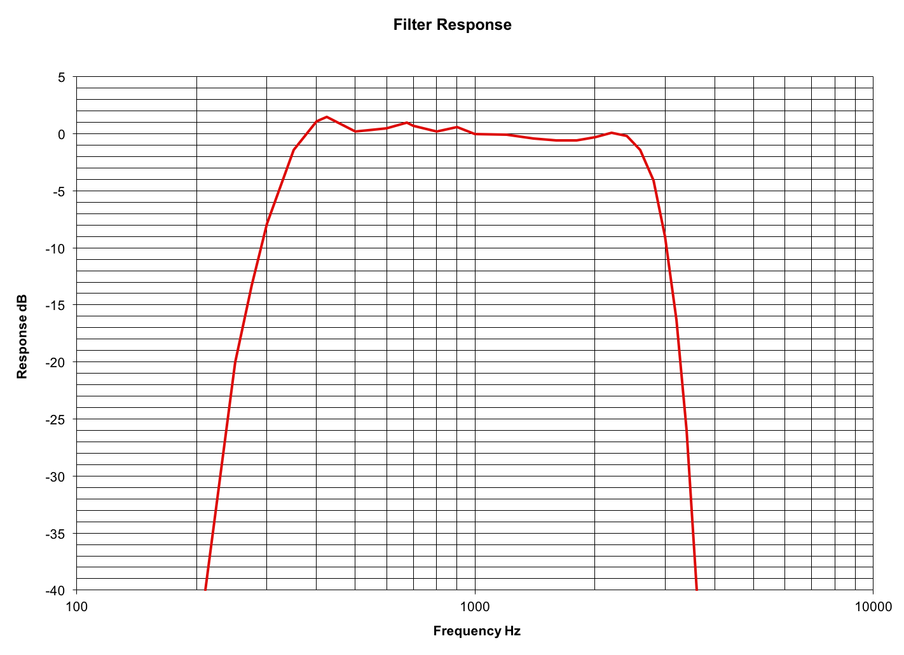
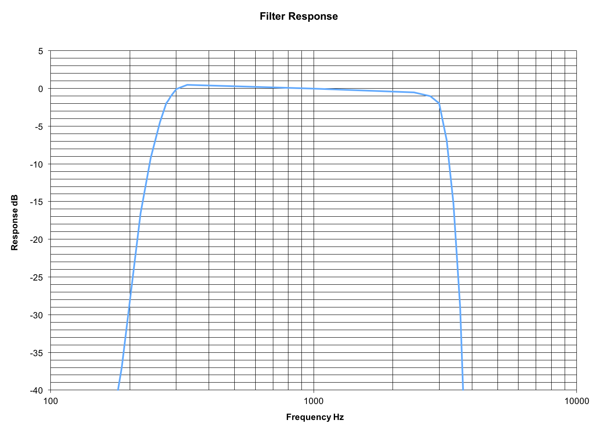

# Audio Filters
The `chan_usbradio` channel driver includes an optional set of audio filters for amateur radio applications.  

The default transmit and receive filters were designed around commercial standards. However, because amateur radio operators have the resources to use wider bandwidths, especially on UHF, they may prefer other filter types in order to provide higher audio quality. Over the years there have been updates to the channel driver, to minimize distortion. The results below prove the distortions are considerably lower than what a typical radio/repeater will add into the audio chain (.8% for the application versus 3 to 5% or more for the radio). Contrary to what you may have read elsewhere, the dynamic range of `app_pt`, when properly deployed, is far beyond the capabilities of wide-band FM radio.

The following settings can be optionally used in a USB radio interface context in `usbradio.conf`. If these key/value pairs are not present, their values default to zero (`0`). These alternate filters should be used with care. Note that additional computing power and radio adjustments may be necessary depending on your application. They have been extensively tested and work fine even with the Raspberry Pi3. 

## Receiver Audio Low Pass Filter Options
* `rxlpf = 0`                       ; 3.0 kHz cutoff. Default value for reduced noise and increased intelligibility.
* `rxlpf = 1`                       ; 3.3 kHz cutoff for increased high end, sibilance, and brightness.
* `rxlpf = 2`                       ; 3.5 kHz cutoff for even more high end, sibilance, and brightness.

## Receiver Audio High Pass Filter Options
* `rxhpf = 0`                       ; 300 Hz cutoff. Default value to reduce sub-audible signals for retransmission, and also in the receiver speaker.
* `rxhpf = 1`                       ; 250 Hz cutoff for additional received and retransmitted bass response. We recommend using this filter with a CTCSS tone no higher than 186.2 Hz.

## Transmitter Audio Low Pass Filter Options
* `txlpf = 0`                       ; 3.0 kHz cutoff. Default value.
* `txlpf = 1`                       ; 3.3 kHz cutoff for increased high end, sibilance and brightness.

## Transmitter Audio High Pass Filter Options
* `txhpf = 0`                       ; 300 Hz cutoff. Default value to reduce interference between voice and sub-audible signaling tones and codes.
* `txhpf = 1`                       ; 250 Hz cutoff for increased bass response in transmitted audio.
* `txhpf = 2`                       ; 120 Hz cutoff for special applications requiring additional bass response in transmitted audio. Not recommended due to the increased possibility of voice energy interfering with sub-audible signaling, but should work okay with very low CTCSS frequencies. 

## Key Points and Specifications
All filter combinations yield aliasing distortion/folding at or below -40 dBr. Note that all testing was done with the `usbradio` channel driver using discriminator (flat) receive audio, and with transmit audio pre-emphasis in software.

The measurements that follow *include* the low-pass filter inside the DMK URI in the transmit audio path, which is down about 3 dB at 3.5 kHz. The frequency response is better with a modified fob or radio adapters with wider frequency response.

The variations in amplitude response within the passband as you switch filters are fairly minor. A perfectionist would re-calibrate both receive and transmit levels after switching filters in the config files. You shouldn't be afraid to switch filters without recalibrating as the variation is less than 0.3 dB @ 1 kHz worst-case among all filter combinations. Yes, the filters were designed for unity gain, but there's a little ripple in the passband, plus the ulaw effects, so nothing's perfect, but it's close enough to perfect to not worry about.

THD did not appreciably change as filters were varied, it tends to hover around 0.8% from 300 Hz to wherever the LPF's start to kick in. At low amplitudes (either due to low audio levels or filter skirt attenuation), obviously distortion, as a ratioed value, appears to rise due to quantization noise, but that's unavoidable in our little 8-bit ulaw corner of the world. IMD was likewise acceptable across the range. 

## Recommended Settings
Start off with all of the filters (`rxlpf`, `rxhpf`, `txlpf`, `txhpf`) set to `1`.

This will make a marked improvement in frequency response, both as far as local repeat audio goes as well as through the network. With the default (zero) filters, frequency response is pretty restricted. 

Here's a brief synopsis of what the frequency response from receive to transmit is like with the DEFAULT (zero) filters that everybody is currently using:

So, you can see that the low-end suffers quite a bit, as it's almost 8 dB down at 300 Hz. It also has overshoots in excess of 1 dB centered at 425 and 675 Hz. The high end falls off quite sharply as well.

By switching to all `1`'s for the filters, the response and flatness is greatly improved.

Notice the improvement at the low end and high end.  

The frequency response is flat to within ±1 dB from 286 Hz to 2.77 kHz. Regardless of what low-pass filtering you have (or don't have) in your transmitter, nor what your channel spacing is (15 kHz versus 20/25), you should have no problems as far as excessive occupied bandwidth using all `1`'s for the filters. 

However (and here's a big however), the CM108, even when not being sent data by the channel driver, has about 350 uV RMS of residual wideband noise, with energy primarily falling at harmonics of the sample rate (48 kHz). 350 uV is about 71 dB below the maximum output level of the CM108 best-case, but the ratio may be much worse than that depending on how low you have `txvoice` set (i.e. it may only end up being 30 or 40 dB down if your transmitter has a sensitive input and you have `txvoice` set accordingly low).

As such, we strongly **DO NOT** recommend feeding a CM108/119 output directly to the modulator without low-pass filtering in the exciter, or optionally in the radio adapter. The LPF doesn't need to be anywhere near as aggressive as it would be in a stock radio of course, but it should sufficiently attenuate everything in the ultrasonic range. As always, you should proof your contraptions with a spectrum analyzer before sticking them on a mountaintop!  

Deviations from all filters being set to `1` follow:

If you are using a CTCSS tone **ABOVE** 186.2Hz and you do **NOT** have an external CTCSS filter in the repeater receiver, then leave `rxhpf` at `0`. Otherwise, you will start putting receive audio onto the network with insufficient CTCSS filtering (we like to see 40 dB of PL rejection, but -37 dB at 186.2Hz is close enough).

If you **DO** have an external CTCSS reject filter in the receiver, you should be able to use `rxhpf=1` no matter what tone you're using.

Some receiver discriminators have a little more high-end roll off than others. At your option, and after adequate testing, going to `rxlpf=2` shouldn't cause any problems either locally or on the network. But, the difference between `rxlpf=1` and `rxlpf=2` is pretty minor, and really only improves the response over a fairly narrow range at the very high end, which most people aren't going to notice.

In summary, if you switch all of the filters to `1` you may be very happy with the improvement in quality, and no further tweaking will be necessary. The goal was to make the `1` filters plug and play. The improvement will obviously be greatest when both the repeater you're on as well as the repeater of the user(s) you're talking to have the filters enabled.