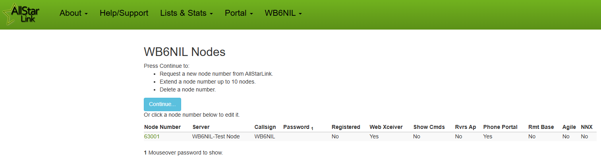
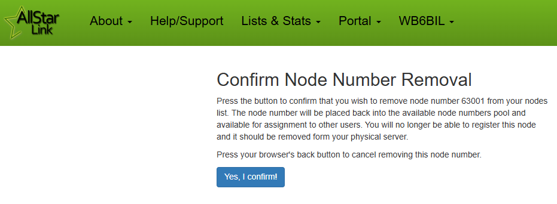

# Node Number Extensions (NNX)
A Node Number Extension is a method to expand any issued node number to as many as ten node numbers. The reasons for this are to allow users to assign themselves sequential node numbers while preserving and expanding valuable node number space. The concept is very simple, allow users to optionally expand the length of any of their node numbers by one digit.

## NNX Example
When a user with an existing node number selects to extend the number, they go to the portal and select to **Extend** a node, rather than **Request** a new node. The portal converts node xxxxx to xxxxx0 and adds node xxxx1 to the user’s node list. An additional eight NNX nodes may be added for a total of 10 sequential (xxxxx0 thru xxxxx9) node numbers. The reason xxxxx has to be changed to xxxxx0 is because AllStarLink would connect to node xxxxx when attempting to dial node xxxx1.

Example:

```
Initial Node:                       63001
NNX Conversion:                     63001 --> 630010
NNX Node Pool:                      630010 to 630019
```

Once the node user has reconfigured their node computer (if previously registered as xxxxx), both node numbers register, show on the AllStar nodes list, show on stats page, appear in [Allmon3](../allmon3/basics.md) and of course can connect or be connected to.   

!!! note "First Time Registration"
    New users that have not yet been issued a node number would **Request** their initial node number first. Then you can **Extend** the issued node number to allow up to ten nodes to be created. See the [Getting Started](../user-guide/gettingstarted.md) section of the manual for information on requesting your initial node number.

## Requirements
Use of NNX node numbers is totally optional, but strongly recommended. The prior node request process still exists. Existing and new users may continue to request new node numbers per current policy.

Users who opt to expand an existing node number will need to make configuration changes to their existing node (if configured). That is (using the example numbers above) all references to node 63001 will need to change to 630010. These files include rpt.conf, extensions.conf, rpt_http_registartions.conf, and allmon3.ini (if using [Allmon3](../allmon3/config.md)). Reconfiguring all occurrences of the existing node number is critical. Such an oversight may confuse users and put an extra support load on system admins, at least initially. The menus that are built into ASL3 installs simplify this task greatly.

!!! note "New Node Setup"
    If you are registering for a node number for the first time, it would be wise to extend your node number before you configure your new node for the first time. That way, you can have your xxxxx0 number ready to deploy, without having to reconfigure it after the fact. It also sets you up to easily deploy additional nodes, as your extended node numbers will already be available.

Adding NNX nodes xxxxx1 thru xxxxx9 is the same process as adding any additional node.  

## Considerations
* NNX nodes can be assigned to any of the user’s servers, assigned a password and otherwise modified as desired
* No changes to the AllStarLink registration system, the Stats Server or Allmon3 systems are required
* Any existing node number (aka Issued Node Number or INN) can be converted to an NNX. INN and NNX node numbers can run on the same server. NNX Nodes can be split across different servers
* Users who desire more than ten sequential node numbers and have not already been assigned sequential node numbers, may opt to request new node numbers in sequential order.  Two subsequent INNs may expand to 20 NNX numbers, or three to 30 NNX nodes, etc. All with little impact on node number resource. It’s conceivable that some users may opt to relinquish their non-sequential INN node numbers after converting, further easing any pressure on node number space
* A provision for releasing no longer used INN numbers has been included on the new portal page as has a provision to revert NNX nodes back to the original INN number

## NNX on the AllStarLink Portal
Node Number Extension implementation on the AllStarLink Portal is shown below.
  
### Request Initial Node Number
Before you can complete Node Number Extension, you need an Initial Node Number. See the [Getting Started](../user-guide/gettingstarted.md) page for instructions on how to request your Initial Node Number.

### Extend a Node Number
Log in to the [AllStarLink Portal](https://www.allstarlink.org/portal) with your user credentials. From the **Portal** menu, choose **Node Settings**.

{width="400"}

You will see your current assigned nodes. Click **Continue** to proceed.

{width="400"}

Ensure **Extend** is in bold (the currently selected tab), pick the node you want to extend from the drop down menu, then click **Continue**.

{width="400"}

Confirm that you indeed want to proceed with extending your node number.

{width="400"}

You should see a **Success** message when your node has successfully been extended. Click **OK** to continue.

{width="400"}

You will be returned to your Nodes page, showing your available node numbers. You should now see that you Initial Node Number has been extended (adding a `0` on the end), and a new node ending in `1` has also been created.

{width="400"}

At this point, you can modify each node as desired. You can re-assign them to different servers, as well as modify their individual node parameters by clicking on the node number. You can now proceed with configuring your node on your actual server, using the [ASL3 Menu](../user-guide/menu.md) to complete your `Node Setup`. 

If you wish to create additional nodes, see the next section.

### Add an Additional NNX Node
From the **Node Settings** page, click **Continue** to open the **Extend/Request/Remove** page.

{width="400"}

To add another NNX Node, ensure you are on the **Extend** tab (it will be bold), choose the node you wish to add an additional NNX to from the drop down menu, then click **Continue**.

{width="400"}

On the following screen, click **Submit** to add the next NNX in sequence.

{width="400"}

You should see a **Success** message when your additional node has been added. Click **OK** to continue.

{width="400"}

You will be returned to your Nodes page, your new NNX node number will now appear in your Nodes List.

{width="400"}

At this point, you can modify each node as desired. You can re-assign them to different servers, as well as modify their individual node parameters by clicking on the node number. You can now proceed with configuring your node on your actual server, using the [ASL3 Menu](../user-guide/menu.md) to complete your `Node Setup`.

### Revert a NNX Back to an INN
Should you decide that you no longer want to use extended node numbers, you can revert back from NNX to a base node number (Initial Node Number).

!!! warning "Deletes All NNX Nodes!!"
    Be warned, proceeding to revert your NNX node back to a base node number **will delete all NNX node numbers**. 

From the **Node Settings** page, click **Continue** to open the **Extend/Request/Remove** page.

{width="400"}

To revert your node, ensure you are on the **Remove** tab (it will be bold), choose the node you wish to revert, then click **Continue**.

{width="400"}

Next, you need to confirm that this is indeed what you want to do.

{width="400"}

You should see a **Success** message when your node has been reverted, and all your NNX nodes have been removed.

{width="400"}

You will be returned to your Nodes page, and your base node number will now appear in your Nodes List.

{width="400"}

### Delete a Base Node Number
If you wish to delete a node entirely from your account, follow the process below.

!!! warning "This Will Delete Your Node!"
    This process will delete your node entirely from the AllStarLink database, and return your node number to the pool for re-assignment.

From the **Node Settings** page, click **Continue** to open the **Extend/Request/Remove** page.

{width="400"}

To delete your node, ensure you are on the **Remove** tab (it will be bold), choose the node you wish to delete, then click **Continue**.

{width="400"}

Next, you will need to confirm that this is indeed what you want to do.

{width="400"}

At this point, you need to ensure that you wipe the configuration from any server that had this node number configured, as it will continue trying to register with AllStarLink, providing unnecessary strain on our resources.

## Editing Node Parameters
Each node number you create has individual parameters associated with it. From your **Node Settings** page, click on the node number to edit its parameters.

{width="400"}

On this page, you will find a number of important settings to modify.

### Password
By default, a random password is assigned for the node. You can leave this as-is, or change it to something else. Be sure it follows the guidelines shown.

### Callsign
This is the callsign that will show up in Allmon3 as well as on the various [Links & Stats](https://www.allstarlink.org) pages (including the Bubble Charts). It is *normally* the repeater callsign, however, it *could* be something else (such as the name of a hub system).

### Frequency
This will show up as the frequency in Allmon3 as well as on the various [Links & Stats](https://www.allstarlink.org) pages (including the Bubble Charts). For a conventional repeater, it *normally* would be of the format `MMM.kkk(s)` where `(s)` would be the optional "split" (`+` or `-` for duplex repeaters). It *could* be a description of hub node, or an indication that this is a "Radioless Node" or something similar.

### CTCSS Tone
If your repeater requires a CTCSS tone, this should be set. It will show up beside the frequency in Allmon3 as well as on the various [Links & Stats](https://www.allstarlink.org) pages (including the Bubble Charts).

### Server Selection
From the drop down menu, you can select which of your pre-configured servers this node should be assigned to.

### Web Transceiver (WT) Access
Selecting `yes` here will allow applications such as [RepeaterPhone for iOS](https://apps.apple.com/us/app/repeaterphone/id1637247024), Transceive for Mac OS, and [DVSwitch Mobile for Android](https://play.google.com/store/apps/details?id=org.dvswitch&hl=en_US&gl=US) (in "Node Mode") to connect to this node.

There was originally a "Web Transceiver" Java application that this was used with, but that has since been deprecated.

### Show Function List 
The default setting of `no` here is fine. There was originally a "Web Transceiver" Java application that this was used with, but that has since been deprecated.

### Allow Reverse Autopatch Access?
If you want to allow users to call into your node from a landline (reverse of the normal "autopatch"), you would need to set this to `yes` to allow incoming calls to be processed.

### Allow Telephone Portal Access?
In most cases, you likely want to set this to `no`. A telephone portal is available to call in to nodes, if users have an AllStarLink account and use the PIN found in their Portal Account Settings.

### Is Node a Remote Base?
If this node is specifically configured as a [Remote Base](./remotebase.md), set this to `yes`, otherwise, leave it set to `no`.

### Is the Remote Base Frequency Agile?
If this node is specifically configured as a [Remote Base](./remotebase.md), AND it is frequency agile, set this to `yes`. Otherwise, leave it set to `no`.

