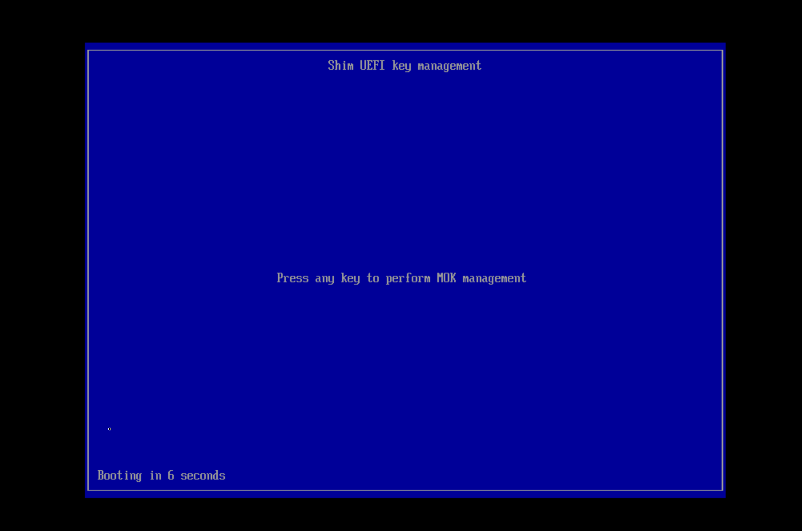
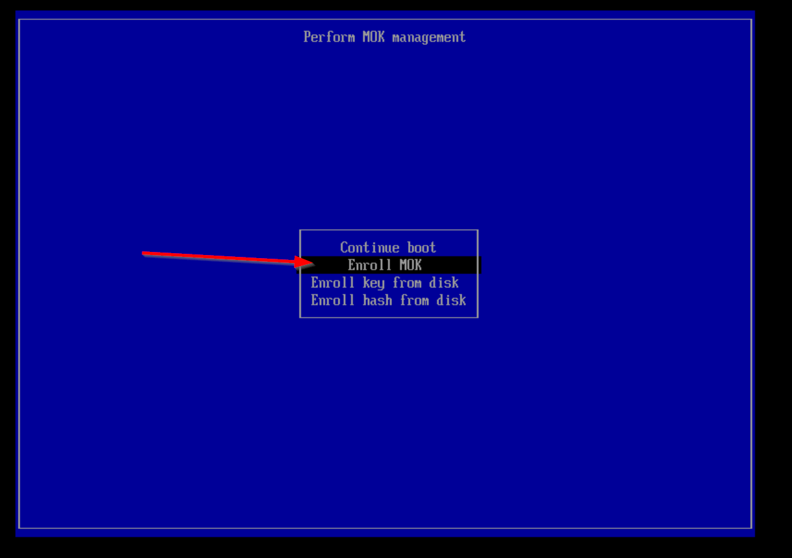
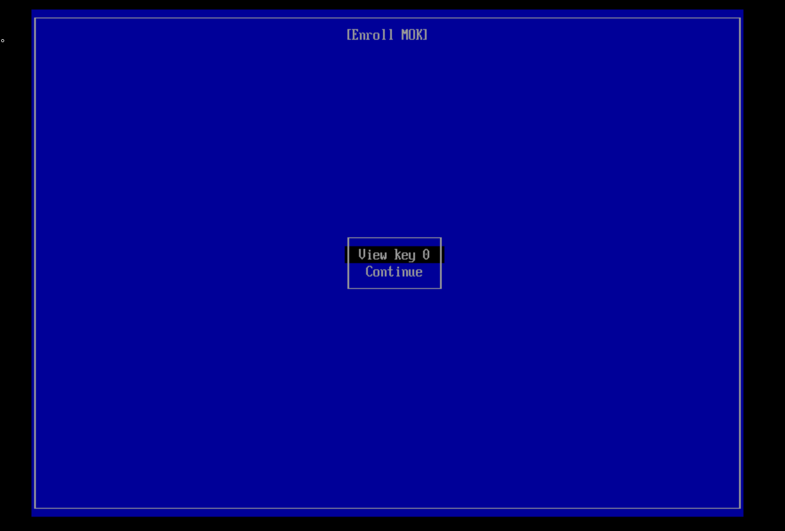
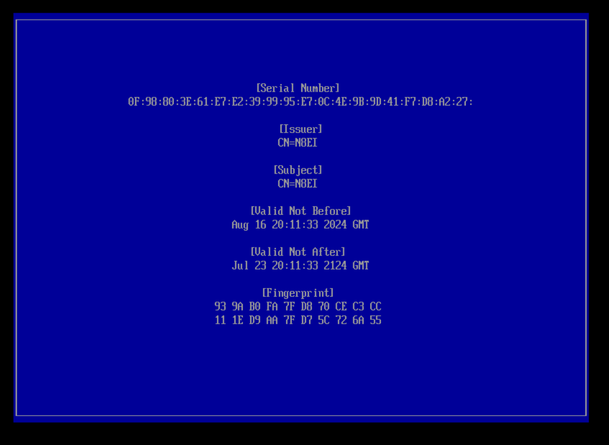
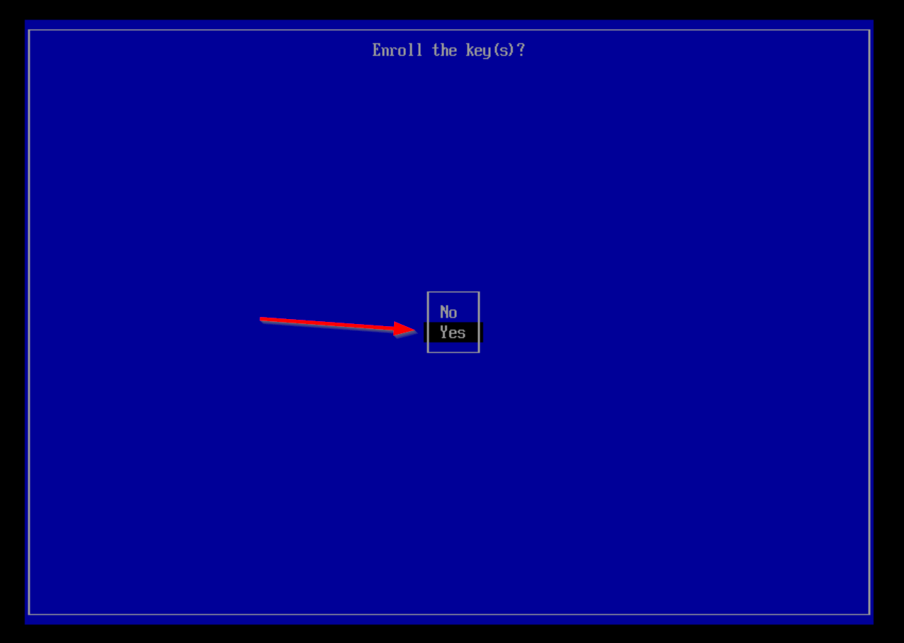
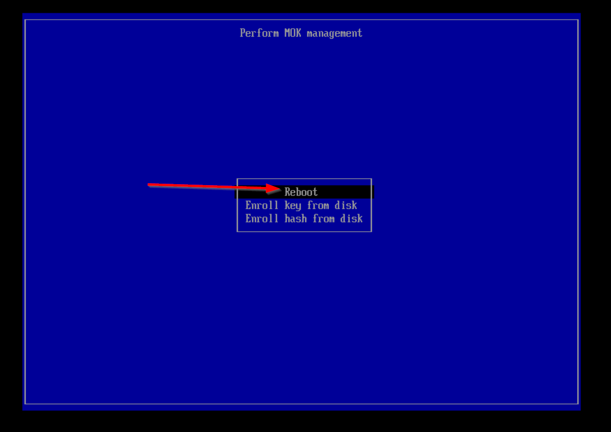

# UEFI and SecureBoot
UEFI (Unified Extensible Firmware Interface) is a modern firmware interface that replaces the older BIOS system, providing a more flexible and powerful environment for booting and managing hardware. It supports larger hard drives, faster boot times, and a more user-friendly interface.

Secure Boot is a feature of UEFI that ensures only trusted software is loaded during the boot process, protecting the system from malware and unauthorized software. It works by verifying the digital signatures of boot loaders and operating system files against a database of trusted certificates.

Together, UEFI and Secure Boot enhance the security and efficiency of modern computing systems.

Given a quirk of how Asterisk and `app_rpt` needs a kernel module (driver) not already contained in the core system provided by Debian, installing AllStarLink on a system requiring UEFI/SecureBoot requires additional steps to create what's called a Machine Owner Key (MOK).

!!! note
    Raspberry Pi does not use or support UEFI or SecureBoot

## Generating a Machine Owner Key
Generation of a Machine Owner Key (MOK) is done with the [`asl-setup-dkms-mok`](../mans/asl-setup-dkms-mok.md) utility. This tool appeared in the package asl3-3.3.0-1.

1. Run the command `sudo asl-setup-dkms-mok`. This will prompt for several items of information. An example run will look like:

    ```
    $ sudo asl-setup-dkms-mok
    !!!
    !!! WARNING - RUNNING THIS SCRIPT WILL REGENERATE THE
    !!! DEFAULT MACHINE OWNER KEY (MOK) FOR SECURE BOOT. IN GENERAL YOU
    !!! ARE RUNNING THIS SCRIPT BECAUSE YOU NEED TO AND YOU KNOW WHY
    !!! YOU ARE DOING IT. HOWEVER BE WARNED!
    !!!
    ENTER "galaxy" TO CONTINUE>> galaxy

    Generating an MOK requires a name for the certificate. This can be
    anything, however your name or your callsign is recommended.

    Name or callsign>> N8EI

    Generating the MOK...
    ......+...+...+.....+++++++++++++++++++++++++++++++++++++++++++++++++++++++++++++++++*................+++++++++++++++++++++++++++++++++++++++++++++++++++++++++++++++++*.+.........+......+...+.+...........+...+.+...+..+.+...+..............+.......+...........+.........+................+..+++++++++++++++++++++++++++++++++++++++++++++++++++++++++++++++++
    .....+............+.........+.+.....+....+...+...+..............+.+..+...............+.+..+...+.+........+.+......+........+...............+++++++++++++++++++++++++++++++++++++++++++++++++++++++++++++++++*.......+...+............+..+....+............+..+++++++++++++++++++++++++++++++++++++++++++++++++++++++++++++++++*....+.....+...+...........................+......+.......+...............+.....+......+..........+++++++++++++++++++++++++++++++++++++++++++++++++++++++++++++++++
    -----

    Enter a one-time password for this key. This password will be prompted
    for at the next reboot to properly install the key in the UEFI
    bootloader keyring. This does not need to be an incredibly complex
    password and you may write it down until it's used.

    input password:
    input password again:

    Setup /etc/dkms/framework.conf.d/asl.conf
    Generate /etc/dkms/asl_sign_helper.sh

    You must reboot the system and enter the OTP to load the key into SecureBoot
    This will appear on your directly-connected monitor or your cloud console
    ```

2. Prepare to reboot the system. Make sure a monitor is attached to the system or, if using a cloud virtual machine / VPS, make sure that a remote virtual console is connected. Then, reboot the system.

    !!! warning "MOK Load Staging is One-Time Only"
        Note that the MOK is only staged for load one time. If the MOK load prompt
        is not responded to at the first/next reboot, the MOK staged for load
        is wiped and Step #1 will have to be run again.

3. Complete the steps to review, unlock, and load the MOK
    
    !!! tip "The next step varies by vendor"
        The next step uses screenshots from a Linux/QEMU virtual
        environment. Every device manufacturer or cloud provider will
        have a slightly different process or look.

    {width="400"}

    {width="400"}

    {width="400"}

    {width="400"}

    {width="400"}

    {width="400"}
    
    {width="400"}


4. Reboot the system back into Linux and log in.

5. Check that the MOK created is now loaded by looking for the "name" you provided the certificate in Step 1. In this example, the MOK was named "N8EI".

    ```
    sudo dmesg | grep -i N8EI
    ```

    The output will look like:
    ```
    $ sudo dmesg | grep -i N8EI
    [    0.674788] integrity: Loaded X.509 cert 'N8EI: 92ed492eeb11594eb25af5cc70ff0587115f2577'
    ```

6. Rebuild the `dahdi-dkms` package so that the modules are signed by the MOK so that the kernel will load them.

    ```
    apt install --reinstall -y dahdi-dkms
    ```

7.  Test the module loads successfully:

    ```
     $ sudo modprobe dahdi dahd_dummy dahdi_transcode
    $ lsmod | grep dahdi
    dahdi_dummy            16384  0
    dahdi_transcode        16384  0
    dahdi                 258048  2 dahdi_dummy,dahdi_transcode
    ```

