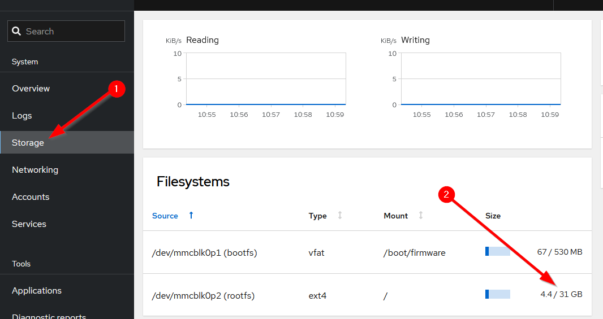

# Incompatibilities, Changes, and Known Issues

## Incompatibilities and Changes From Legacy Versions
With the upgrade to Asterisk 20, and all the associated code changes that had to go along with it, ASL3 has certain incompatible with older versions of the AllStarLink system. There are also some changes in how certain things function.

### VOTER/RTCM Default Port
Modern installations of Asterisk runs as the unprivileged `asterisk` user rather than as `root`. Linux typically prohibits non-root users from listening on a TCP
port below `1024`. The default port for VOTERs/RTCMs was previously port `667`. This has been changed to port `1667` to allow Asterisk to access the port, and connect to VOTERs/RTCMs.

If the VOTER/RTCM port cannot be easily changed, then the following configuration change can be made to the underlying operating system:

```
echo net.ipv4.ip_unprivileged_port_start=667 > /etc/sysctl.d/aslport667.conf
sysctl -p
systemctl restart asterisk
```

If running the AllStarLink Pi Appliance (or another system with a firewall), inbound to port `667/UDP` must be permitted. For directions on how to do this with the Pi Appliance see [Managing the Firewall](../pi/cockpit-firewall.md). **Don't forget to also allow this port through any firewall that may part of your internet connection.**

**NOTE:** While this workaround is available, its use is strongly discouraged, as it defeats a security measure in Linux. If at all possible, please try and update any of your VOTERs/RTCMs to use port `1667`. 

### Pi Serial Port(s) Available by Default
On the ASL3 Pi Appliance, the system comes pre-configured for `/dev/serial0` (formerly `/dev/ttyAMA0`) accessibility.

That means that Bluetooth and the default serial console are disabled. Any directions requiring editing of `config.txt` or `cmdline.txt` are unnecessary with the ASL3 appliance.

### Pi `/dev` Entry Changes
As ASL3 is based on Debian 12, users with Raspberry Pi devices must note that the serial port on the Pi expansion header is now `/dev/serial0` rather than the historical `/dev/ttyAMA0`. If you are following directions for Pi serial port operations, such as programming an SA818/DRA818-based radio hat or a SHARI node, use `/dev/serial0` in place of the `/dev/ttyAMA0` reference.

### USB `udev`
A `udev` rule is needed to allow Asterisk running as non-root access to the USB system. ASL3 systems installed from `.debs` using `apt install`, or Raspberry Pi images will already have this rule in place, so no additional action is required. This is documented for advanced users and developers.

```
/etc/udev/rules.d/90-asl3.rules
SUBSYSTEM=="usb", ATTRS{idVendor}=="0d8c", GROUP="plugdev", TAG+="uaccess"
```

The `udev` subsystem must be reloaded and then the USB device re-inserted into the port. `udev` is reloaded with the command:

```
udevadm control --reload
```

Alternatively, reboot the system.

### SimpleUSB and USBRadio Config Files
The way USB audio interfaces are handled, including their config files has changed. See the [USB Audio Interfaces](../adv-topics/usbinterfaces.md) page in this section for detailed information.

## Known Issues
The following issues are currently known to exist in ASL3 and, where possible, what the workarounds are.

### GitHub Issues Trackers
Check the following locations to see if your issue has already been reported:

* [ASL3 Issues](https://github.com/AllStarLink/ASL3/issues)
* [Asterisk/app_rpt Issues](https://github.com/AllStarLink/app_rpt/issues)
* [asl3-menu Issues](https://github.com/AllStarLink/asl3-menu/issues)
* [Allmon3 Issues](https://github.com/AllStarLink/Allmon3/issues)

### Issues with connections to "new" NNX Nodes

There can be some confusion when first extending a node number (NNX).  Specifically, if you have/had a node that recently registered with the AllStarLink network and you expand the node number with the [Node Number Extensions (NNX)](../adv-topics/nnx.md) then some nodes may not be able to connect with your extended nodes.  Here's what happens :

- You start off with a node, e.g. 63001
    - This node registers with the AllStarLink network
    - The ASL servers add registration info for your node (63001).  This includes updating the DNS records and node directory file (`/var/lib/asterisk/rpt_extnodes`) used by other nodes to establish connections to your node.

- You extend and reconfigure your node, e.g. 63001 becomes 630010
    - Your extended node registers with the AllStarLink network
    - The ASL servers add registration info for your new extended node (630010).  This includes adding new DNS records and updating the node directory file.  Unfortunately, the older DNS records are not immediately removed.

- Another node attempts to use a DTMF sequence to connect with your new node number.  As they enter DTMF digits their node will attempt to connect to a remote node based on the digits received.  For example, if they are trying to connect with your node, 630010, the following can happen :
    - They have pressed the first 4 digits of the node number, 6300, their node issues a query, no match is found in the registry, and the node keeps listening
    - They pressed the 5th digit of the node number, now 63001, their node issues a query, finds a DNS match for the pre-NNX node 63001, stops listening, and attempts to connects to the node.
    - Everyone involved is confused about why the connection did not succeed!

What happened?  Simply put, the older pre-NNX DNS records blocked the full 6-digit query and connection attempt from succeeding.  If the old records had been removed then the remote node would have kept listening for the last important digit, queried and matched the NNX node, and would have been able to successfully connect with your node.

At this time, we have a once daily process that cleans out the older records.  But, you have to wait for the cleanup to happen.  We are working on changes to more quickly update the DNS records.


### resize2fs_once "Error"
There are intermittent cases of errors on the screen or in  the system logs about a failure of a service named `resize2fs_once.service` after the final first boot upon installation. The error may report that it "Failed to start" or "timed out". If the `/` partition has been properly resized, which has been the case in every known 
occurrence of the error, then there is no action to take and the issue will not appear on subsequent reboots.

A properly resized `/` should be a bit smaller than the full size of the SD card or USB drive used with the device.

In Cockpit, look at the Storage tab:

{width="600"}

In this example, `/` is a 31G partition on a 32G SD card.
