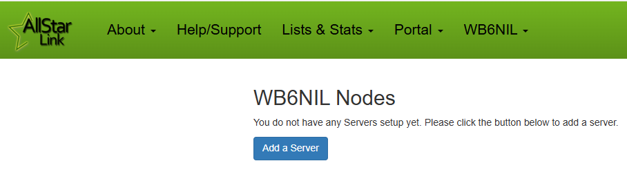

# AllStarLink Portal
The [AllStarLink Portal](https://www.allstarlink.org/portal) is where you manage the administration for all the servers and nodes you create to link to the network.

This is where you will apply for a [node number](./gettingstarted.md#what-is-a-node-number) to connect to the AllStarLink network, configure options on how network features interact with your node, and set how your node is described to other nodes and the public facing status pages.

## Create an Account
The first step in getting an AllStarLink node number assigned is to create an account at [www.allstarlink.org](https://www.allstarlink.org). Head over there, and click the **"Login/Sign Up"** link at the top of the page. In the box that opens, click **"Sign Up"** at the bottom of the box.

{width="400"}

Carefully read all the information on the page that opens, then click **"Begin Registration"** to get started.

{width="400"}

Fill out the registration form and submit it with your valid information for verification.

You will then receive an email from the *AllStar Helpdesk* (helpdesk@allstarlink.org if you need to add it to your spam filters) with a link to confirm your email address. **Be sure to click the link in the email to validate your address, or your account request will not proceed.**

You should then receive another email from from the *AllStar Helpdesk* within 24 hours, notifying you that your account has been validated (at which point you will be able to log into the Portal).

## Request a Node Number
Once you have a validated account for the Portal, you can now proceed with requesting a node number.

Go to [https://allstarlink.org](https://allstarlink.org) and click the **Login/Sign Up** link at the top of the page.

Enter your credentials in the login box, and click **Login**.

When you have successfully logged in, the **Login/Sign Up** link at the top of the page will change to your **CALLSIGN**. You will also note a new **Portal** link has appeared to the left of your callsign.

{width="400"}

From the **Portal** menu, click **Server Settings**.

{width="400"}

Since this is the first time you've logged in and you don't currently have any nodes assigned to you, click the **Proceed with Server Setup** button to continue.

{width="400"}

If you inadvertently clicked the **Node Settings** link, it will still ask you to **Add a Server**.

{width="400"}

Fill in all the information about where your server will be located, be sure to have the latitude and longitude (or click on the map), then click **Submit**.

{width="400"}

Now you will have a new server created to associate your node number to.

{width="400"}

Go back up to the top menu bar, and under the **Portal** menu select **Node Settings**.

{width="400"}

Now, you can click **Continue** to proceed to the **Request/Extend/Remove** page.

{width="400"}

On the **Request/Extend/Remove** page, **Request** will be in **bold** as this is your initial request. Ensure the server you created is selected in the **Server** box, and then click **Submit**.

{width="400"}

That's it! On the page that opens, you will see your newly assigned node number.

{width="400"}

!!! note "Additional Node Numbers"
    Your first node number is automatically approved. If you need additional nodes, you should consider doing the NXX extension (to create up to ten nodes, based off your initial node number). If you need a completely different additional node number, additional node requests are subject to admin approval.

!!! note "Node Password"
    Take note that on this screen, you will find the *password* for your node (hover your mouse over the password field). You can double-click the password, and then type ctrl-c to copy it to your clip board. **You will need this later when setting up the ASL3 software to register with the AllStarLink servers.**

## Node Number Extension (NXX)
Node numbers are a limited resource. If you are just starting out, you would be strongly encouraged to click the **Continue** button on your **Node Settings** page, and complete the [Node Number Extension (NNX)](../adv-topics/nnx.md) process. This will add a *zero* to the end of your primary node number (ie 63001 becomes 630010), and open up an additional nine node numbers (ie 630011-630019) for your use.

## Editing Node Parameters
Each node number you create has individual parameters associated with it. From your **Node Settings** page, click on the node number to edit its parameters.

{width="400"}

On this page, you will find a number of important settings to modify.

### Password
By default, a random password is assigned for the node. You can leave this as-is, or change it to something else. Be sure it follows the guidelines shown.

### Callsign
This is the callsign that will show up in Allmon3 as well as on the various [Links & Stats](https://www.allstarlink.org) pages (including the Bubble Charts). It is *normally* the repeater callsign, however, it *could* be something else (such as the name of a hub system).

### Frequency
This will show up as the frequency in Allmon3 as well as on the various [Links & Stats](https://www.allstarlink.org) pages (including the Bubble Charts). For a conventional repeater, it *normally* would be of the format `MMM.kkk(s)` where `(s)` would be the optional "split" (`+` or `-` for duplex repeaters). It *could* be a description of hub node, or an indication that this is a "Radio-less Node" or something similar.

### CTCSS Tone
If your repeater requires a CTCSS tone, this should be set. It will show up beside the frequency in Allmon3 as well as on the various [Links & Stats](https://www.allstarlink.org) pages (including the Bubble Charts).

### Server Selection
From the drop down menu, you can select which of your pre-configured servers this node should be assigned to.

### Web Transceiver (WT) Access
Selecting `yes` here will allow applications such as [RepeaterPhone](https://apps.apple.com/us/app/repeaterphone/id1637247024) for iOS, [Transceive](https://transceive.app/) for macOS, [DVSwitch Mobile](https://play.google.com/store/apps/details?id=org.dvswitch&hl=en_US&gl=US) for Android (in "WT Mode"), and the [SharkRF M1KE](https://www.sharkrf.com/products/m1ke/) (using "AllStarLink" mode) to connect to this node.

There was originally a "Web Transceiver" Java application that this was used with, but that has since been deprecated.

See the [External Applications](../user-guide/externalapps.md) page for further details on how this operates.

### Show Function List 
The default setting of `no` here is fine. There was originally a "Web Transceiver" Java application that this was used with, but that has since been deprecated.

### Allow Reverse Autopatch Access?
If you want to allow users to call into your node from a landline (reverse of the normal "autopatch"), you would need to set this to `yes` to allow incoming calls to be processed.

### Allow Telephone Portal Access?
In most cases, you likely want to set this to `no`. A telephone portal is available to call in to nodes, if users have an AllStarLink account and use the PIN found in their Portal Account Settings.

### Is Node a Remote Base?
If this node is specifically configured as a [Remote Base](../adv-topics/remotebase.md), set this to `yes`, otherwise, leave it set to `no`.

### Is the Remote Base Frequency Agile?
If this node is specifically configured as a [Remote Base](../adv-topics/remotebase.md), AND it is frequency agile, set this to `yes`. Otherwise, leave it set to `no`.

## Editing Server Parameters
Each server you create has individual parameters associated with it. From your **Server Settings** page, click on the server to edit its parameters.

{width="400"}

On this page, you will find a number of important settings to modify.

{width="400"}

### Server Name
Use this field to give your server a descriptive name, so that you know which device it is.

### Server Location
This is displayed as the "Location" on the AllStarLink Node List, as well as in the title of the node in Allmon3. It would typically be the City,State/Province where the server and/or node is located.

### Site
This optional field is displayed as the "Site Name" on the AllStarLink Node List.

### Affiliation
This optional field is displayed as the "Affiliation" on the AllStarLink Node List. It is often the operator or club that sponsors the node. It allows for all the nodes with the same affiliation to be filtered on in the Node List.

### IAX Port
**This is a critical setting.** This is the UDP port that the network will try and connect to your server on when a connection request is made. In many cases, the default of `4569` (the standard IAX port) is fine. You would change this if you have multiple servers behind the same firewall/NAT router.

!!! note "Remember to Configure Your Node"
    In addition to setting the IAX Port here in the Portal, you also need to configure ASL3 on your hardware to use the matching port (if using something other than the default of `4569/UDP`).

### Proxy IP
!!! warning "Advanced Configurations Only"
    Do not touch this setting (leave it blank), unless you **specifically** know that you need to change it.

This is an advanced setup configuration that helps manage a server that may have a frequently changing IP address. See [Proxy Configuration](https://wiki.allstarlink.org/wiki/Proxy) for more information.

### Latitude and Longitude
These should be pretty obvious. They indicate where in the world your server and node(s) are.

They are used to display locations on the [Map of Nodes](https://stats.allstarlink.org/maps/allstarUSAMap.html).

Set the Latitude and Longitude manually in decimal degrees, or drag the pin on the map.

## Change Callsign
Has your callsign changed, and you need to change it on the Portal?

Click on your callsign after you log in, and then select **Change Callsign**.

{width="400"}

Follow the instructions on the screen to send a notification to the Help Desk.

## Find My Node Number
How do you know what node number(s) have been assigned to you? Look under you **Node Settings** in the Portal.

From the **Portal** menu, click **Node Settings**.

{width="400"}

Here you will find all your currently assigned node numbers.

{width="400"}

Click **Continue** if you want to add or remove nodes.

## Change Node Password
When your node was created, it was assigned a random password. This password is used during the provisioning of your ASL3 installation to allow it to authenticate to the registration servers.

From the **Portal** menu, click **Node Settings**.

{width="400"}

You can find your node's current password by hovering your mouse over the **Password** field.

{width="400"}

To change your node's password, click on the **Node Number** that you want to modify.

See [Editing Node Parameters](#editing-node-parameters) in this section for the location to update.

## Reset Portal Password
If you have forgotten your password to log in to the [AllStarLink Portal](https://www.allstarlink.org/portal), click on the **Login/Sign Up** link at the top of the page, then click on **Forgot Password** to get started.

{width="400"}

You will be prompted to enter your callsign and email address that you registered with. Fill out the form and click **Submit**.

{width="400"}

If your information is valid, further instructions will be sent via email.
