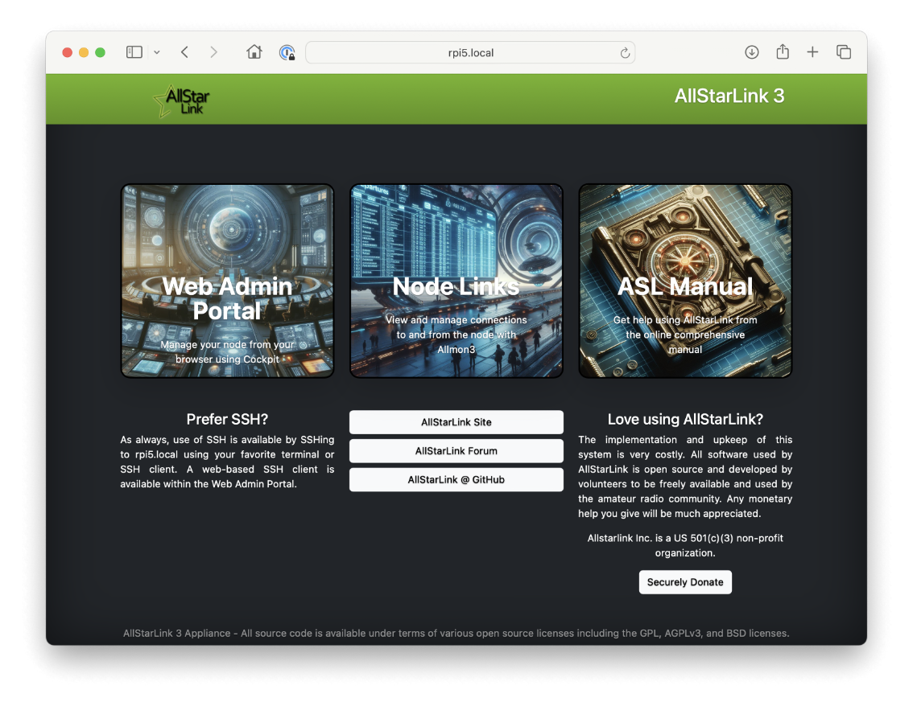

---
hide:
  - navigation
  - toc
---
# Welcome to AllStarLink 3
AllStarLink’s version 3 is the next generation of AllStar repeater and
hotspot software.  This version of AllStar has been redesigned to run
on Asterisk LTS (Long Term Support), the latest Debian Linux operating
system, and modern hardware or virtual machines.

{ width="400" align=right}

The update from Asterisk 1.4 to Asterisk 20 implements over 15 years
of Asterisk bug fixes, security improvements and enhancements.  It brings
with it the latest Asterisk applications, channel drivers and other
functionality. This update required app\_rpt (the Asterisk application
that is AllStar) to be heavily modified. Many memory leaks have been addressed,
modules load or refresh more reliably and many bugs have been squashed. This
all adds up to improved stability and uptime.

As part of this update to Asterisk 20, app\_rpt has been refactored to make the code base
easier to maintain and enhance.  The goal being to make app_rpt accessible to
more developers. The app\_rpt code base will meet all current Asterisk®
coding guidelines.  This process has been going on for over two years and
will continue with continue open source contributions and improvements.

**Supported Hardware & Software**

- Any x86_64/amd64 hardware device
- Any emulated x86_64/amd64 virtual machine
- Any arm64-based device such as Raspberry Pi
- Any emulated arm64 virtual machine
- Debian 12

# New Features

In addition to the app_rpt code update, we've added many new features to
make ASL3 the best AllStar release yet.

- Asterisk runs as non-root for increased security.
- Raspberry Pi image with attractive landing page, system management, service discovery and reduced microSD wear.
- Packages for Debian 12 Bookwork for any platform running x86_64/amd64 and arm64
- Worry free apt updates and upgrades. Linux Kernel updates won't break your node!
- HTTP AllStarLink Registration and DNS IP address resolution with fallback to file.
- USB improvements including live logic view and auto device string discovery.
- Improved menu includes compatibility with user config file edits.
- Access lists modified to individual per node lists with CLI or menu management.
- Configuration templates to simplify edits and menu updates.
- EchoLink code has been extensively reworked to improve stability. Added chats and doubling prevention.

<!--
{ width="100"}
-->

