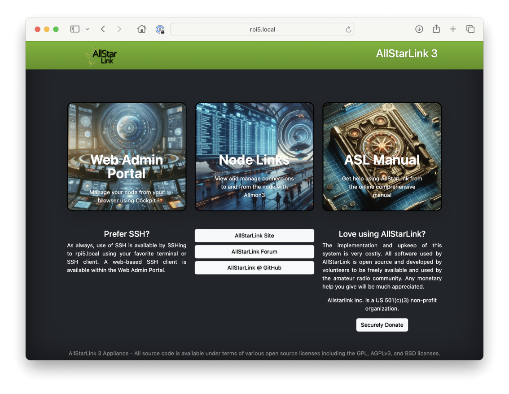

---
hide:
  - navigation
  - toc
---
# Welcome to AllStarLink 3
AllStarLink is a network of Amateur Radio repeaters, remote base stations and hot spots accessible to each other via Voice over Internet Protocol. AllStarLink runs on a dedicated computer that you host at your home, radio site, datacenter, or hosting provider.

{ width=40% align=right }

 AllStarLink is based on the open source Asterisk PBX running our app_rpt application. App_rpt makes Asterisk a powerful system capable of controlling one or more radios. It provides linking of these radio "nodes" to other systems of similar construction anywhere in the world via VoIP.

AllStarLink’s version 3 (ASL3) is the newest generation of AllStarLink repeater and hot spot software. This version of AllStar has been redesigned to run on Asterisk LTS (Long Term Support), the latest Debian Linux operating system, and modern hardware or virtual machines.

**Supported Hardware & Software**

* Any x86_64/amd64 hardware device
* Any emulated x86_64/amd64 virtual machine
* Any arm64-based device such as Raspberry Pi
* Debian 12 or 13

## Manual Navigation
Did you see the "Next" and "Previous" buttons at the bottom of the page? Those will move you forward and back through the various pages in each manual section. At the top of the page, you will find the Navigation Bar, to let you jump to a particular section of the manual. Once you are in a section of the manual, a Table of Contents is provided on the left side of the screen, to let you quickly find the topic you are looking for.

Click the Next button on the bottom of the page to Get Started!

## Upgrading from Legacy ASL1, ASL2, or HamVOIP
Modern AllStarLink has been redesigned to run on the current Asterisk Long Term Support (LTS) version, track the latest supported Debian Linux operating system, and modern hardware or virtual machines.

Moving to the modern platform from ASL1, ASL2, or HamVOIP moves the whole platform light years
foward from Asterisk 1.4 to Asterisk 22. This brings over 15 years of Asterisk bug fixes, security improvements, and enhancements. It brings with it the latest Asterisk applications, channel drivers and additional functionality.

This update required `app_rpt` (the Asterisk application that is AllStar) and it's various modules to be heavily modified. Many memory leaks have been addressed, modules load or refresh more reliably and many bugs have been squashed. This all adds up to improved stability and uptime.

In addition to the many `app_rpt` improvements and fixes, the code base is easier to maintain and enhance. The goal being to make `app_rpt` code accessible to more AllStar developers. Also, the `app_rpt` code base has been modified to meet Asterisk® coding guidelines.

In addition to the `app_rpt` code update, we have added many new features to make ASL3 the best AllStar release yet.

* Asterisk runs as non-root for increased security
* Raspberry Pi image with an attractive landing page, system management, service discovery and reduced microSD wear
* Packages for Debian 12 Bookworm for any platform running x86_64/amd64 and arm64
* Worry free `apt` updates and upgrades. Linux Kernel updates won't break your node!
* HTTP AllStarLink Registration and DNS IP address resolution with fallback to file
* USB improvements including live logic view and auto device string discovery
* Improved menu includes compatibility with user config file edits
* Access lists configurable on a per node basis, with CLI or menu management
* Configuration templates to simplify edits and menu updates
* EchoLink code has been extensively reworked to improve stability. Added chats and doubling prevention

<!--
{ width="100"}
-->

