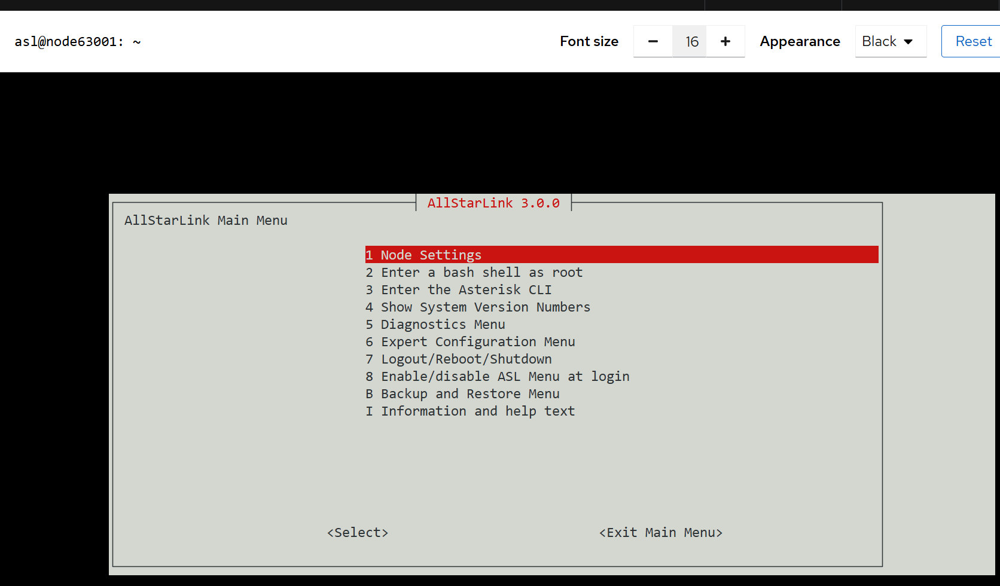

# ASL3 Appliance Installation

!!! danger "Raspberry Pi Imager"
    **You must use the Raspberry Pi Imager,** even if you prefer another imager, and carefully follow the instructions below. Failure to do so will result in a system that won't boot or that you will not be able to login to.

You will install an image on a microSD card and go. This is the simplest install. For most nodes, the menus will walk you through the setup. 

!!! note "SD Card Size"
    A minimum SD card size of 4G is required and it is recommended to use at least an 8G SD card.

## Step-by-Step Pi Appliance Setup
These directions are specific for Windows, but in general should work the same for the same tool set on macOS and Linux. For each screenshot below, click on the image for a larger version.

**NOTE:** For this example, the hostname used shall be `node63001` and the node number is `63001`. Replace "63001" with your node number as you proceed through these directions.

- If you do not already have it installed, install the [Raspberry Pi Imager](https://www.raspberrypi.com/software/)

- Launch **Raspberry Pi Imager** from the start menu

- Click on  **APP OPTIONS**

    {width="400"}

- Click on "Content Repository" **EDIT**

    {width="400"}

- From the "Content Repository" window :
    - Click on **Use custom URL**
    - In the text box, enter **https://rpi.allstarlink.org/latest.json**
    - Click on **APPLY & RESTART**

    {width="400"}

- Choose the type of Raspberry Pi hardware on which AllStarLink 3 Appliance is being installed and click on **NEXT**

    {width="400"}

- Choose the `AllStarLink` operating system and click on **NEXT**

    {width="400"}

- Connect the SD card or the SD card in a USB adapter to the computer.
You should see the media associated with the SD card named something such as "Mass Storage Device USB Device - 16.0 GB".
Click on that entry and then **NEXT**

    {width="400"}

- For "Choose hostname", enter your **hostname** for the device to appear as on the network.
In this example, `node63001` is used.
Unless you have another naming convention for AllStarLink nodes, use the nodeNNNNN format.
Once entered, click on **NEXT**

    {width="400"}

- For "Localisation", enter a **Capital city**, **Time zone**, and **Keyboard layout** for the device.
Once entered, click on **NEXT**

    {width="400"}

- For "Choose username", enter a **Username** and **Password** for the device.
It is recommended to set the username to `asl` if you have no strong feeling about the
username.
Choose a good password and record the password somewhere safe.
**NOTE: There is NO DEFAULT USER for the image.  Failure to set an account will require a re-image of the SD card with the proper settings**
Once entered, click on **NEXT**

    {width="400"}

- For "Choose Wi-Fi", if the device will be connected to Wi-Fi, enter the name of the wireless network in **SSID** and the password for that network in **Password**.
Once entered (or if you will not be using Wi-Fi), click on **NEXT**

    {width="400"}

- For **SSH authentication**, make certain to **Enable SSH**.
Here, you also have the choice of using password or public key authentication.
Once entered, click on **NEXT**

    {width="400"}

- The last step is **Write Image**.
When you click on **NEXT** the application will write the image to the SD card.

    {width="400"}

- Depending on the speed of the computer and the type of SD card, one will have time for a beverage of their choice. When the write is complete, eject the card, remove the card from computer and insert it into the Pi. If using a USB adapter for the SD card, remove the SD card from the adapter and insert the card into the Pi. The Pi *will not* use the SD card in the USB adapter

- Power on the Pi. Wait approximately 2 to 5 minutes for the Pi to boot and perform the various first boot tasks. Depending on the type of a Pi board used, this process could be lengthy. If there is a screen connected to the Pi, it will be noted that Pi will reboot several times. This is normal and expected

- (Optional) Network connectivity may be tested using the command to ping the hostname set in Step 10. For example, if the hostname set was `node63001` then do `ping -4 node63001.local` from a command prompt or PowerShell window. When you get a response, the host is connected to the network

    {width="400"}

- Open the browser on your computer and navigate to `https://nodeNNNNN.local`. In this example the name was `node63001` then one would enter `https://node63001.local`. Your Pi and your computer must be on the same LAN for this to work. Use the IP address rather than the hostname if the Pi is on a remote network or the hostname is unreachable. Depending on your network and browser, one may have to enter the name several times until the page is displayed. The first connection will report a message that "Your connection isn't private". For the Pi appliance, this is acceptable. Click on **Advanced** and then **Continue to node63001.local (unsafe)**. This only must be done the first time

    {width="400"}

- The AllStarLink Launchpad will appear. Clicking on **Web Admin Portal** will take one to the web-based administration portal that includes a web-based SSH client for using [`asl-menu`](../../user-guide/index.md) and other commands. Clicking on **Node Links** will take one to the Allmon3 interface. Clicking on **ASL Manual** will take one
to the top of this manual

    

- To setup the new node, click on **Web Admin Portal**. Similar to Step 20, click **Advanced** and **Continue to node63001.local (unsafe)** to see the logon box. This only must be done the first time. Enter the `username` and `password` configured during the imaging process above. Click **Log in**

    

- The Overview tab is displayed. Using the Web Admin Portal (`Cockpit`) with AllStarLink is [covered in the manual](../../pi/cockpit-get-started.md). At the top,
 click on **Turn on administrative access**

    

    Enter the password again when prompted and click **Authenticate**

    

- The web-based SSH console appears as **Terminal** at the bottom of the left scrollable menu. Click it and an SSH terminal console will appear:

    

The Terminal window is a complete interface to AllStarLink, Asterisk, and more. No SSH client is required although use of SSH directly is fully supported.

## Quick Config via ASL-Menu
The node may now be configured. New users or those wanting a quick start experience should use the [`asl-menu`](../../user-guide/index.md) utility with `sudo asl-menu`.

The menu will appear:

Proceed from here with the **Node Settings** option in order to configure your node number and choose/configure your audio interface. 

## Asterisk Console
To start the asterisk console from the Terminal window enter `sudo asterisk -rv`.

## Software Updates
One should also apply any latest updates and reboot the device as described in [Cockpit Updates](../../pi/cockpit-updates.md).

## Allmon3 Default Login
The default-configured username and password combination is `allmon3 / password`.

**You *must* delete this and add a new one:**

* Launch Web Admin Portal (aka `Cockpit`) by going to `https://node63001.local:9090`
* Open the Terminal
* Type `sudo allmon3-passwd --delete allmon3` to remove the default login
* Type `sudo allmon3-passwd <new user login>` to set the new user login. Type the new password when prompted.
* Type `sudo systemctl restart allmon3` to load the new login.

Details on updating the login(s) and other Allmon3 settings can be found in the [Allmon3](../../allmon3/index.md) section of the manual.

## Logging Out
When finished with the admin system, click on **Session** in the upper right and then choose **Logout**.

## Node Configuration
If you haven't already, the next step is to configure your node settings. YouTuber Freddie Mac has a nice ASL3 installation and configuration video. See [https://youtu.be/aeuj-yI8qrU](https://youtu.be/aeuj-yI8qrU). Also see [ASL3 Menu](../../user-guide/index.md) for details.
