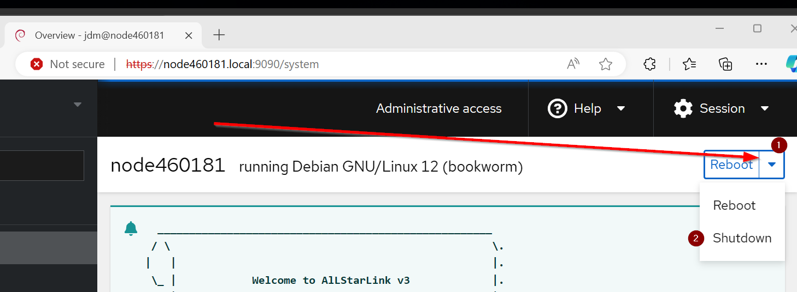
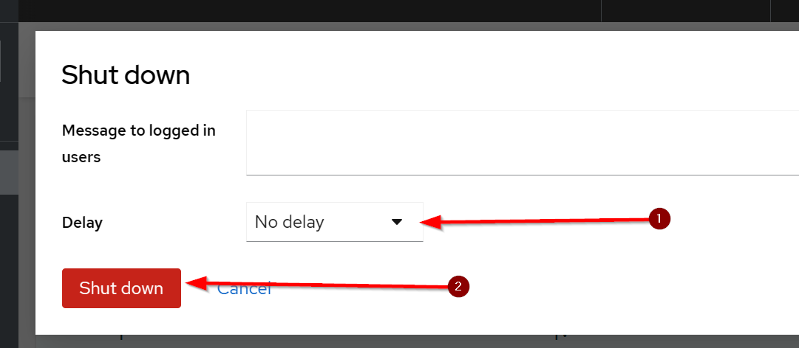
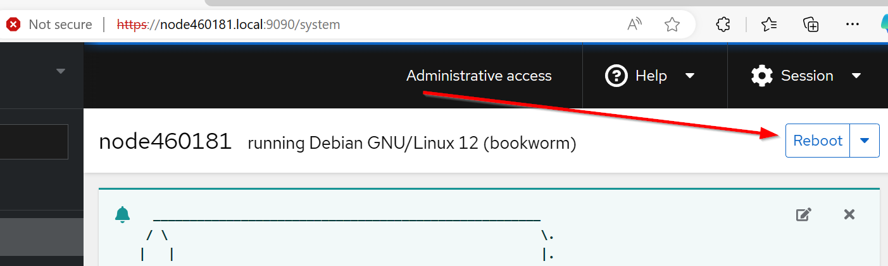
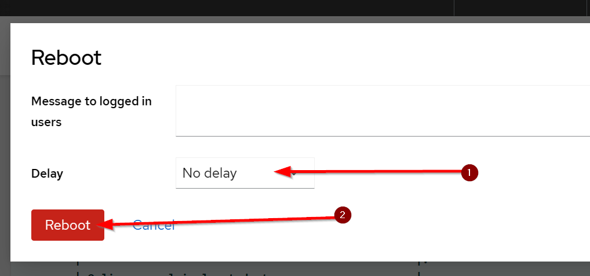

# Cockpit Basics

## What is the Cockpit Web Console?
The `Cockpit` web console is a web-based interface designed for managing and monitoring your AllStarLink Pi Appliance.

The `Cockpit` web console enables you to perform a wide range of administration tasks, including:

* Managing AllStarLink, Asterisk, and its related applications
* Managing services
* Managing user accounts
* Managing and monitoring system services
* Configuring network interfaces
* Reviewing system logs
* Updating software  

The `Cockpit` web console uses the same system concepts as you would use in a terminal, and actions performed in a terminal are immediately reflected in the `Cockpit` web console. That is to say, you can use `Cockpit` and an SSH connection interchangeably as you desire.

You can monitor the logs of application. In addition, you can change the settings directly in the web console or through the terminal. 

Throughout this documentation a host named `node63001.local` is used as the example host. Substitute that name with your own node's name as it was set during the imaging process.

## Logging In to the Web Console
1. In your web browser, enter the following address to access the web console: `https://node63001.local:9090`

2. The browser may display a warning. Accept the security exception to proceed with the login

    

3. Enter the username and password set during the imaging process

    

4. Click **Log In**

## Administrative Access
The web console has a concept of Administrative access. While it does remember the access level across logins, to access certain functions you may need to enable Administrative access from Limited access.

To do that:

1. Click on the bar marked **Limited Access** to enable admin-level access.

    
    You may be prompted to to enter the password again. Do so and then click **Authenticate**
    

2. Click **Close** on the box reporting administrative access has been granted.

## Shutting Down the Appliance
You can use the web console to shut down the system.

1.  Log into the web console.

2. (optional) Click on the bar marked **Limited Access** to enable admin-level access.

    

3. (optional) Click **Close** on the box reporting administrative access has been granted.

4. Click on the downward arrow next to Reboot and then select **Shutdown**

    

5. Change the __Delay__ dropdown to **No delay** and click **Shut down**

    

6. A **Disconnected** message will appear. The node will shutdown is about 15-30 seconds, after which power may be removed.

## Rebooting the Appliance
1. Log into the web console.

2. (optional) Click on the bar marked **Limited Access** to enable admin-level access.

    

3. (optional) Click **Close** on the box reporting administrative access has been granted.

4. Click on Reboot

    

5. Change the __Delay__ dropdown to **No delay** and click **Reboot**

    

6. A **Disconnected** message will appear. The node will reboot and be available again in about 15-30 seconds. After that, one can click **Reconnect**.

## Configuring Time on the Appliance
In general, the appliance should be left in the default setting of using the NTP service to automatically set the time. However, you may want to change the timezone. To change the time:

1. Log into the web console.

2. (optional) Click on the bar marked **Limited Access** to enable admin-level access.

    

3. (optional) Click **Close** on the box reporting administrative access has been granted.

4. Click on Overview and scroll down to **Configuration**

5. Click on highlighted time next to **System time**

6. Change the **Time zone** drop-down to the desired zone.

7. Click **Change**.
___
**NOTE:** Some content copied from 
[__Managing systems using the RHEL9 web console__](https://access.redhat.com/documentation/en-us/red_hat_enterprise_linux/9/html/managing_systems_using_the_rhel_9_web_console/index) which is released under the Creative Commons Attribution–Share Alike 3.0 Unported license ("CC-BY-SA")
