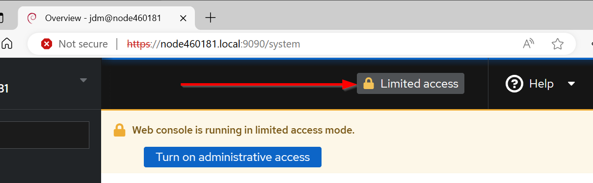
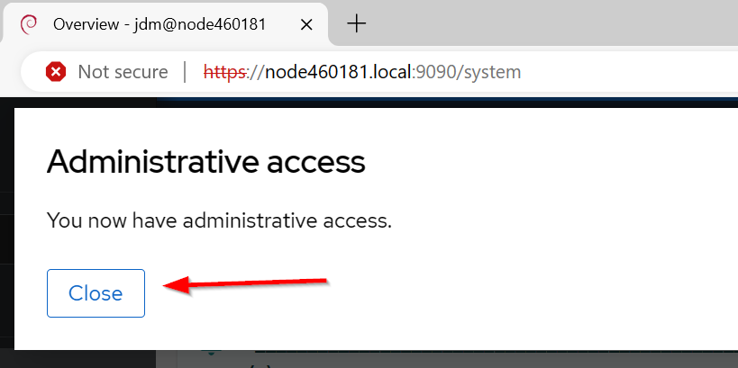

# Cockpit Basics
The Cockpit web console is a web-based graphical interface
By using it, you can perform system administration tasks,
such as inspecting and controlling services, managing storage,
configuring networks, analyzing network issues, and inspecting logs. 
Of course, it's also very handy for administering Asterisk on
your AllStarLink Pi Appliance!

# What is the Cockpit Console
What is the Cockpit Console

The Cockpit Console is a web-based interface designed for managing and monitoring your
AllStarLink Pi Appliance.

The Cockpit Console enables you to perform a wide range of administration tasks, including:

    Managing AllStarLink, Asterisk, and its related applications
    Managing services
    Managing user accounts
    Managing and monitoring system services
    Configuring network interfaces
    Reviewing system logs
    Updating software
    

The Cockpit Console uses the same system concepts as you would use in a
terminal, and actions performed in a terminal are immediately reflected
in the Cockpit Console. That is to say, you can use Cockpit and
an SSH connection interchangeably at your desire.

You can monitor the logs of application. In addition, you can change the
settings directly in the web console or through the terminal. 

Throughout this documentation a host named `node460181.local` is used as
the example host. Substitute that name with your own node's name as it 
was set during the imaging process.

# Logging In to the Web Console
1. In your web browser, enter the following address to access the web console:
    https://node460181.local:9090

2. The browser may display a warning. Accept the security exception to
proceed with the login.

3. Enter the username and password set during the imaging process.

3. Click **Log In**. 

# Administrative Access
The Web Console has a concept of Administrative access. While it does
remember the access level across logins, to access certain functions
you may need to enable Administrative access from Limited access.
Do do that:

1. Click on the bar marked **Limited Access** to enable admin-level
access.

2. Click **Close** on the box reporting administrative
access has been granted.

# Shutting Down the Appliance
You can use the web console to shut down the system.

1.  Log into the Web Console.

2. (optional) Click on the bar marked **Limited Access** to enable admin-level
access.

3. (optional) Click **Close** on the box reporting administrative
access has been granted.

4. Click on the downward arrow next to Reboot and then
select **Shutdown**

5. Change the __Delay__ dropdown to **No delay** and click **Shut down**

6. A **Disconnected** message will appear. The node will shutdown
is about 15-30 seconds, after which power may be removed.

# Rebooting the Appliance
1. Log into the Web Console.

2. (optional) Click on the bar marked **Limited Access** to enable admin-level
access.

3. (optional) Click **Close** on the box reporting administrative
access has been granted.

4. Click on Reboot

5. Change the __Delay__ dropdown to **No delay** and click **Reboot**

6. A **Disconnected** message will appear. The node will reboot and
be available again in about 15-30 seconds. After that, one can click
**Reconnect**.

# Configuring Time on the Appliance
In general, the appliance should be left in the default setting of using
the NTP service to automatically set the time. However you may want
to change the Timezone. To change the time:

1. Log into the Web Console.

2. (optional) Click on the bar marked **Limited Access** to enable admin-level
access.

3. (optional) Click **Close** on the box reporting administrative
access has been granted.

4. Click on Overview and scroll down to **Configuration**

5. Click on highlighted time next to **System time**

6. Change the **Time zone** drop-down to the desired zone.

7. Click **Change**.
___
Note: Some content copied from 
[__Managing systems using the RHEL9 web console__](https://access.redhat.com/documentation/en-us/red_hat_enterprise_linux/9/html/managing_systems_using_the_rhel_9_web_console/index)
which is released under the Creative Commons Attribution–Share Alike 3.0
Unported license ("CC-BY-SA")/
