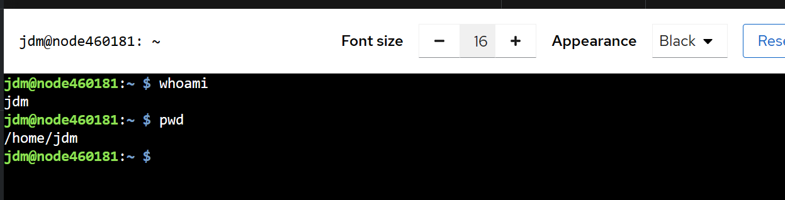
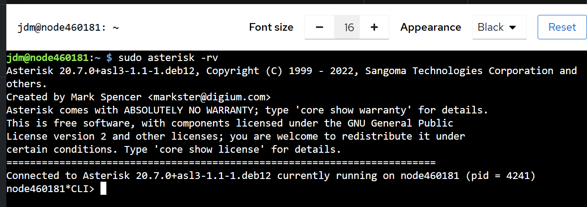
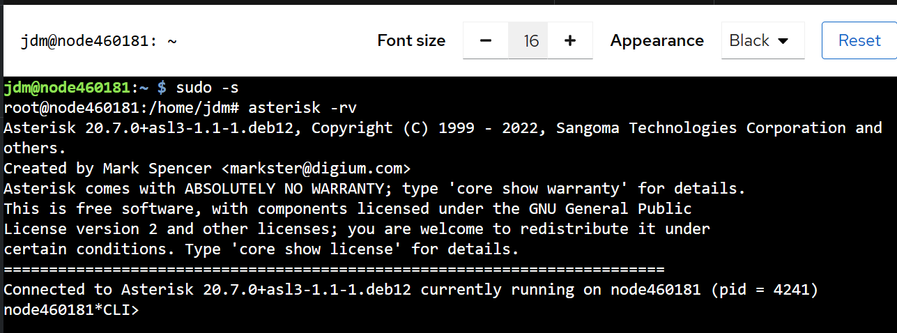

# Terminal / Console
The `Cockpit` web console provides a feature-complete terminal interface in the web browser without requiring setup and configuration of an SSH client. This allows administration of the node from anywhere!

Use of the web console Terminal and an SSH client is fully interactive and interchangeable.

1. Log in to the web console with administrator privileges. For details, see [Cockpit Basics](cockpit-basics.md)

2. Click **Terminal** in the web console menu on the left

3. You will be connected to a terminal of the user that you logged in with

    

4. To execute commands as root, either prefix the command with `sudo`:

      

5. One can enter a root session completely by issuing the command `sudo -s`:

      

___
**NOTE:** Some content copied from 
[__Managing systems using the RHEL9 web console__](https://access.redhat.com/documentation/en-us/red_hat_enterprise_linux/9/html/managing_systems_using_the_rhel_9_web_console/index) which is released under the Creative Commons Attribution–Share Alike 3.0 Unported license ("CC-BY-SA")