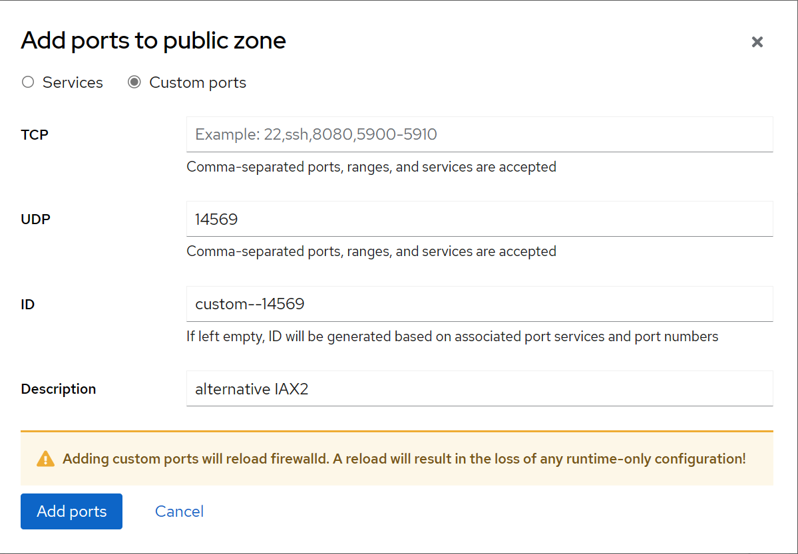
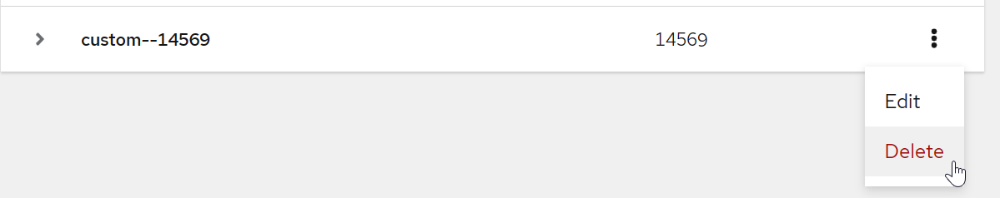
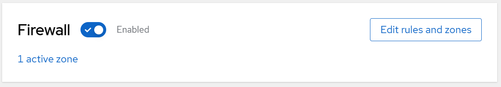
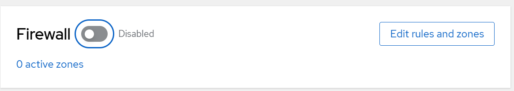

# Managing the Firewall
A firewall is a way to protect nodes from any unwanted traffic. It enables users to control incoming network traffic on host machines by defining a set of firewall rules. These rules are used to sort the incoming traffic and either block it or allow it through. 

In the AllStarLink Pi Appliance, the `firewalld` service with the `nftables` backend functions as the firewall. Through the web console, you can configure `firewalld`. 

# Adding an Inbound Port
The firewall is enabled by default with a reasonable set of default rules. The most common reasons to edit the port list would be to change the IAX2 port to be outside the range of `4560-4580` (default is `4569`) or to change the VOTER port (default `1667` in ASL3, you might need `667` for [legacy reasons](../adv-topics/incompatibles.md#voterrtcm-default-port)).

1. Log in to the web console with administrator privileges. For details, see [Cockpit Basics](cockpit-basics.md)

2. Click **Networking** in the web console menu on the left

3. Click **Edit rules and zones** in the **Firewall** panel

4. Click **Custom ports**

5. Enter the TCP or UDP port or ports to be permitted in the **TCP** or **UDP** fields respectively. Multiple ports can be separated with commands and a range of ports can be specified with a hyphen. It is highly suggested to include a Description for the port. For example, if adding an alternative IAX2 port on `14569`:

      

6. Click **Add ports**

7. The change is immediate.

# Removing an Inbound Port
The firewall is enabled by default with a reasonable set of default rules. If you need to remove a port from the rules list:

1. Log in to the web console with administrator privileges. For details, see [Cockpit Basics](cockpit-basics.md)

2. Click **Networking** in the web console menu on the left

3. Click **Edit rules and zones** in the **Firewall** panel

4. Next to the service to delete, click on the three vertical dots and select **Delete** 

      

5. The change is immediate.

# Enabling and Disabling
The firewall is enabled by default with a reasonable set of default rules. Unless you are familiar with networking, DO NOT disable the firewall or make changes to it. If, for some reason, you need to disable/enable the firewall manually:

1. Log in to the web console with administrator privileges. For details, see [Cockpit Basics](cockpit-basics.md)

2. Click **Networking** in the web console menu on the left

3. To enable the firewall, slide the toggle to the right. This is the default setting and should not be changes unless you're 100% sure of what you are doing
      
      

4. To disable the firewall, slide the toggle to the left. Do not disable the firewall unless you're 100% sure of what you are doing

      
___
**NOTE:** Some content copied from 
[__Managing systems using the RHEL9 web console__](https://access.redhat.com/documentation/en-us/red_hat_enterprise_linux/9/html/managing_systems_using_the_rhel_9_web_console/index) which is released under the Creative Commons Attribution–Share Alike 3.0 Unported license ("CC-BY-SA")