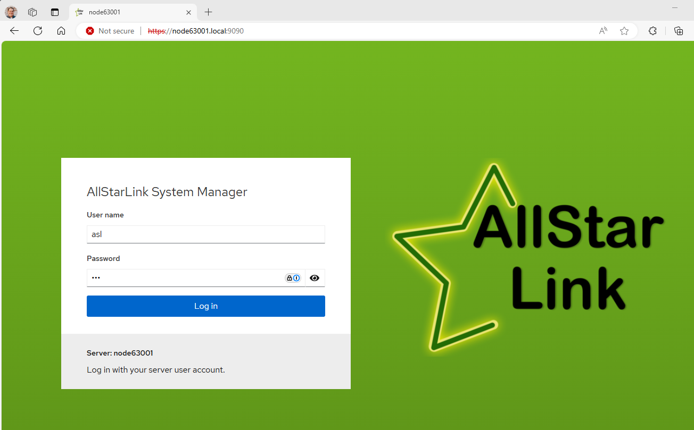

# Cockpit Web Admin Interface
The AllStarLink Pi Appliance includes the user-friendly `Cockpit` system for ease of administration. `Cockpit` is accessed on port `9090` of the appliance. In these examples the hostname `node63001` is used and should be replaced with the name you set during setup. If the name `node63001` was used at setup, then pointing a browser to `https://node63001.local:9090/` will bring up the `Cockpit` interface. 

**NOTE:** The hostname only works when your node and your PC are on the same LAN. Otherwise, use the IP or DNS name you assigned. Login is the `username` and `password` that was setup during the Pi imaging process.

The first connection will report a message that "Your connection isn't private". For the Pi appliance, this is acceptable. Click on **Advanced** and then
**Continue to node63001.local (unsafe)**. This only must be done the first time.

Enter the `username` and `password` configured during the imaging process above. Click **Log in**

`Cockpit` is fairly intuitive to use, the rest of this section will cover different features of the `Cockpit` console in further detail.