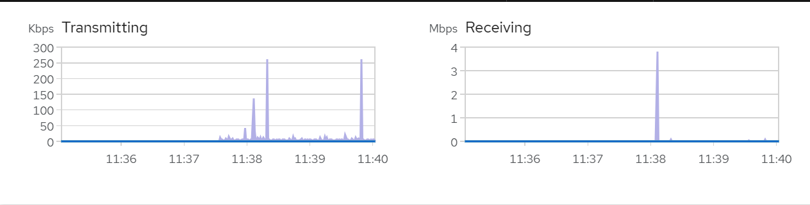
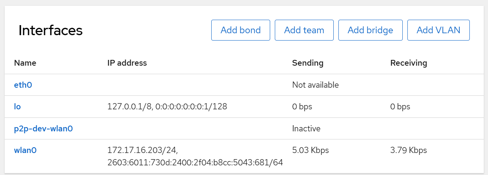
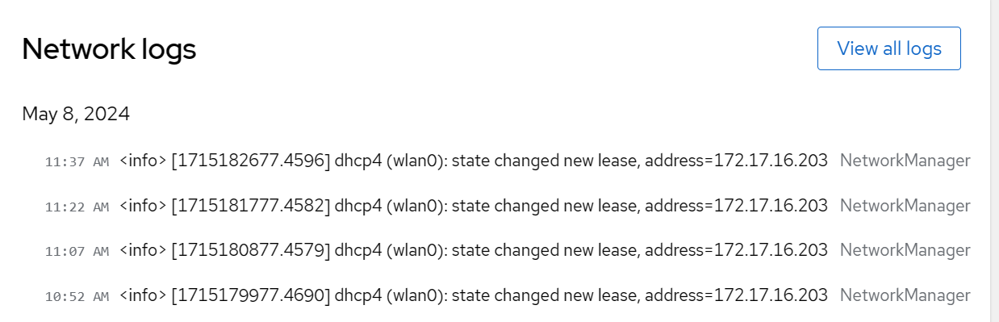
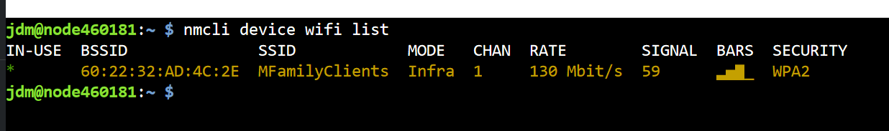

# Network Configuration
The Networking system tool in the web console permits viewing the status of the network as well as making network configuration changes to the appliance.

## Observing Network Status and Configuration
1. Log in to the web console with administrator privileges. For details, see [Cockpit Basics](cockpit-basics.md)

2. Click **Networking** in the web console menu on the left

3. At the top of the screen will be the network data statistics for transmitted and receiving network traffic. This information can be helpful if there are questions about network bandwidth utilization:

      

4. The next panel down shows the current configuration of the present network adapters:

    

5. Finally, at the bottom is the logs about the current state of the network:

    

## Changing Adapter Settings
1. Log in to the web console with administrator privileges. For details, see [Cockpit Basics](cockpit-basics.md)

2. Click **Networking** in the web console menu on the left

3. Scroll down to the **Interfaces** section

4. Click on the **Name** of the interface

5. Make desired changes

6. Changes take place immediately. Be cautious when changing IP addressing because you may accidentally remove your ability to access to the console.

## Changing WiFi Settings
Unfortunately, `Cockpit` does not have an interface for managing WiFi networks with in it. Currently WiFi network changes must be made from the web console Terminal screen.

### Listing Existing WiFi Networks
List the existing WiFi network(s) with `nmcli device wifi list`:



### Add a WiFi Network
1. Log in to the web console with administrator privileges. For details, see [Cockpit Basics](cockpit-basics.md)

2. Click **Terminal** in the web console menu on the left

3. At the prompt enter the command:

    ```  
    nmcli device wifi connect MYNETWORK password MYPASSWORD
    ```

    where `MYNETWORK` is the name ("SSID") and `MYPASSWORD` is the password ("Key"). To join the network `RadioSite` with the password `RF1234`:

    ```
    nmcli device wifi connect RadioSite password RF1234
    ```

    If there is a space in the name or password, you must use quotes around the element with the space in it.

4. If the network is not currently active (i.e. adding a network where the appliance will be in the future) or the SSID is hidden, adding is slightly more complicated. Again, substitute `MYNETWORK` and `MYPASSWORD` with as appropriate.

    ```
    nmcli conn add type wifi con-name MYNETWORK ifname wlan0 ssid MYPASSWORD
    nmcli conn modify MYNETWORK wifi-sec.key-mgmt wpa-psk wifi-sec.psk MYPASSWORD
    ```

**NOTE:** DO NOT use the `raspi-config` tool to attempt to set the Wifi network and
password. This will break the appliance's networking.

___
**NOTE:** Some content copied from 
[__Managing systems using the RHEL9 web console__](https://access.redhat.com/documentation/en-us/red_hat_enterprise_linux/9/html/managing_systems_using_the_rhel_9_web_console/index) which is released under the Creative Commons Attribution–Share Alike 3.0 Unported license ("CC-BY-SA")
