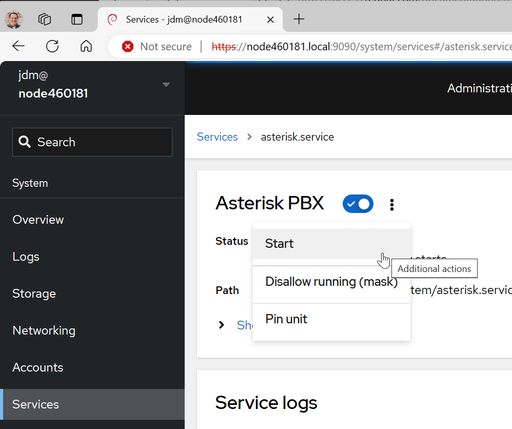
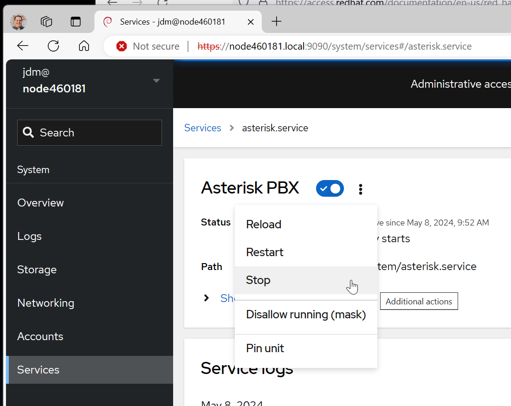
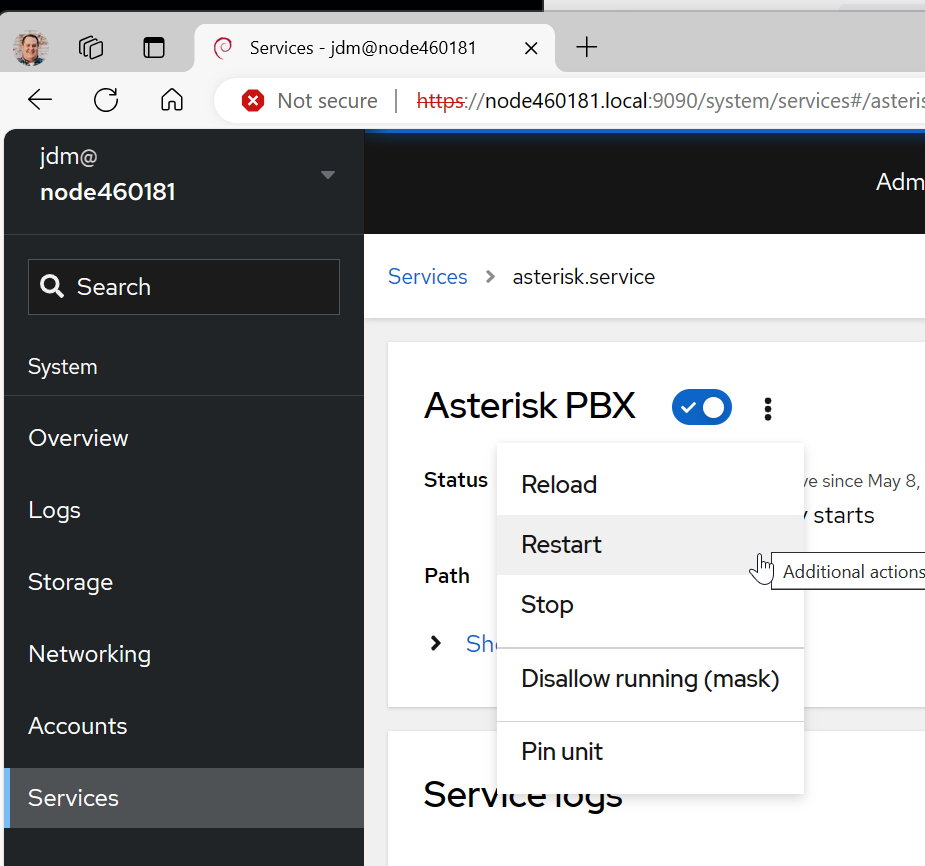

# Services Management
The Cockpit Web Console allows the management of all of the
running services. You can activate or deactivate services,
restart or reload them, or manage their automatic startup.

# Start, Stop, and Restart Services
This procedure stops or starts system services using the web console interface.
You can filter the services by name or description and also by
Enabled, Disabled, or Static automatic startup. The interface shows the
current state of the service and its recent logs.

1. Log in to the web console with administrator privileges.
   For details, see [Cockpit Basics](cockpit-basics.md).

2. Click Services in the web console menu on the left. The default
tab for Services is System Services. If you want to manage targets,
sockets, timers, or paths, switch to the respective tab in the menu on top.
To open service settings, click on a selected service from the list.
You can tell which services are active or inactive by checking the State column.

3. To start an inactive service, click the Start button.

4. To deactivate an active service, click the Stop button

5. To restart a service, click the Restart button

# Seeing Status and Recent Logs of a Service
This procedure stops or starts system services using the web console interface.
You can filter the services by name or description and also by
Enabled, Disabled, or Static automatic startup. The interface shows the
current state of the service and its recent logs.

1. Log in to the web console with administrator privileges.
   For details, see [Cockpit Basics](cockpit-basics.md).

2. Click Services in the web console menu on the left. The default
tab for Services is System Services. If you want to manage targets,
sockets, timers, or paths, switch to the respective tab in the menu on top.
To open service settings, click on a selected service from the list.
You can tell which services are active or inactive by checking the State column.

3. Scroll down to see **Service logs**. The botton **View All Logs** can
be clicked to review an extensive output of the service's logs.

___
Note: Some content copied from 
[__Managing systems using the RHEL9 web console__](https://access.redhat.com/documentation/en-us/red_hat_enterprise_linux/9/html/managing_systems_using_the_rhel_9_web_console/index)
which is released under the Creative Commons Attribution–Share Alike 3.0
Unported license ("CC-BY-SA")