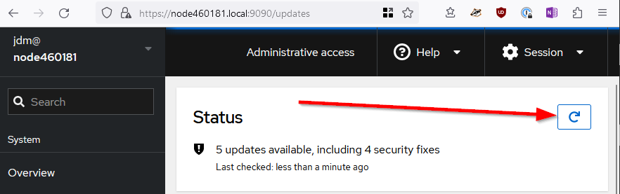
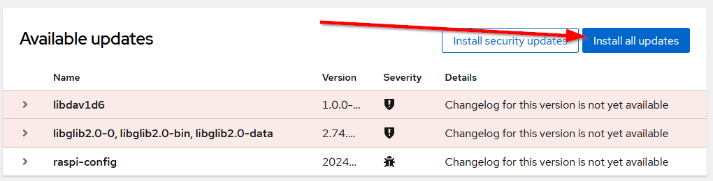
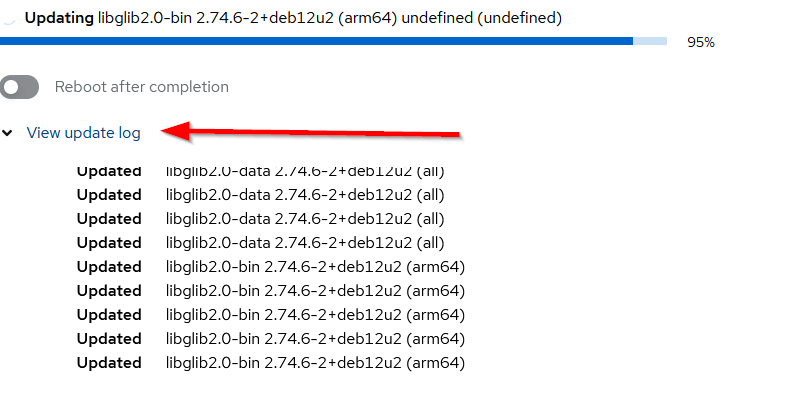
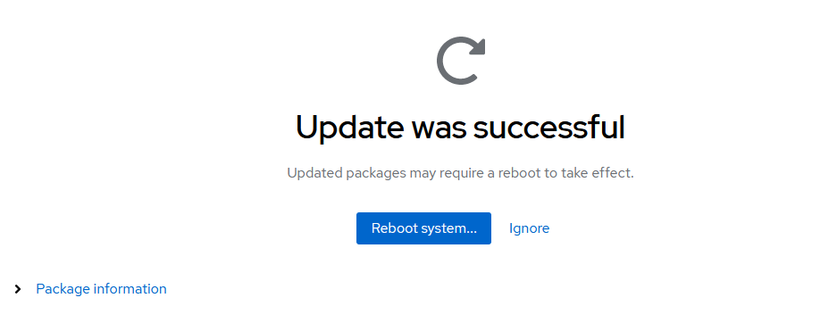

# Software Updates
The Software updates tool in the web console is how to install package updates to the AlLStarLink Pi appliance. This includes updating AllStarLink software and its associated
items.

# Checking For and Installing Updates
1. Log in to the web console with administrator privileges. For details, see [Cockpit Basics](cockpit-basics.md)

2. Click **Software Updates** in the web console menu on the left

3. Click on the cycle icon in the upper right of the panel

      

4. Available updates will be displayed. Click on **Install all updates**

      

5. The updates will start. Depending on the quantity of updates, the speed of the Pi hardware, and how long certain installs take, this may take quite a while to complete. For example, if there is a Linux kernel update, then the DAHDI package will be recompiled for the new kernel which can take up to 10 minutes. Be patient while updates run. You can observe the updates by clicking on **View update log**

      

6. When the updates are complete, you will be prompted to reboot the system. In general, it is advised to reboot the system after updates, however that is not necessarily required for most updates. Kernel updates and DAHDI updates DO require a reboot

      

7. After the updates are completed, returning to the **Software Updates** screen should show that the software is up to date

      
