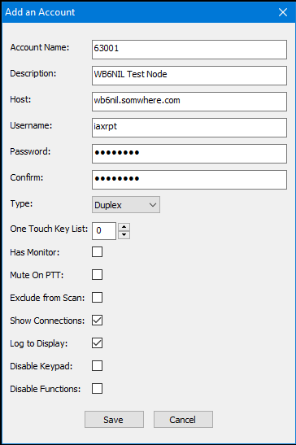
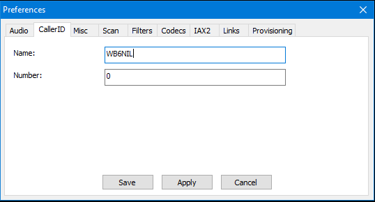
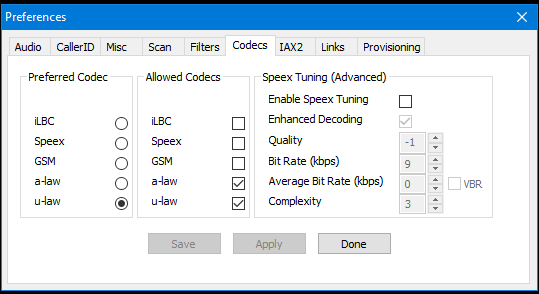

# External Applications
There are a number of different applications that can be used to interact/connect to the AllStarLink Network. As ASL3 runs Asterisk at its core, there are a number of different ways to leverage IAX and SIP connections to connect to your node.

This section will explain some of the common utilities available, and how to do basic configuration to get them to connect to your node.

## Authenticating Connections to AllStarLink
There are generally three ways to authenticate when connecting to an AllStarLink node:

1. Registration based authentication. When nodes come online, they attempt to register themselves with the ASL Registration system. The registration request uses either HTTP or IAX, and the registration server validates the node credentials and saves the current IP address of the node. Other nodes query the registration database using DNS queries or look at the node information from a downloaded copy of the nodes database to find the IP address and port to connect to the desired target node. When a connection is initiated to a target node, the target node uses the `[radio-secure]` context in `extensions.conf` to process the incoming connection.

2. IAX local authentication. In this scheme, an IAX client presents a username and password that must match credentials that are configured *on the remote node* in the ASL config files (`iax.conf` or `custom/iax.conf`). If the credentials match, the client is authenticated and may connect. This often uses `[iaxrpt]` and/or `[iax-client]` in `extensions.conf` to process the connection. See the [Node Configuration](#node-configuration) section below for how to configure a node.

3. IAX “allstar-public” authentication. Also called “Web Transceiver”, this is a variation on the username and password above. However, instead of the individual user credentials being stored locally in the ASL config files, the IAX client logs in to the allstarlink.org website and obtains a token. Then, when the client connects to a node, it presents the user’s callsign and token. The node will query allstarlink.org to see if the credentials are valid. If the query is successful, the client is authenticated and may connect. This requires Web Transceiver connections to be allowed in Node Settings on the Web Portal, and uses the `[allstar-public]` context in `extensions.conf` to process the connection.

Many of the utilities below can be configured to use methods 2 or 3 to authenticate (method 1 is strictly for node-to-node connections, except DVSM in "Node Mode").

## Web Transceiver
Before getting into the details of each application, we should discuss some of the workings "under the hood". Specifically, looking at, "how do phone apps like “RepeaterPhone” actually work?".

Here is a post from the [AllStarLink Community](https://community.allstarlink.org) that sums up a lot of the common questions about Web Transceiver access:

    I have some friends with iPhones that are connecting in with an app called “RepeaterPhone”. 
    They just plug in their allstarlink.org main admin account credentials and it “just works”. 
    I do not have an iPhone myself to test or understand this.
    
    How does it actually gain access to nodes like it does?
    
    Also, it shows up in the AllStar Network as “CALLSIGN” and not a node number.
    
    It does not appear to be using IAX2 directly like any other node. 
    I can only assume this is using some kind of cloud broker provided by the app provider, 
    or something, and connecting on it’s behalf?

    Or, is there another path into the AllStar Network I’m not familiar with?

    How is it that they are presenting as a callsign instead of a node number?

    I would expect any app like this would normally need to register as a “normal node” 
    and follow those rules, but this appears to be something different, and users are not 
    setting these up as a normal node… They are simply plugging in their main allstarlink.org credentials.

The following information should (hopefully) answer many of the questions above.

[RepeaterPhone](https://repeaterphone.com/) for iOS, [Transceive](https://transceive.app/) for macOS, [DVSwitch Mobile](https://play.google.com/store/apps/details?id=org.dvswitch&hl=en_CA&pli=1) for Android (using "WT Mode"), and the [SharkRF M1KE](https://www.sharkrf.com/products/m1ke/) (using "AllStarLink" mode) use the "Web Transceiver" functionality of the AllStarLink Network. This is still IAX2, but a different context.

The original Web Transceiver (WT) was a Java applet that one could use from the AllStarLink website to call nodes directly. That feature itself has been deprecated, but the background technology still exists, and is leveraged for other applications.

Using this method, you are issued a token by [allstarlink.org](https://www.allstarlink.org/portal) when you login to the Web Portal with your credentials (ie. through one of the applications above). An unauthenticated call is placed to a node in the `[allstar-public]` context in `extensions.conf`, which has as part of its dialplan, a mechanism for verifying that the token for the incoming CallerID (the callsign) is valid. If it is, it lets the call through and connects the application to the node. If it can’t validate, then it hangs up.

***This doesn’t require a node number***, as the call isn’t being directed to `[radio-secure]`, it just requires an account on [allstarlink.org](https://www.allstarlink.org/portal). **READ THAT AGAIN.** If you are strictly using these applications to connect to other nodes, you **DO NOT** need to register for a node number, but you **DO** need to create an account in the Web Portal.

!!! note "Connecting to Real Nodes"
    As noted above, while you don't need a node number assigned to use these applications in Web Transceiver mode, you can only connect to real nodes (node numbers) that are actively registered with the AllStarLink Network. When the application makes its query to the AllStarLink severs, the node number needs to resolve to an active and reachable node in order for the connection to be successful.

There are downsides to this, as not all node owners, particularly some larger networks, have `[allstar-public]` enabled on their nodes. This is often disabled by commenting out or deleting the entire `[allstar-public]` context in `extensions.conf`, or it can be handled more gracefully in one of a few different ways (including disabling Web Transceiver Access in the `Node Settings` in the Web Portal).

!!! note "DVSwitch Mobile"
    DVSwitch Mobile does have a method called *Node Mode*, which registers as its own node number.

!!! note "SharkRF M1KE"
    SharkRF refers to connecting via this method as "AllStarLink Mode" in some of their documentation. It is, in fact, actually using "Web Transceiver" mode.

### Web Transceiver Node Settings
If you are a node owner, and you wish to allow these applications to connect to your node via the Web Transceiver method, you need to ensure that it is enabled in your `Node Settings` in the Web Portal.

See [Editing Node Parameters](../basics/portal.md#editing-node-parameters) for more information on how to find this setting.

You should also confirm that you have an `[allsta-public]` context in `extensions.conf`, and that it isn't commented out (it should be there and active, unless you've previously made changes).

## RepeaterPhone
[RepeaterPhone](https://repeaterphone.com/) for iOS can be used to connect to AllStarLink nodes.

Be sure to read their [FAQs](https://repeaterphone.com/pages/faq.html).

Detailed steps to configure RepeaterPhone:

1. Purchase and Install: Obtain the RepeaterPhone app from the Apple App Store. 

2. Access Settings: Open the app and tap the Settings gear wheel. 

3. Add AllStarLink Account:
    * Tap "New Account" and then select the AllStarLink emblem. 
    * Enter your AllStarLink callsign and password (used for logging into the AllStarLink portal). 
    * Tap "Add Account". 

4. Add Nodes to Favorites:
    * Go to the Favorites section (star icon). 
    * Tap the "+" symbol to add a new node. 
    * Choose your AllStarLink username. 
    * Enter the node number of the desired AllStarLink node. 
    * Give the node a name (e.g., its callsign). 
    * For Authentication, select "Account" to use your AllStarLink account (configured in Step 3). 

5. Connect and Use: 
    * Once you've added nodes to your favorites, you can connect to them by selecting them and tapping "Connect". You'll transmit by holding down the green circle, and you can adjust microphone gain and speaker/non-speaker mode using the provided icons. 

!!! note "Node Authentication"
    RepeaterPhone supports different authentication methods. You can choose between "Account" (using your AllStarLink web portal credentials) or "Node" authentication (using an IAX username and password provided to you by the node owner). 


## Transceive
[Transceive](https://transceive.app/) for macOS can be used to connect to AllStarLink nodes.

Be sure to read their [Help](https://transceive.app/help/) section.

For detailed steps to configure Transceive, see their page on [Setup](https://transceive.app/help/setup).

!!! note "Node Authentication"
    Transceive supports different authentication methods. You can choose between "Authenticate with an AllStar Account" (using your AllStarLink web portal credentials) or "Use Node Specific Credentials" authentication (using an IAX username and password provided to you by the node owner). 

## DVSwitch Mobile
[DVSwitch Mobile](https://play.google.com/store/apps/details?id=org.dvswitch&hl=en_CA&pli=1) for Android can be used to connect to AllStarLink nodes.

For support, see their [Support Forum](https://dvswitch.groups.io/g/Mobile), they also have a [Support Wiki](https://dvswitch.groups.io/g/Mobile/wiki).

!!! note "Node Authentication"
    DVSwitch Mobile (DVSM) supports different authentication methods. You can choose between "Web Transceiver" mode (using your AllStarLink web portal credentials), "IAXRpt" mode (using an IAX username and password provided to you by the node owner), or "Node" mode (where DVSwitch Mobile configures itself as a real node). 

### Web Transceiver Mode
When used in this mode, DVSM requires the user to have an account on the [AllStarLink Portal](https://www.allstarlink.org/portal), but you do NOT need to apply for a node number.

Why use this mode?

* Quickest way to connect to the AllStarLink Network

* Only requires a valid account on the [AllStarLink Portal](https://www.allstarlink.org/portal)

Disadvantages to this mode?

* Requires setting up and authenticating an account on the [AllStarLink Portal](https://www.allstarlink.org/portal)

* Not all nodes allow the Web Transceiver authentication method (many systems specifically block it on purpose)


To use Web Transceiver Mode:

* From the main Dialer screen in DVSM, press and hold the "D" button

* If this your first time using WT mode, press "WT Setup"

    * Put your AllStarLink Portal username and password in the appropriate boxes
    * Press "Update Token"
    * If successful, the dot to the left of the Update Token button should turn green
    * Press "Save"

* Otherwise, press "Enter WT Mode"

You will return to the dialer screen, and you should see the mode in the lower part of the screen (under the "More" button) change to "ASL-WT".

You can now dial any node that supports Web Transceiver.

To see if the node you want to connect to supports Web Transceiver, press and hold the "D" button. In the menu that pops up, press "Extended ASL Lookup". Put in the node number in the "Node Number" box, and press the magnifying glass to query the system. Check and see if the result indicates, "WT Enabled: True".


To exit Web Transceiver Mode:

* From the main Dialer screen in DVSM, press and hold the "D" button

* Press "Exit WT Mode"

You will return to the dialer screen, and you should see the mode in the lower part of the screen (under the "More" button) change to "ASL-RADIO".

### IAXRpt Mode
When used in this mode, DVSM requires the user to have received a username and password (aka secret) from the node owner who's node you wish to connect to (and that node owner needs to configure `iax.conf` with the same credentials to allow authentication, see [Node Configuration](#node-configuration) below).

Why use this mode?

* Node owners can specifically allow users (ie. club members) to connect to their nodes, while still blocking general Web Transceiver access

* Bypasses allow/deny lists that may be in use for controlling node access (since the user is authenticated with a pre-configured username and password)

Disadvantages to this mode?

* More complicated to setup as it requires node owners to configure/assign user credentials on their node(s)

* User credentials only apply to a particular node (or possibly nodes under the control of the same administrator)


To use IAXRpt Mode:

* Obtain the following from the node operator of the system you wish to connect to:

    * Hostname of their AllStarLink server
    * IAX Port of their AllStarLink server (often 4569)
    * Your assigned username
    * Your assigned password (aka secret)

* Press "Accounts" at the top of the screen

* Press any empty account slot

* Fill in the following:

    Setting|Value
    -------|-----
    Protocol:|`IAX2`
    Hostname:|Hostname of the remote AllStarLink server
    Port:|IAX port of the remote AllStarLink server (often 4569)
    Username:|Username (supplied by the node owner)
    Password:|Password (supplied by the node owner)
    CallerID:|Your callsign
    Caller Number:|Must be `0`
    Node:|Node number of the node you are connecting to
    Phone Mode:|`checked`
    Public Authentication:|`not checked`
    Auto Connect:|`not checked`

* Save your settings, and this account will be selected, and should try and register

* When you return to the dialer screen, you should see the mode in the lower part of the screen (under the "More" button) change to "ASL-PHONE".

* Press the "Connect" button, and you should be connected to the target node, and see the status change in the lower part of the screen to show the target node.

### Node Mode
When used in this mode, DVSM requires the user to have an account on the [AllStarLink Portal](https://www.allstarlink.org/portal), AND have a node number assigned to them associated with that account. In this mode, DVSM is configured such that it registers with the AllStarLink registration servers as that assigned node.

Why use this mode?

* Makes your application appear as a node on the AllStarLink Network, using existing node authentication methods
* Does not require node owners to assign specific credentials to users
* Does not rely on the Web Transceiver method being enabled on nodes

Disadvantages to this mode?

* More complicated to setup, as you need to register for a node number in addition to creating an [AllStarLink Portal](https://www.allstarlink.org/portal) account
* Connections to nodes are subject to allow/deny lists on the remote system, which could prevent connections


To use Node Mode:

* Login to the [AllStarLink Portal](https://www.allstarlink.org/portal), go to `Node Settings` and get the following:

    * Your node number
    * Your node password (hover your mouse over the password field to see it)

* Press "Accounts" at the top of the screen in DVSM

* Press any empty account slot

* Fill in the following:

    Setting|Value
    -------|-----
    Protocol:|`IAX2`
    Hostname:|`register.allstarlink.org`
    Port:|`4569`
    Username:|Node Number (from Node Settings)
    Password:|Node Password (from Node Settings)
    CallerID:|Your callsign
    Caller Number:|Leave blank
    Node:|Leave blank
    Phone Mode:|`not checked`
    Public Authentication:|`not checked`
    Auto Connect:|`not checked`

* Save your settings, and this account will be selected, and should try and register

* When you return to the dialer screen, you should see the mode in the lower part of the screen (under the "More" button) change to "ASL-NODE".

* You can now dial and connect to any other node, as if you were any other node on the system.

!!! note "Registration Updates"
    Because you entered `register.allstarlink.org` into the account settings, DVSM will maintain a registration session with the main registration server. This server keeps a list of all the registered nodes and their IP addresses. When a node connects to another node, this list is used to lookup the IP address of the node trying to connect and if the IP address matches the list, a connection is established. The connection to the registration server is refreshed once per minute.

    On older systems running ASL2, the node list is downloaded by nodes from the registration server on a schedule, typically once every 5 minutes. As a node, you have
    to be registered for at least this amount of time for a remote node to get the updated list and your IP address. You may need to wait for the node list to propagate out to the network before you can connect to your desired node. ASL3 uses DNS lookups by default, so you should be able to connect to ASL3 nodes almost immediately. 

!!! note "Outbound Calls Only"
    While you are registered with the AllStarLink Network as a node in this mode, you are still only able to make outbound connections only. DVSM currently does not support other nodes connecting to you.

## SharkRF M1KE
The [SharkRF M1KE](https://www.sharkrf.com/products/m1ke/) can be used to connect to AllStarLink nodes.

See their [Support Page](https://manuals.sharkrf.com/m1ke/) for documentation on how to configure and use the M1KE.

In order to connect to an AllStarLink node, you will need to configure an [IAX2/AllStarLink Connector](https://manuals.sharkrf.com/m1ke/web/connectors/iax2.html).

!!! note "Node Authentication"
    M1KE supports different authentication methods. You can choose between "AllStarLink" (using your AllStarLink web portal credentials) or "IAX2" authentication (using an IAX username and password provided to you by the node owner). 

## IAXRpt PC Client
IAXRpt is a specialized Windows "soft phone" program which allows users to connect from their PC's to an AllStarLink node. 

IAXRpt was originally written and distributed by a company called Xeletec, but it has since been orphaned, and their download servers have been offline since 2019. As such, you will need to download the setup file from [our local server copy](https://wiki.allstarlink.org/images/5/56/Setup_iaxrpt_xipar_010146.exe).

In order to use the IAXRpt PC Client, you need to be supplied with a username and password (aka secret) from the node operator who's node you want to connect to, as well as the hostname and port of the node server. **That also means that the node operator needs to configure their node to allow external connections from IAXRpt, and authenticate users.** More information for node operators on how to configure their node is provided below.

The IAXRpt client is getting pretty old and it may not play nice with newer version of Windows, your experience may be less than stellar. Things may not work as expected, but until someone writes a new software package, this is what we have to work with.

!!! note "Minimize to Tray"
    Beware that if you "minimize" the IAXRpt client window, it will appear to disappear (doesn't minimize to the Taskbar). When you minimize the window, it will minimize to the Tray instead. Go find the icon in the Tray to maximize/restore the client window.

### Node Configuration
This section is for node operators, and covers how to configure your node to allow for connections from clients such as IAXRpt and DVSwitch Moblie (using [IAXRpt mode](#iaxrpt-mode)).

#### Authentication Flow
Before we get into configuration, you need to understand how an incoming call is processed by Asterisk.

* When a client attempts to connect to a node using one of the aforementioned clients, the incoming call is processed through `iax.conf` 

* The context in `iax.conf` that is used is determined by the `username` that the client sends 

* If a context name is found that matches the `username`, the `secret` in that context is then compared with the `password` the client sent to authenticate the client (otherwise the call is rejected) 

* If the authentication succeeds, the call is passed to `extensions.conf` for further processing, using the context defined by the `context =` directive

Therefore, for each user that you want to allow to connect to your system via this method, you either need to use one default username (context) and password (secret) in `iax.conf` for all users, or you need to add a specific context to `iax.conf` for each user (and provide them with a unique password (secret)). If you choose the latter, ALL the contexts can still point to the same context in `extensions.conf` for common processing.

#### Configuring `iax.conf`
The default `iax.conf` installed with your ASL3 installation should contain context similar to the following (if not, add it):

```
[iaxrpt]                            ; Connect from iaxrpt Username field (PC AllStar Client)
type = user                         ; Notice type is user here <---------------
context = iaxrpt                    ; Context to jump to in extensions.conf
auth = md5
secret = CHANGEME                   ; Change this to something else, this is the "password" for this context
host = dynamic
disallow = all                    
allow = ulaw
allow = adpcm
allow = gsm                       
transfer = no
```

At the bare minimum, you need to change the secret (password), `CHANGEME` to something else. On new ASL3 installations, this will be a randomly generated password. As shown above, clients can connect to this node if they use the username `iaxrpt` and the password `CHANGEME`. If you share this username/password with users, they will all be able to connect using the same credentials. You can prevent any connections using this context by commenting it out (put a `;` at the beginning of each line).

!!! warn "Call Tokens"
    With ASL3 moving to Asterisk 20+, IAX2 now requires [IAX2 Call Tokens](https://docs.asterisk.org/Configuration/Channel-Drivers/Inter-Asterisk-eXchange-protocol-version-2-IAX2/IAX2-Security/), which some client software may not support, causing their calls to be rejected. You may need to add `requirecalltoken = no` to the affected context in `iax.conf` to resolve this.

If you would like to provide a unique username and password to each user, just duplicate the `[iaxrpt]` context, and give it a new name and secret, such as:

```
[wb6nil]                            ; Connect from wb6nil Username field (PC AllStar Client)
type = user                         ; Notice type is user here <---------------
context = iaxrpt                    ; Context to jump to in extensions.conf
auth = md5
secret = il0veallstar               ; This is the "password" for this context
host = dynamic
disallow = all                    
allow = ulaw
allow = adpcm
allow = gsm                       
transfer = no
```

The username and password to supply to the user for the above context would then be, `wb6nil`/`il0veallstar`. 

!!! note "Codec Selection"
    Pay attention to the allowed codecs (defined by the `allow =` directives). Clients (IAXRpt in particular) may need to be configured to use a codec you support. If, for example, you delete `gsm` from your allowed codecs list (because it sounds like garbage), client connections may fail if they are trying to negotiate to use that codec.

!!! note "Restart Asterisk"
    Don't forget to restart Asterisk after you make any changes to `iax.conf`.

#### Configuring `extensions.conf`
The default `extensions.conf` installed with your ASL3 installation should contain context similar to the following (if not, add it):

```
[iaxrpt]
; Entered from iaxrpt in iax.conf
; Info: The X option passed to the Rpt application
; disables the normal security checks.
; Because incoming connections are validated in iax.conf,
; and we don't know where the user will be coming from in advance,
; the X option is required.
exten => ${NODE},1,rpt(${EXTEN},X)       ; NODE is the Name field in iaxrpt
```

The `context = iaxrpt` directive found in the `[iaxrpt]` context in `iax.conf` directs here for call processing, once a user is authenticated.

Normally, you shouldn't need to make any changes here. However, you could customize this context to do additional things such as playback ringing tone the client, announce the node number, etc. That is beyond the scope of this document, but you could take hints from `[iax-clinet]` context that is also likely present in the default file. 

!!! note "Restart Asterisk"
    Don't forget to restart Asterisk after you make any changes to `extensions.conf`.
 
### IAXRpt Client Configuration
This section is for users installing the IAXRpt client, and configuring it to connect to a dedicated node.

You will need to obtain the following from the node operator who's node you wish to connect to:

* username

* password (aka secret)

* node hostname

* node IAX port

Install and open the software, then go to Options --> Account --> Add. 

{width="400"}

Fill in the boxes as follows:

Setting|Value
-------|-----
Account Name|Node Number
Description|Friendly name/description of the node/system you're connecting to
Host|Hostname of the node (supplied by the node operator), defaults to port 4569
Username|Username (supplied by the node operator, may be `iaxrpt` or something custom)
Password|Password/secret (supplied by the node operator)
Confirm|Type your password again
Type|Duplex
Remaining Settings|Leave default

!!! warning "IAX Port"
    By default, if the node you are connecting to uses the default IAX port of `4569`, you just need to put the hostname in the Host box. If, however, the node you are connecting to uses a different port, you need to specify it at the end of the hostname, such as `wb6nil.somewhere.com:45691`.


Click Save and then Done.

Now, go to Options --> Preferences --> CallerID (tab).

{width="400"}

Put **YOUR** callsign in the Name box. This will be what is displayed in Allmon3 when you connect to the node. Be sure the Number box is set to `0`.

While in this same window, go to the Codecs tab.

{width="400"}

Many node operators may have removed GSM as an allowed codec (because the audio quality is poor). Change your Preferred Codec to `u-law`, which is the standard codec that AllStarLink uses. You can set the Allowed Codecs as shown to prevent IAXRpt from trying to negotiate a poorer audio quality codec.

Click Done when you are finished making changes.

You MAY need to adjust Options --> Devices for your speaker and microphone setup on your computer.

You should now be able to select the node (Account) from the drop down box beside Call: on the main screen, then click Connect to connect to the node.

## Other IAX/SIP Devices
ASL3 runs on Asterisk. As such, it is possible to connect other IAX/SIP phones, soft phones, and soft clients to it.

Unfortunately, due to the vast number of devices available and their individual quirks, how to do that is beyond the scope of this document.

If you do have a working device, and want to share the configuration for others to use, and have it included here, please open an [Issue](https://github.com/AllStarLink/ASL3-Manual/issues) on GitHub, or open a [Pull Request](https://github.com/AllStarLink/ASL3-Manual/pulls) to update the manual.

