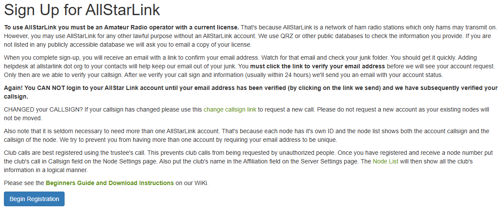
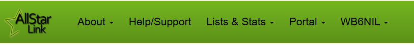
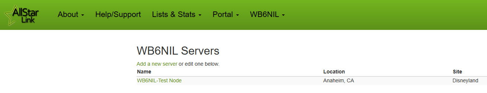

# Getting Started
## What is a "Node"?
A node, in simplest terms, is a computer that connects to the AllStarLink network. Nodes typically have an RF radio interface as well as an internet connection. Radios can range in size from a repeater radio to a low power radio integrated into a node. A node allows you to connect to other nodes in the AllStarLink network. 

Nodes can take the form of an inexpensive Raspberry Pi computer or a PC running the Linux operating system.

## How do I use AllStarLink?
If you have a local FM repeater that is AllStarLink enabled, you may already be using it! However, before attempting to control a local FM repeater, check with the owner(s) first before doing so -- amateur radio etiquette applies.

AllStarLink is typically used in these ways:

* Via a FM repeater that is AllStarLink enabled. Controlled through [DTMF Commands](https://wiki.allstarlink.org/wiki/AllStar_Link_Standard_Commands), via the internet, or an autopatch
* Via a local micro-node that is purchased by an amateur radio operator to join the AllStarLink network directly
* Via PC/Mac software that allows you to connect directly to a node over the internet. The computer microphone/speaker are used for audio
* Via a mobile app such as [DVSwitch Mobile](https://play.google.com/store/apps/details?id=org.dvswitch&hl=en_US&gl=US) to connect directly to a node
* Via a reverse-autopatch

## Getting on AllStarLink
* If you wish to create your own node, follow the directions below to create an account. After your account is active, you will need a suitable PC or Raspberry Pi computer to install ASL3 onto
* If you wish to use a local FM repeater that is AllStarLink enabled, you do not need an AllStarLink account. Check out our [Active Nodes List](https://stats.allstarlink.org/) to find a repeater near you. If you type your city name in the search box, you will be given a list of active nodes. However, before controlling any node via RF or DTMF, be sure to talk to the operator(s) of that node and receive permission first 
    * For a list of possible commands, visit the [AllStarLink Standard Commands](https://wiki.allstarlink.org/wiki/AllStar_Link_Standard_Commands) page
    * Some nodes may be local/non-public nodes, so look for information that the node is in fact public
* If you wish to purchase a pre-made or complete node, check out our [Radio Connections](https://wiki.allstarlink.org/wiki/Radio_Connections) page for a list of vendors

## Creating Your Own Node
If you want to create your own node to connect to the AllStarLink network, the rest of this manual is for you! Before you get to installing software and connecting up radios, you'll need to get a node number assigned to you. 

!!! note "Private Nodes"
    In order to connect to other public AllStarLink nodes via the internet, you need a public node number assigned. If you just want take things for a "test drive" to get comfortable first, you can opt to build and deploy a [Private Node](../adv-topics/privatenodes.md) first.  

### Create an Account
The first step in getting an AllStarLink node number assigned is to create an account at [https://allstarlink.org](https://allstarlink.org). Head over there, and click the **"Login/Sign Up"** link at the top of the page. In the box that opens, click **"Sign Up"** at the bottom of the box.

{width="400"}

Carefully read all the information on the page that opens, then click **"Begin Registration"** to get started.

{width="400"}

Fill out the registration form and submit it with your valid information for verification.

You will then receive an email from the *AllStar Helpdesk* (helpdesk@allstarlink.org if you need to add it to your spam filters) with a link to confirm your email address. **Be sure to click the link in the email to validate your address, or your account request will not proceeed.**

You should then receive another email from from the *AllStar Helpdesk* within 24 hours, notifying you that your account has been validated (at which point you will be able to log into the Portal).

### Request a Node Number
Once you have a validated account for the Portal, you can now proceed with requesting a node number.

Go to [https://allstarlink.org](https://allstarlink.org) and click the **Login/Sign Up** link at the top of the page.

Enter your credentials in the login box, and click **Login**.

When you have successfully logged in, the **Login/Sign Up** link at the top of the page will change to your **CALLSIGN**. You will also note a new **Portal** link has appeared to the left of your callsign.

{width="400"}

From the **Portal** menu, click **Server Settings**.

{width="400"}

Since this is the first time you've logged in and you don't currently have any nodes assigned to you, click the **Proceed with Server Setup** button to continue.

{width="400"}

If you inadvertently clicked the **Node Settings** link, it will still ask you to **Add a Server**.

{width="400"}

Fill in all the information about where your server will be located, be sure to have the latitude and longitude (or click on the map), then click **Submit**.

{width="400"}

Now you will have a new server created to associate your node number to.

{width="400"}

Go back up to the top menu bar, and under the **Portal** menu select **Node Settings**.

{width="400"}

Now, you can click **Continue** to proceed to the **Request/Extend/Remove** page.

{width="400"}

On the **Request/Extend/Remove** page, **Request** will be in **bold** as this is your initial request. Ensure the server you created is selected in the **Server** box, and then click **Submit**.

{width="400"}

That's it! On the page that opens, you will see your newly assigned node number.

{width="400"}

!!! note "Additional Node Numbers"
    Your first node number is automatically approved. If you need additional nodes, you should consider doing the NXX extension (to create up to ten nodes, based off your initial node number). If you need a completely different additional node number, additional node requests are subject to admin appoval.

!!! note "Node Password"
    Take note that on this screen, you will find the *password* for your node (hover your mouse over the password field). You can double-click the password, and then type ctrl-c to copy it to your clip board. **You will need this later when setting up the ASL3 software to register with the AllStarLink servers.**

## Node Number Extension (NXX)
Node numbers are a limited resource. If you are just starting out, you would be strongly encouraged to click the **Continue** button, and complete the Node Number Extension (NNX) process. This will add a *zero* to the end of your primary node number (ie 65459 becomes 654590), and open up an additonal nine node numbers (ie 65451-65459) for your use.
