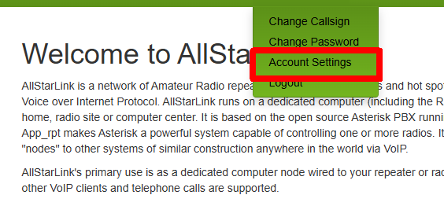
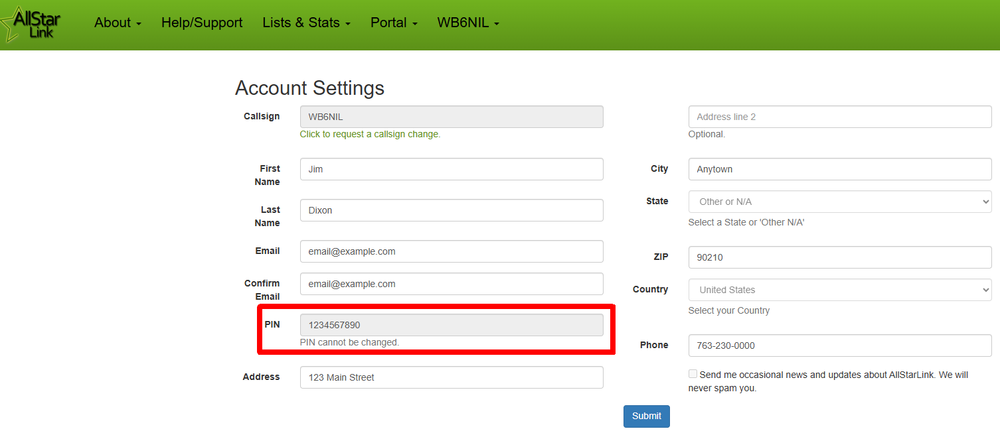
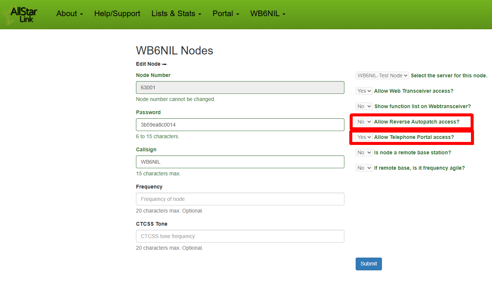

# ASL Telephone Portal Access
It is possible to "dial in" to a node via telephone (from the PSTN). Node operators can configure whether this feature is available/enabled (see below).

When you call from a regular telephone, you will need some method of indicating you want to transmit on the connected note. Two methods are provided, voice-operated (VOX) and function operated (`*99/#`).

Telephone portal access requires that you have a registered and validated account on the [AllStarLink Portal](https://www.allstarlink.org/portal), as you will need your assigned PIN to be able to connect.

The access number for the AllStarLink Telephone Portal is (763)230-0000. 

!!! warning "Toll Charges"
    Note that long distance charges may apply when calling the AllStarLink Telephone Portal.

## Find Your PIN
Log in to your [AllStarLink Portal](https://www.allstarlink.org/portal) account. Click on your callsign, then select **Account Settings**.

{width="400"}

In your Account Settings, you will find your pre-assigned PIN. You need this to connect via the telephone portal.

{width="400"}

## Configure Your Node for Telephone Access
In order to for YOUR node to be accessible via telephone, there are two settings in your node parameters that need to be enabled.

{width="400"}

### Allow Telephone Portal Access?
This option sets whether the Node Access method of connecting to your node is available.

Users dialing the Telephone Portal can choose `Option 1` to connect via Node Access. They then choose whether they want to use voice-operated access (VOX) or function operated access (`*99/#`) for PTT. 

Callers require a valid PIN (from their AllStar account) to access via Reverse Autopatch.

!!! note "Advanced Information"
    Calls from the Telephone Portal drop into the `[allstar-sys]` context in `extensions.conf` using extension `3` for call processing.

### Allow Reverse Autopatch Access?
!!! warning "Currently Broken"
    This option is currently broken, see [Issue 697](https://github.com/AllStarLink/app_rpt/issues/697). Call parking code was changed in newer versions of Asterisk, and the associated code in ASL3 still needs updating.

This option sets whether the Reverse Autopatch method of connecting to your node is available.

Users dialing the the Telephone Portal can choose `Option 2` to connect via Reverse Autopatch. This will place the caller on hold (call is "parked") until someone "picks up" the call on the radio side.

Callers require a valid PIN (from their AllStar account) to access via Reverse Autopatch.

A user on the radio side would need to dial a DTMF code to "pick up" the call and connect the calling party to the radio.

!!! note "Advanced Information"
    Calls from the Telephone Portal drop into the `[allstar-sys]` context in `extensions.conf` using extension `1` for call processing.
