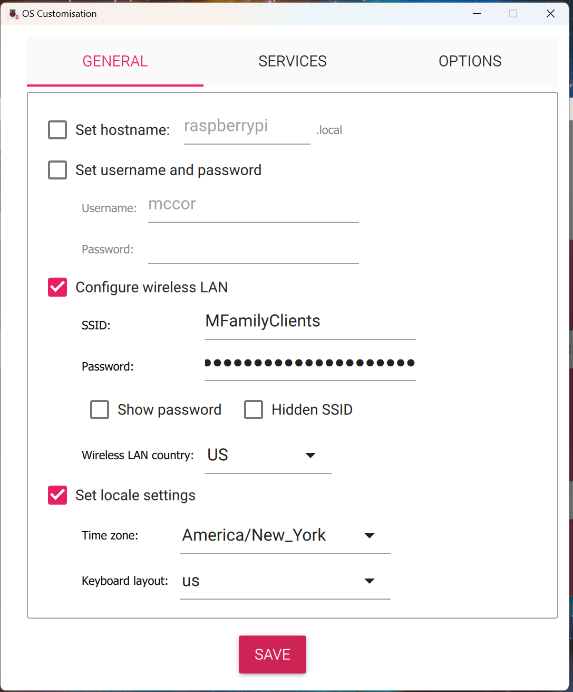

# Step-by-Step Pi Appliance Setup

1. If you do not already have it installed, install the
[Raspberry Pi Imager](https://www.raspberrypi.com/software/).

2. FIX FIXIMG Download the [latest release image](https://github.com/jxmx/firefly-logger/releases). This will
be named `firefly-logger-X.Y-aarch64.img.xz` where "X.Y" is the version. Save it to the local
`Downloads` directory.

3. Launch **Raspberry Pi Imager** from the start menu.

4. Click on **CHOOSE DEVICE** and choose the type of
Pi hardware on which Firefly Logger is being installed.

5. Click on **CHOOSE OS**. Scroll to the bottom of the
list that appears and select **Use custom**. 

6. FIX FIXIMG A **Select image** dialog box will appear. Navigate to the
`Downloads` folder and select the image downloaded in step 2.
It will be named something like firefly-logger-5.1-aarch64.img.xz.
Then click **Open**.

7. Connect the SD card or the SD card in a USB adapter to
the computer. Then click on **CHOOSE STORAGE**. An option
will be presented named something such as "Mass Storage Device USB
Device - 16.0 GB". Click on that entry.

8. Click **NEXT**

9. A box labelled "Use OS customisation?" will appear. Click on
**EDIT SETTINGS**

10. FIX FIXIMG Check the box next to **Configure wireless LAN** and then enter
the name of the wireless network in **SSID** and the password for
that network in **Password**. Change the "Wireless LAN country" to **US**
or other country as appropriate. This is not necessary if the Pi will
use a network cable rather than wireless.

11. (Optional) Check the box next to **Set locale settings** and change the "Time zone"
to the desired region.

12. Click **SAVE** in "OS Customsation".

13. Click **YES** for "Use OS customisation?"

14. FIXIMG Click **YES** to continue to write the image to the SD card.

15. Depending on the speed of the computer and the type of SD card
one will have time for a beverage of their choice. When the write is complete,
remove the card from computer and insert it into the Pi. If using a USB adapter
for the SD card, remove the SD card from the adapter and insert the card into
the Pi. The Pi __will not__ us the SD card in the USB adapter.

16. Power on the Pi. Wait approximately 2 minutes for the Pi to boot
and perform the various firstboot tasks.

17. FIX FIXIMG (Optional) Network connectivity may be tested using the command
`ping -4 firefly.local` from a command prompt or PowerShell window.

