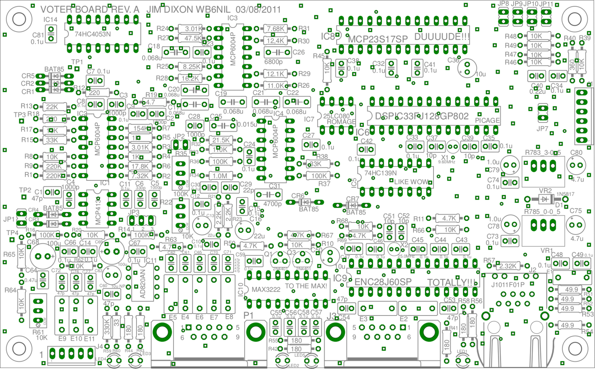
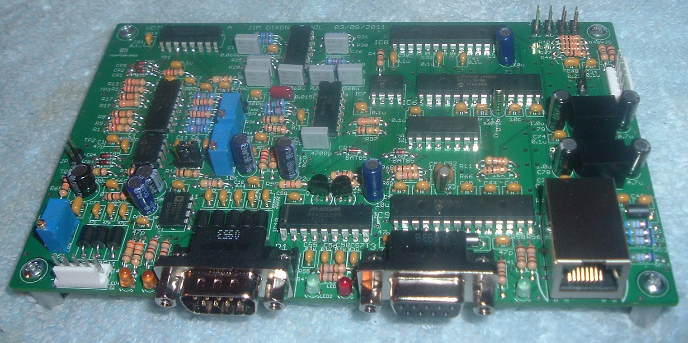
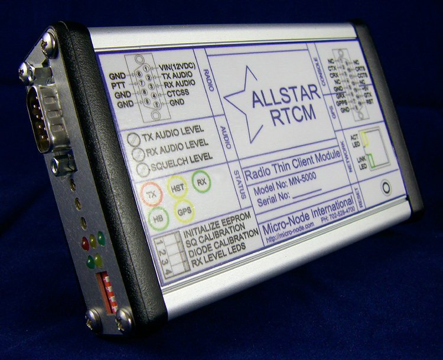
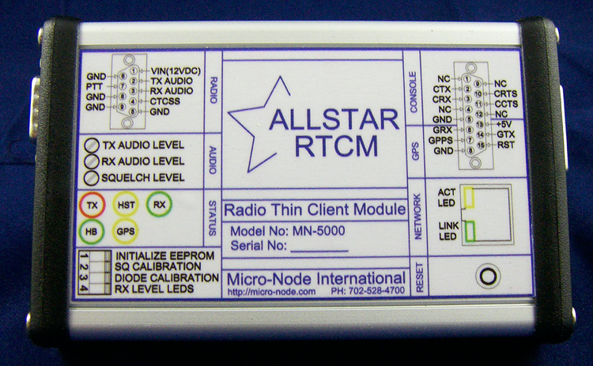
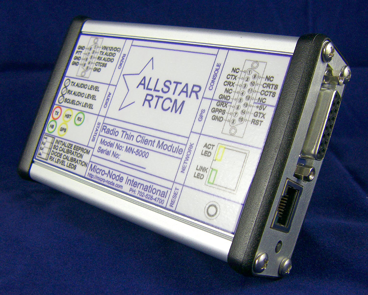
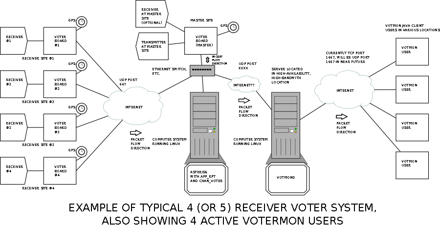

# What is the VOTER?
The VOTER (**V**oice **O**bserving **T**ime **E**xtension for **R**adio) system was originally created by Jim Dixon, WB6NIL (SK).

In many two-way radio applications, both for repeater systems and simplex base-stations, it is often difficult to have reliable reception when there is signal impairment due to terrain or other obstacles.

One common way to solve this problem is by use of a voting multi-receiver system. Such a system is comprised of a number of receivers, located at diverse locations. The location of these receivers are chosen so that the combined coverage of all the receivers more or less fill-in the entire desired coverage area, even though it may take a number of receivers to accomplish this. All such receivers are connected ("linked") to a central location (generally the transmitter site), and a device compares each receiver's signal strength and selects the one with the best signal. This is called **voting**.

Often in such a system, there is one single high-powered transmitter located at a central site that all mobile/portable stations would be able to receive. Sometimes, one single transmitter can not be located where coverage of the entire desired area is possible. In such cases, multiple transmitters are deployed in several locations. Since all these transmitters are on the same frequency, they must be *very precisely* locked to the same frequency **and** be transmitting the *exact same audio* at the **exact same time**. Not doing so would severely degrade their reception. This is called **simulcast** (transmitters).

Traditionally, receivers that comprise a voting system are each connected to the central site via either a UHF or microwave link. Since this requires a receiver, link transmitter and link receiver for every receive site, implementation and continued cost of such a system typically becomes quite significant and in most cases prohibitive, and requires a high complexity of implementation.

There are, however, many advantages of implementation of such a system that warrant the cost and effort required.

With the advent of VoIP-based interconnections for radio systems, it is now possible to implement a voting system using VoIP to link the receivers to the central site, and therefore reduce the system requirements and complexity and cost by eliminating the radio links between the receivers and the central site.

There are a few commercial vendors of VoIP-based voting systems that offer a functional and reliable, yet proprietary and extremely high-cost solution.

Although using VoIP-based technology significantly reduces the cost and complexity of implementation of a voting system, the cost of the commercial VoIP-based devices is still quite prohibitive for all but large commercial and/or government applications. Therefore, it seemed appropriate to offer a completely open-source, open-hardware solution that makes the cost and complexity of a VoIP-based voting system nearly trivial and gives almost anyone the ability to implement this type of a system that wishes to do so.

## History
By: Jim Dixon, WB6NIL (SK)

The [Original Documentation Package](https://github.com/AllStarLink/Voter/blob/master/docs/votersystem.pdf) (NO LONGER CURRENT) for the original VOTER system is still available. For current documentation, see the rest of the sections in this part of the manual, or the documentation of the commercially-available [RTCM](./assets/rtcm_manual.pdf) product.

For a number of years, I have been asked about, and have been considering the possibility of the implementation of a multiple site remote receiver voting system that runs with VOIP on `Asterisk/app_rpt`. The more I looked into it, the more I realized that it was a **FAR** from a trivial task.

The main problem to overcome is that when you have multiple streams of audio information from multiple receivers, you need a concise and accurate way of synchronizing all of the audio, so that if switching of streams occurs, there will be no inconsistencies in the audio. This is far more easily done on conventional, RF-linked voting systems, being that the delay between the receiver and the transmitter site is very minimal (basically the speed of light) and is painfully consistent. Not so on the Internet. The packet delays can be extremely long and varied, and it makes the task of synchronization far more difficult.

The first challenge is to obtain and convey ultra-accurate time information along with the audio data, so that the transmitter site will know what time the signal was received (which may not have much to do with the time it was received at the transmitter site from the Internet). In order to accomplish this, ultra-accurate time information must be made available, and it must be processed in reasonable and consistent time for it to be meaningful.

GPS is the simplest and most cost-effective solution to obtain ultra-accurate time information. For little money, a Garmin GPS LVC18 module (there are many others, too) may be purchased. It provides an accurate 1 pulse-per-second signal that can be used to synchronize a timing device.

A "host" type computer running Linux (or UNIX, etc.) **is not** appropriate to be used as such a device, since it has absolutely **no way** of processing external inputs (or anything else, for that matter) in a *consistent* and *predictable* time. For applications that need to be accurate to hundreds of milliseconds, its fine, but for this purpose, where timing down to ***individual 125 microsecond*** audio samples is necessary, it just won't do.

The only reasonable solution is to design hardware to accomplish this. Since hardware design is necessary, I figured that I might as well design a stand-alone board that does all the necessary functions to interface a receiver and a GPS device to an Ethernet with Internet connectivity. Certainly, a peripheral device that attaches to a "host" type computer would also be a reasonable solution, but for the same or less cost, it seems reasonable to eliminate the need for a "host" computer at receiver sites all together.

The second challenge is determining signal strength (RSSI) information from an attached receiver. Thanks to wonderful technology designed by Steve Rodgers, WA6ZFT, which is a small board that implements a VERY high-quality squelch processor, I was able to take the code and front-end design, include it in my design, and not only is it very good squelch processor, but it also is able to provide information from which the signal strength of the received signal may be calculated.

The third challenge is at the transmitter site end (where the `app_rpt` system is located) taking all of the streams of audio from the various receivers and synchronizing them via included time information, and making a reasonable decision on which stream to "use", based upon signal strength and quality. The synchronization is done with basically a "multi-dimensional jitter buffer" and is implemented in the Asterisk channel driver that I wrote for this application, `chan_voter`.

The fourth challenge is to facilitate a method of testing the protocol and its implementation within `app_rpt`. Obviously, there is no way to have a "real" environment available, where there are multiple receivers, mobiles, etc., so a simulator has to be created.

I'm **VERY** sorry and embarrassed to say so, but I wrote it in Java (yuck!). It seemed the most reasonable way to accomplish what was necessary. It simulates up to 10 channels of audio, and has "sliders" so that you have full control of "RSSI" and "TIME DELAY" for each channel, in addition to selecting which, if any channels are being sent to the host. You can run it, if you desire. This is the [VoterSim](https://github.com/AllStarLink/Voter/tree/master/archive/votersim) tool.

I also made a new UDP-based protocol for this technology, (called "VOTER"), which may be [viewed here](./voter-protocol.md), if desired.

## Description
In order to successfully implement a VoIP-based solution for this purpose, it is necessary to have a precise time reference in order to be able to re-assemble (time-wise) the audio streams at the central site, since VoIP has inherent inconsistencies in time delay (jitter and such). Clearly, the best and most reasonable and economic source of such precise timing data is GPS. Therefore, a GPS receiver (with a 1 pulse per second output) **must** be made available at each receiver location (along with the central site).

Since precise timing is necessary, it precludes the use of any implementation which relies on a traditionally host-based operating system, such as Linux or UNIX, because of limitations of timing and scheduling precision and latency.

Therefore, a dedicated hardware device with a simple embedded micro-controller was necessary to accomplish the necessary precise timing requirements. In addition, low cost (in comparison with a host-based solution) makes placing such a simple dedicated hardware device at each receiver location a great advantage.

Such a dedicated hardware solution significantly increases reliability, has a far lower power consumption, and is physically smaller (in comparison with a host-based solution).

The "central site" functionality (the device which receives all of the VoIP-based audio streams from the receivers and selects which receiver's audio to use) is implemented as a channel driver (`chan_voter`) along with `app_rpt` under Asterisk PBX. The host-based system on which this runs, along with a dedicated hardware device (which gives access to the precise GPS-derived time data) is typically located with the system's transmitter (or at least one of them).

Each dedicated hardware device is also capable of simultaneously generating time-synchronized audio out to drive a transmitter (or multiple transmitters in a simulcast system). The audio out of all the dedicated hardware devices at all locations will be identical at the same time.

There are facilities available for online monitoring of the voting system (audio and signal strengths), in addition to recording (logging) facilities.

## Why a 9.6MHz Clock?
A question that often gets asked (in relation to doing simulcast) is, "why not just clock the dsPIC at 10MHz, instead of 9.6MHz". Well, there is a very good reason that Jim picked that oscillator frequency, and a very good reason why you cannot use 10MHz.

It comes down to timers and interrupts. In particular, the ADC servicing subroutine. 

With the way the dsPIC is configured with the 9.6Mhz oscillator, this subroutine is automatically called every 62.5uSec, as it is controlled by Timer 3 (TMR3).

This subroutine is responsible for encoding the RX Audio Packets, and doing all the AtoD on the other analog inputs, RX Noise (for RSSI), Squelch Pot position, and Diode Voltage (temperature compensation).

Every **ODD** time this subroutine is run, it encodes a RX Audio packet. Since this happens every **OTHER** time the ISR runs, that means it runs every **125uSec**. Well, the reciprocal of 125uSec is 8kHz, so this is how we encode 8000 samples/sec of RX Audio! By default, encoding is ulaw, unless you **SPECIFICALLY** configure this client for ADPCM in [`voter.conf`](../config/voter_conf.md).

Every **EVEN** time this ISR runs, it alternates measuring RX Noise, Squelch Pot Position, and Diode Voltage. So, each of those is measured every *sixth* time in, or every 375uSec. 

**EVERY** time this ISR runs, we bump some counters.

Every time TMR3 expires, we service this routine and do an ADC conversion. We alternate between reading the RX Audio, and one of the other three channels (Squelch Noise, Squelch Pot position, and Diode (temp comp) voltage).

So, as you can see, in order to encode ulaw/ADPCM audio at 8kHz, we need precise timing to take the ADC samples of the audio and encode them. Because of this precise timing, and the restrictions in the clock dividers in the dsPIC, it works out that 9.6MHz is the most suitable (common) crystal/clock to use.

That said, some investigation has been done to see if there are any other suitable clocks. As it turns out, there may indeed be. Old CDMA wireless systems had GPSDO's that had a 9.8304MHz (CDMA 8x Chip) output that was locked to GPS (and there are lots of those still surplus). It would appear that there is a valid clock configuration for the dsPIC that *could* allow this clock signal to be used, and still maintain the 62.5uSec timer for the ISR. 

However, there is another problem presented with this approach, the bootloader. The bootloader is expecting a 9.6MHz clock to run, so it isn't going to like it if you feed it 9.8304MHz. We don't have the source code for the bootloader, so that is a more difficult change to implement. However, peeking in to the `.cof` file with a hex editor, one can find what seems to be the opcodes to set up the clock on the dsPIC when it boots. It *may* be possible to hack the bootloader to run at 9.8304Mhz. Further testing is required.

Of course, this is only really of consequence if you are wanting to do simulcast, where everything needs to be precisely timed. For normal voting use, the standard 9.6MHz clock works just fine. If you are planning on doing simulcast transmitters, the crystal stability of the 9.6MHz oscillator is insufficient, you **will** need to provide an OCXO or GPS-derived 9.6MHz clock source to replace the crystal.

## Implementation
A UDP-based VoIP protocol was created specifically for this technology. See the [VOTER Protocol](./voter-protocol.md) page for further details on the underlying communication protocol between client devices and the host.

More information on how the `chan_voter` channel driver works is available on the [`chan_voter`](./voter-chan_voter.md) page.

There are currently two hardware implementations that use the VOTER protocol, and interface to AllStarLink.

### VOTER
The dedicated hardware device (the VOTER) was initially implemented as an approximately 160 by 100mm circuit board utilizing thru-hole mounted components allowing user-assemble-able blank boards to be made available quite inexpensively. 

It uses a dsPIC33FJ128GP802 processor and a few other integrated circuits, including some operational amplifiers (which implement filters, amps, etc). 

The schematics, board design, artwork, and PIC firmware are available on a completely free open-source basis, the original project information is available in the [AllStarLink GitHub Repository](https://github.com/AllStarLink/Voter/tree/master/VOTER-pcb).

<div class="grid" markdown>





</div>

In addition, the schematics of the original VOTER have been redrawn in KiCAD, and are [available here](https://github.com/AllStarLink/Voter/tree/master/VOTER-pcb/KiCAD-schematic). 

Firmware in the [AllStarLink GitHub Repository](https://github.com/AllStarLink/Voter/tree/master/VOTER_RTCM-firmware) is produced to support both the VOTER and RTCM devices.

Documentation to support the VOTER is available on the [VOTER Hardware](./voter-hardware.md) page.

For specific information about the console menus and options available in the firmware, see the [VOTER Menus](./voter-menus.md) page.

### RTCM
The VOTER was then implemented commercially by [Micro-Node International](http://micro-node.com) and marketed as their [Radio Thin Client Module (RTCM)](http://www.micro-node.com/thin-m1.shtml). The RTCM is effectively a VOTER, but built with SMT components. It runs the same (similar) firmware as the VOTER, with differences being in the dsPIC that it uses, as well as some of the peripheral mapping. 

<div class="grid" markdown>







</div>

Firmware in the [AllStarLink GitHub Repository](https://github.com/AllStarLink/Voter/tree/master/VOTER_RTCM-firmware) is produced to support both the VOTER and RTCM devices.

As it runs the same (similar) firmware as the VOTER, for specific information about the console menus and options available, see the [VOTER Menus](./voter-menus.md) page.

Unless specifically noted, references to the VOTER hardware apply equally to the RTCM, and both terms may be used interchangeably. 

There is a [User Manual](./assets/rtcm_manual.pdf) available for the RTCM, but it has not been updated in a long time. You may wish to supplement with information from our online [VOTER Hardware](./voter-hardware.md) (for the through-hole board) or the [RTCM Hardware](./rtcm-hardware.md) pages.

### Firmware Upgrading
See the [VOTER firmware](./voter-firmware.md) page on the procedure to upgrade the firmware.

## Provisioning and Configuration
### General System Provisioning

There needs to be:

* Some number (> 1) of receiver sites that contain 1 of identical model receivers (or at least ones with identical characteristics), one VOTER (embedded hardware) card, one GPS receiver and some sort of Internet connection (can be a private LAN).
* Some number of transmitter sites (typically one, but not necessarily) that contain a transmitter, one VOTER/RTCM (embedded hardware) card, one GPS receiver, and some sort of Internet connection (can be a private LAN). A site *may* have both a receiver and transmitter sharing the same VOTER card, GPS receiver, and Internet connection.
* A Linux host running Asterisk (AllStarLink) with `app_rpt` and `chan_voter`, along with a VOTER/RTCM (embedded hardware) card, a GPS receiver, and an Internet connection (may be a private LAN in some cases) with sufficient bandwidth to accommodate all the packet traffic from/to all the receiver and/or transmitter sites. This location may also have a receiver and/or transmitter connected to the VOTER/RTCM card.
* *Optionally*, system monitoring access (both audio and signal strength at all receive sites) may be made available through the use of a JAVA applet (deprecated) and a process running on a server at a location with high availability and high bandwidth internet connection. Typically, this is not at the same location as the above system, but may be, if appropriate. 

!!! note "System Monitoring"
    The original system monitoring was accomplished with `votemond` and `votermon`. Both those utilities have been deprecated. In their place, Allmon/Supermon can display the status of voting sites.

The system layout is envisioned as:



### IP (Internet) Network Planning and Provisioning
The receiver/transmitter sites may be connected to the "master" site (the one containing the Linux system running `chan_voter`, `app_rpt`, and Asterisk (AllStarLink)) via either a LAN (either physical or extended Local Area Network), a public Internet connection, or some combination thereof.

See the [VOTER Protocol](./voter-protocol.md) page for further details on the underlying communication protocol between client devices and the host.

Regardless of the interconnection method, the following criteria must be met: 

* Sufficient bandwidth must be available at all times between each receiver/transmitter site and the "master" site. The latency of such connections must be within *reasonable* limits, and ***certainly*** must be within the limits configured in both the VOTER board devices and [`voter.conf`](../config/voter_conf.md).
* The "master site" really *should* be on a static IP address. Although not 100% necessary, it could really make for an unreliable installation.
* Any of the devices (including the "master" site) may be behind NAT and/or a firewall. There is no specific requirement for the VOTER board to have any sort of non-NATed access, since the actual IP address and UDP port that is public really makes no difference. All authentication is based upon CHAP-type tokens, and not upon IP address in any way. The "master" site may be behind NAT and/or a firewall, as long as its listening UDP port (generally 1667) is exposed to the public (unless entire system is on an entirely private network). If the implementer wishes, TELNET access may be configured for the VOTER board, and in that case, the port selected for TELNET must be made publicly accessible (since the VOTER firmware supports dynamic DNS, it certainly may be on a dynamically-assigned public IP address when the TELNET option is used, and its actual IP address really doesn't matter if TELNET is not configured).

!!! danger "Do This at Your Own Risk"
    It is a **VERY BAD** idea to expose TELNET to the public Internet, you accept all responsibility if you choose not to heed this warning!

### Bandwidth Considerations
Typically, the IP bandwidth usage in each direction, when a signal is present is approximately 100kbps (including UDP/IP overhead, one direction only if just a receive or just a transmitter site, or both directions if a receive/transmit site).

On a public Internet connection, its a good rule-of-thumb to use a connection capable of three to four times the required bandwidth in the slowest direction (often, such connections are asymmetrical as far as their speeds are concerned).

If possible, avoid wireless connections (ie "cellular", "MiFi", etc.). DSL/Fiber/Cable is your friend. It tends to be more reliable and consistent (less latency and jitter) then other forms of broadband connections.

If a wireless connection is *really* required (ie mountain-top microwave link), use a high reliability solution, such as the devices from Ubiquiti or Microtik. The VOTER hardware DOES support ToS marking of packets, but your link *shouldn't* be congested to the point where that would be required anyways!

### Port Forwarding
Since token-based authentication and identification is utilized, having the UDP port open to the public should not be a significant security risk. There **must** be a VOTER board on the **same physical LAN (ie switch)** (very low latency) as the Asterisk server implementing the “master site”, which acts as the Master Timing Source. This allows `chan_voter` to have a consistent, reliable, accurate timing source with which the timing information from all other inbound packets are compared and appropriately processed, and from which to generate accurate timing information for time-consistent transmission purposes.

The AllStarLink server at the “master site” (in addition to all the ports that are canonically made public to operate a standard `app_rpt` installation) **must** have the port specified in the `port` parameter in the `[general]` stanza in the [`voter.conf`](../config/voter_conf.md) file made publicly available, or at least available to all possible IP addresses from which its associated VOTER clients could possibly be operating.

### Network QoS
Your IP Network quality is important. You may wish to add a rule in your routers to prioritize traffic on UDP port 1667 so that VOTER audio is given priority over other 
traffic. Also see the below for notes on how to tag your packets with ToS.

By default in firmware >2.00, packets **from** the VOTER/RTCM **to** the host are tagged. You can use [Debug Options](./voter-hardware.md#debug-options) to disable that for testing. You still need to have the appropriate `utos=y` line in the `[general]` stanza of your [`voter.conf`](../config/voter_conf.md) to tag packets **from** the host **to** the VOTER/RTCM clients.

Specifically to Ubiquity devices, see [airMAX FAQs](https://help.uisp.com/hc/en-us/articles/22590834519959-airMAX-Frequently-Asked-Questions-FAQs).

So, if we set ToS/DSCP in the header to `C0`, then Ubiquity (and other gear watching ToS) *should* prioritize the packets. This sets the DSCP to `110 000` aka `48`. UBNT shows this as 802.1p Class 6 (Voice <10mS latency). Other sources show this as a Network Control TOS.

## Receiver (and/or Transmitter) Site
A receiver and/or transmitter site consists of a receiver capable of providing direct access to the output of the FM discriminator (and output of CTCSS/CDCSS tone decoder, if applicable) and/or a transmitter, a VOTER (embedded hardware) board, a GPS receiver capable of providing a precise 1 pulse per second signal (such as the Garmin LVC18) and NMEA or TSIP information packets, and an Ethernet-based Internet connection.

Since there may very well be several versions of the VOTER board hardware available, this document will not cover specific details of the shown hardware device here. The full details for each hardware device, including construction (if applicable), programming, and specific configuration options are available from the vendor of the particular device. Only generic configuration concepts and options will be covered here.

### VOTER Hardware Configuration Settings
There are several categories of configuration parameters that apply to all version of the VOTER hardware.

* IP SETTINGS – Standard IP setup parameters (IP Address, Netmask, Gateway, DHCP, etc.).
* VOTER SERVER – VOTER server address, specified as a Fully-Qualified Domain Name (FQDN), UDP port on VOTER server, and (optionally) local UDP port (generally left at default), and client and server passwords. 
!!! note "VOTER DNS Resolution"
    The firmware in the VOTER board does a DNS resolution once per minute and resolves the IP address for the VOTER server, based upon the FQDN specified in this configuration. Therefore, the actual IP address of the VOTER server may be changed (and its associated DNS entry), and the VOTER board firmware will continue to be aware of its current IP address (thus not requiring re-configuration of the VOTER board firmware if the IP address of the VOTER server changes).
* The “client password” is the password, as configured in the server, that identifies the VOTER hardware (client), and the “server password” is the common server password as configured in the server (which allows verification of the server's identity by the VOTER hardware firmware).
* TX BUFFER PARAMETER – Transmit buffer length. This allows for simultaneous time-consistent audio output at all VOTER clients in a system. Buffer length is set to allow for maximum network latency between “master (host) site” and receive/transmit sites.
* GPS RECEIVER PARAMETERS – Data Protocol (NMEA or TSIP), Baud Rate, Data Polarity and PPS Signal Polarity (and time offset, don't ask, just leave it at 0, hopefully) for GPS receiver.
* TELNET PARAMETERS – Port Number, User name, and Password for console TELNET access.
* DYNDNS PARAMETERS – Setup parameters necessary to make dynamic DNS work (if desired).
* EXTERNAL TONE DECODE – Sets mode for external tone decode (CTCSS) input (enable/polarity).

The serial console of the VOTER gives access to a menu allowing setting of the above mentioned parameters in addition to various system-related functions, reboot, save parameters, status, etc. In addition, the console displays important system status messages as various events occur (such as changes in GPS status, changes in DNS resolution, etc.). More information on all the menus and options is available on the [VOTER Menus](./voter-menus.md) page.

### VOTER Hardware Setup and Installation
For more information on the VOTER Hardware connections, see the [VOTER Hardware](./voter-hardware.md) page. For the RTCM, see the [user manual](./assets/rtcm_manual.pdf) and/or the [RTCM Hardware](./rtcm-hardware.md) pages.

Appropriate connections need to be made between the receiver's discriminator, and optionally its tone decode output, and/or the transmitter and its external (auxiliary) audio input (or microphone input, attenuated), and PTT signals. 

!!! warning "Transmit Audio Connections"
    In most applications, transmit audio must be routed through the external (auxiliary) audio input so that it gets pre-emphasized, limited, and splatter filtered. **DO NOT** directly connect to a modulator input, data input, or other direct transmitter connection (UNLESS you are generating CTCSS with the VOTER, see below). 

**Discriminator audio is required** to do noise (RSSI) and squelch analysis on the incoming audio, prior to the actual voice audio (baseband) being de-emphasized and sent to the host (unless it is specifically overridden, then it is a custom application). As such, the audio sent from the host to the transmitter(s) needs to be pre-emphasized before being sent over the air. 

The GPS receiver needs to be connected (see notes on the [VOTER GPS](./voter-gps.md) page), and the VOTER hardware needs to be connected via Ethernet to an Internet connection, and, of course, power needs to be applied to the board.

With no antenna connected to the receiver, the board needs to have its “squelch calibration” procedure performed (see the documentation for the specific hardware).

The receive level needs to be set, either by putting the board in “level setting” mode, or with use of the console (see the documentation for the specific hardware). 

The transmit level also needs to be set at transmitter site(s). See the [VOTER Audio](./voter-audio.md) page for further instructions on configuring audio and setting levels.

Once the above procedures are performed, the board is ready to have its operating parameters configured and then it will be ready for use. Configuration is done via serial console or TELNET. Serial console may be required for initial configuration, if you cannot determine the IP address given to the VOTER hardware via DHCP when first connected to your network.

Set the IP Settings, TX Buffer Parameters, GPS Parameters (if necessary), TELNET Parameters, DYNDNS Parameters, and External Tone Decode appropriately for the installation.

The VOTER/RTCM hardware device needs to be on an Ethernet network (typically a router or switch or wireless bridging device of some sort) that has connectivity to the “master/host” site, either via public Internet or via private LAN (extended, perhaps). 

It may be on a network that allocates IP addresses (LAN and/or public IP address) dynamically. The [VOTER Protocol](./voter-protocol.md) and the VOTER hardware firmware are designed specifically to allow for not needing the IP address of any VOTER board to be long-term consistent, or even important, for that matter. All authentication and identification is based upon tokens, not IP address or port.

If TELNET access is desired, the VOTER hardware needs to at least have its TELNET port accessible (through a NAT/Firewall if used), otherwise it is not necessary. Even if TELNET access is used, a dynamically-assigned public IP address will work, because dynamic DNS (dyndns.org) is supported in the VOTER hardware firmware.

!!! danger "Do This at Your Own Risk"
    It is a **VERY BAD** idea to expose TELNET to the public Internet, you accept all responsibility if you choose not to heed this warning!

This document assumes sufficient familiarity with IP and general networking concepts, and therefore will not go into specific details of network provisioning.

The VOTER Server Settings on the VOTER hardware will be covered in the next section.

### Overall System / Main Site Configuration
`app_rpt` (Asterisk) uses a channel driver `chan_voter`, which implements the “master site” or "host" functionality, providing an Asterisk channel which `app_rpt` may open as a radio interface (like a `usbradio` or `pseudo` channel in a non-voting AllStarLink system). This driver receives (and/or sends) UDP packets (typically on UDP port 1667) from/to all associated VOTER clients at receive and/or transmit sites.

For each VOTER channel instance, both voting (GPS-based) and non-voting “general-purpose” (non-GPS-based) clients may be used. The channel driver essentially “mixes” the resultant audio from the voting subsystem along with the audio from all of the “general-purpose” clients (if any).

In addition, the channel driver (optionally) may be configured to send a stream of UDP packets to a predetermined IP address and UDP port. This stream is meant to be redistributed by the `votmond` program (deprecated) running on a high-availability, high-bandwidth Linux Server, and give users access to monitoring of the VOTER audio and signal strength information in real time.

`chan_voter` uses a configuration file, [`voter.conf`](../config/voter_conf.md), which contains typically several stanzas. See the [`voter.conf`](../config/voter_conf.md) page for more information on the contents of this file, and the available options.

### Voting Selection Algorithm and Associated Parameters
Voting selection (the choice of client from which to take the audio stream) is based upon the RSSI (relative signal strength/quality) value associated with each particular client's received signal.

The parameters associated with voting selection are the `thresholds` and `linger` parameters specified for each VOTER instance.

If neither of these parameters are specified, the voting selection algorithm will default to choosing the client with the highest RSSI number (*and the last-most one listed in the `voter.conf` file*, if a tie exists) each and every received audio frame (every 20 milliseconds). 

Although this is a functional option, this is probably **NOT** what you really want. Doing so will cause the received signal to have an audible “squelch-tail” at the end of a transmission if there is a receiver receiving the signal strongly in addition to a receiver receiving the signal at a low, noisy level. 

This, however, might be appropriate in very rare instances where receivers are placed in locations that require very agile following of the strongest signal. It is very unlikely, however, that this is the case.

It is far more likely that it is appropriate to set up a set of `thresholds` and optionally a `linger` time that is different then the default (which is 6 frame periods of 20 milliseconds).

The `linger` parameter allows specification of a default `linger` value (**in multiples of 20 millisecond frames**) of other then the system default value (6).

The `thresholds` parameter is a comma-separated list of RSSI threshold values each specified as follows:

```
MIN_RSSI[=REASSESS_FRAMES[:LINGER_FRAMES]]
```

* `MIN_RSSI` is the minimum RSSI value for this threshold (1-255)
* `REASSESS_FRAMES` is the number of 20ms frames for the client to remain selected at this threshold level before being re-assessed (may be specified as 0, meaning “re-assess at next frame”)
* `LINGER_FRAMES` is the number of 20ms frames for the client to remain selected after no longer being at this threshold (or any other) (may be specified as 0, meaning “do not linger”)

If `MIN_RSSI` is specified without the other values, its `REASSESS_FRAMES` is considered to be infinite (it will not get re-assessed if its RSSI value remains at this threshold), and `LINGER_FRAMES` will be its default value (6).

If `MIN_RSSI` and `REASSESS_FRAMES` are specified, `LINGER_FRAMES` will be at its default value(6).

A specification for `REASSESS_FRAMES` **must** be present if there is a specification for `LINGER_FRAMES`.

For example:

```
thresholds = 255,110=5
```

Meaning:

If the RSSI level is 255, stay selected on that client as long as it still has an RSSI of 255, else if the RSSI level is at least 110, stay selected there for no more then 5 frames. If the RSSI drops below 110, re-assess every frame (since no value below 110 was specified).

Also, since there were threshold values specified and the `linger` value remained default, any client that meets any specified threshold, stays selected for 6 frames when no clients meet any thresholds any longer.

If, instead the example was:

```
thresholds = 255,110=5:10
```

Then:

The same would be true except that if a client meets the “110” threshold (and not the “255” threshold), and then no more clients meet any more thresholds, the client that met the “110” threshold would stay selected for 10 frames rather then the default 6.

This whole methodology is rather strange, but it seems to be appropriate and effective. In the future, it may be improved or modified in some way, but for now it is more than sufficient.

### Buffer Tuning
See the [VOTER Buffers](./voter-buffers.md) page for information on how the buffers work, and how to tune them for proper operation.

### Simulcasting
The RTCM/VOTER boards do support simulcasting, however, there are a bunch of quirks that one needs to be aware of.

See the [VOTER Simulcasting](./voter-simulcasting.md) page for further information.

### General-Purpose/Mixed Mode Configurations
The primary use of the VOTER/RTCM is to implement multi-site receiver voting repeater systems. That leads itself then to also adding simulcast transmitters (if you already have the sites for receivers).

However, this is not the only use case.

The VOTER/RTCM also works very well as a repeater interface to a stand-alone repeater. In fact, in a few key areas, it is a superior choice for interfacing a repeater to AllStarLink:

* Hardened hardware (no SD card to corrupt with power failures)
* No operating system crashes
* No USB configuration issues
* No USB audio level configurations to get corrupted
* Supports CTCSS transmit tone generation
* Easily transits NAT networks with minimal network configuration

Remember, the VOTER/RTCM is basically a custom Radio over IP (RoIP) adapter. It was just designed from the ground up by a very smart amateur radio operator.

When used in "General-purpose"/"Mixed Mode" (for a stand-alone repeater), you do **not** require a GPS for timing. Although, there is nothing stopping you from using one. Setting the PPS Polarity setting to `2` (ignore) will force the VOTER/RTCM in to "General-purpose" mode. 

As the name "Mixed Mode" implies, you could have a "General-purpose" client that is mixed with voting clients, and `chan_voter` will "mix" the audio from non-voting clients with the voted audio.  

A simple [`voter.conf`](../config/voter_conf.md) for Mixed Mode would look like this:

```
[general]
port = 1667
password = BLAH

[1999]
Site1 = pswrd1,master,transmit
Site2 = pswrd2,transmit
```

#### Mixed Client Error
"I am getting this error in Asterisk":

```
WARNING[2368]: chan_voter.c:4511 voter_reader: Voter client master timing source mobile1 attempting to authenticate as mix client!!
```

A mixed client error means the [`voter.conf`](../config/voter_conf.md) file is expecting a VOTER/RTCM to try and connect with a GPS IP packet (ie. has `master` in it's definition in [`voter.conf`](../config/voter_conf.md)), but the VOTER/RTCM isn't sending a GPS IP packet. So it is a mismatch between [`voter.conf`](../config/voter_conf.md) and the PPS setting in the VOTER/RTCM. 

If you want to use a mix client (non-voted), make sure that receiver's configuration line in [`voter.conf`](../config/voter_conf.md) **does not** have the `master` option set.

#### Mix Clients with Voted Client Issues
Situation...
"I have a private node with 6 voted receivers using RTCMs. I'd like to add a 7th RTCM to this node that is always mixed in rather than voted. I'm able to make this RTCM work as a 7th voted receiver with no problem. Everything I've read seems to indicate that if I change GPS PPS polarity to "none" this will achieve my desired results, however I am unable to get audio out of my transmit RTCM from this 7th site. It does change color to cyan in Allmon indicating it is non voted input but I do not get any indication or audio when that units COR goes active."

"Setting `voter debug level 3` in Asterisk and I'm seeing the following message repeatedly scrolling by in a blur when the mix client detects COR (COR is active). Sequence numbers are continually incrementing by 1. I'm running software version 1.47 on all my clients:"

```
mix client (Mulaw) my_client index:0 their seq:629 our seq:629
mix client my_client outa bounds, resetting!!
```

If you have a similar situation to the above... check your `buflen` in [`voter.conf`](../config/voter_conf.md). Make sure it is at >=160 and see if that fixes it. You may also want to review [buffer tuning](./voter-buffers.md).

## Summary
This technology/project is a great asset to the two-way radio community in general, particularly Amateur Radio and other pubic-service related radio services, allowing inexpensive, general, and open access to what previously would have been impossible or otherwise unattainable. 

Systems of this type can greatly improve ability to provide efficient and reliable communications, not to mention promoting usage of frequencies and modes that otherwise may have been underutilized or ignored.

