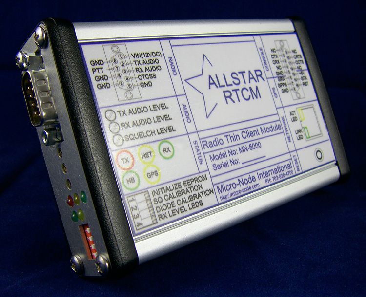

# RTCM Hardware
This is the documentation page to support the commercial SMD implementation of the VOTER Hardware Client, marketed by [Micro-Node](http://www.micro-node.com) as the [Radio Thin Client Module (RTCM)](http://www.micro-node.com/thin-m1.shtml).

<div class="grid" markdown>




</div>

The Micro-Node RTCM (and [VOTER](./voter-hardware.md)) interfaces are typically used with AllStarLink in voting/simulcast applications. They **may** be used for **ANY** repeater interface application, through the `chan_voter` channel driver, as they are primarily a Radio over IP (RoIP) adapter. 

The [VOTER](./voter-hardware.md) is the original through-hole board designed by Jim Dixon (SK) for this application. It is open-source, and the relevant Gerber files and BoM to build it are available. 

The [Micro-Node Radio Thin Client Module (RTCM)](http://www.micro-node.com/thin-m1.shtml) is the commercial version of the VOTER. It uses surface mount parts (SMD), but is functionally equivalent to the original VOTER. In general, the two terms (RTCM/VOTER) are used interchangeably, as they operate the same, and use the same firmware (mostly, see below).

## Firmware
See the [VOTER firmware](./voter-firmware.md) page for information on upgrading the firmware.

## Board Layout

## Connectors and Switches

```
J1    - ICSP Programming Header
P1    - Radio
P2    - Console/GPS
SW1   - Reset (Momentary)
SW2-1 - Init EEPROM
SW2-2 - Calibrate Squelch
SW2-3 - Calibrate Diode
SW2-4 - RX Level LEDs
```

### J1 - ICSP Programming Header (6 pin MTA-100)

```
1 - MCLR
2 - +3.3Vdc
3 - GND
4 - PGD (Program Data)
5 - PGC (Program Clock)
6 – NU
```

### P1 - Radio Connector Pinout (DB9 Male)

```
1 - + VIn (7-24 Volts DC).
2 - Transmit Audio Out
3 - Receive (discriminator) Audio In
4 - External CTCSS Input (optional)
5 - Gnd
6 - Gnd
7 - /PTT Out (open-collector, active-low)
8 - Gnd
9 – Gnd
```

### P2 - Console/GPS Connector Pinout (DB15 Female)

```
1 - NC
2 - Console Transmit Data
3 - Console Receive Data
4 - NC
5 - Gnd
6 - GPS Receive Data
7 - PTT Out
8 - Gnd
9 - NC
10 - Console Request To Send (RTS)
11 - Console Clear To Send (CTS)
12 - NC
13 - GPS Power Output (5Vdc @ 800ma MAX)
14 - GPS Transmit Data
15 – External Reset
```

### SW1 - Reset
Depress SW1 momentarily to reset the RTCM.

### SW2 - DIP Switch 

```
SW2-1 - Init EEPROM
SW2-2 - Calibrate Squelch
SW2-3 - Calibrate Diode
SW2-4 - RX Level LEDs
```

#### SW2-1 - Init EEPROM
SW2-1 will "Initialize configuration parameters in EEPROM" (factory reset). If **ON** when the firmware starts, the operating parameters in the EEPROM will be set to default values. The system activity LED (LD1, green) will stay off for approximately 4 seconds, then stay on steady to indicate that the initialization process is complete. Afterwards, the switch may be **TURNED OFF** and the system will continue running normally. 

!!! note "Diode Calibration"
    If `SW2-3` is **ON** during this procedure, the “Diode Calibration” process will also occur.

#### SW2-2 - Calibrate Squelch
SW2-2 will calibrate squelch. With the receiver connected and its antenna removed, switch **ON** SW2-2. In the next few seconds the "Receive Signal Indicator" (LD3, Green) will flash on and off, then (hopefully) on steady. This indicates that the squelch calibration has occurred successfully. If unsuccessful, the LED will flash either **fast** to indicate that the discriminator noise level is too **high**, or **slowly** to indicate that the discriminator noise level is too **low**. 

!!! note "Diode Calibration"
    If `SW2-3` is **ON** during this procedure, the “Diode Calibration” process will also occur.

#### SW2-3 - Calibrate Diode
SW2-3 will perform "Diode Calibration" when turned **ON**. This may only be done in conjunction with a configuration parameter initialization (see SW2-1, above), or a "Squelch Calibration" (see SW2-2, above). This is a form of temperature compensation, where a power supply voltage is sampled that is dependent on the temperature coefficient of a diode.

#### SW2-4 - RX Level LEDs
SW2-4 temporarily re-purposes LD4 and LD5 to allow for visual indication of RX input level when turned **ON**. With SW2-4 on, LD5 will indicate (by brightness) if the RX level is too low, and LD4 will indicate (by brightness) if the RX level is too high. So the idea is to tune R36 so that there is minimal brightness on both LD4 and LD5 (like a null, more or less). Alternatively, [Menu 97](./voter-menus.md#97-rx-level-display) on the console gives a more graphical method of setting the Rx input level. 

## LED Designations

```
LD1 - Heartbeat
LD2 - PTT
LD3 - COS On solid is valid Rx signal, flashing is without CTCSS
LD4 - GPS On solid is GPS received and locked, flashing is GPS received, lock in progress
LD5 - HOST
```

The COS (RX) LED on the RTCM will flash (same rate as Heartbeat LED) if you have External CTCSS enabled, and the received signal has the wrong (or no) valid PL.


## Jumpers
The RTCM has internal jumpers that can be changed to affect the following:

```
JP1 - Discriminator Level Boost
JP2 - 20dB Pad
JP3 - Output Amp Power Source
JP4 - GPS TX RS-232/TTL Select
JP5 - GPS RX RS-232/TTL Select
JP6 - Not Used
JP7 - Bootloader Programming
```

### JP1 - Discriminator Level Boost
Insert if low discriminator level. If squelch cannot self-calibrate with JP1 removed (too low), try with JP1 inserted.

!!! note "Squelch Calibration Only"
    This jumper affects the squelch calibration circuit only. Not to be confused with JP2, which is the pad for the receive audio.

### JP2 - 20dB Pad
Insert to attenuate discriminator input level by 20db. This pad affects the **receive audio level**. See the [Receive Level Input Calibration](#receive-level-input-calibration) section.

### JP3 - Output Amp Power Source 
Selects power source for output audio amplifier. 1-2 is to power it from the 5VDC power supply. 2-3 is to power it directly from Vin. 

### JP4 - GPS TX RS-232/TTL Select
Selects GPS Serial transmit level. 1-2 RS232 Level, 2-3 TTL (5V) Level.

### JP5 - GPS RX RS-232/TTL Select
Selects GPS Serial receive level. 1-2 RS232 Level, 2-3 TTL (5V) Level.

### JP6 – Reserved
Not used.

### JP7 - Bootloader Programming
This jumper only needs to be removed when programming the bootloader in the dsPIC using the ICSP header. 

## Potentiometers

```
R22 - Squelch adjustment
R36 - Rx Input Level
R10 - Tx Output Level
```

## Initialization 
Once you have verified that the firmware is running, turn on SW2-1 and SW2-3. 

Be sure to do this at a reasonable human room temperature (like 60-80 deg. F). This is necessary because this procedure initializes the operating parameters in the EEPROM and also does a temperature compensation diode calibration, which *needs* to happen at room temperature. 

Once the switches have been turned on, power-cycle the board and wait for the system activity light to come on **steady** (about 4 seconds or so after the 5 second initial wait time).

Then, turn **off** the switches, and proceed with [Squelch Calibration and Setting](#squelch-calibration-and-setting).

## Squelch Calibration and Setting
With the receiver connected and its antenna removed, turn on SW2-2. In the next few seconds the "COS Indicator" (LD3, green) will flash on and off, then (hopefully) on steady. 

This indicates that the squelch calibration has occurred successfully. 

If unsuccessful, the LED will flash either **fast** to indicate that the discriminator noise level is too **high**, or **slowly** to indicate that the discriminator noise level is too **low**. If the discriminator level is too low, try inserting JP1 and try again.

!!! note "Diode Calibration"
    If SW2-3 is inserted during this procedure, the "Diode Calibration" process will also occur.

If you still have troubles calibrating the squelch, you may need to try the [Baseband Examination Window (BEW)](./voter-audio.md#dspbew-firmware-version) firmware.

When Squelch Calibration has been completed, turn **off** SW2-2.

Once the Squelch Calibration procedure has been performed, the squelch adjustment (R22) needs to be properly set. Make sure that the "External CTCSS" is set to "ignore" (value: 0).

```
12 - External CTCSS (0=Ignore, 1=Non-Inverted, 2=Inverted) (0)
```

Adjust R22 until the COS Indicator (LD3) is lit. Then, advance R22 clockwise until LD3 is no longer lit. That is the minimum squelch setting. You probably will want to crank it up at least another turn clockwise, because if you leave it there it will open on a REALLY low level signal.

After proper setting has been achieved, return the "External CTCSS" configuration to its original setting.

[Menu 98](./voter-menus.md#98-status-display) will show the settings of the Squelch Calibration, Diode Calibration, and Squelch Levels:

```
Squelch Noise Gain Value: 45, Diode Cal. Value: 60, SQL Level 675, Hysteresis 10
```

!!! note "Software Squelch"
    Firmware >3.00 allows for the option to set the squelch via software, after initially setting it with the hardware potentiometer to get a baseline level. See the [Squelch Parameters Menu](./voter-menus.md#s-squelch-parameters-menu).

## Receive Level Input Calibration 
See the [VOTER Audio](./voter-audio.md) page for additional considerations when it comes to connecting the RTCM to your receiver, and for level setting instructions.

Place a full-quieting saturated signal on the receiver, modulated by 1000 Hertz sine wave at 3kHz deviation. 

With SW2-4 **on**, LD5 will indicate (by brightness) if the RX level is too low, and LD4 will indicate (by brightness) if the RX level is too high. So the idea is to tune R36 so that there is minimal brightness on both LD5 and LD4 (like a null, more or less). Turn **off** SW2-4, when complete.

Alternatively, [Menu 97](./voter-menus.md#97-rx-level-display) from the console menu gives a more graphical method of setting the receiver input level:

```
RX VOICE DISPLAY:
                                  v -- 3KHz        v -- 5KHz
|=================================>                                        
```

Again, tune R36 until the input level matches 3kHz (since that is the deviation you are feeding in to the receiver).

## Transmit Level Calibration
Transmit output level is adjusted with R10. Transmit Level Calibration is **not* required for satellite receiver sites, obviously.

See the [VOTER Audio](./voter-audio.md) page for considerations when it comes to connecting the transmit audio to your transmitter, and for level setting instructions.

## Console Connection
Serial Console access is provided by an RS-232 serial port (J2 pins 2, 3, and 5) at 57600 baud, 8 bits, No parity, 1 Stop Bit. It is also made available remotely (off-board) via TELNET. When TELNET-ing the default user is `admin` and the password is `radios`. 

```
VOTER System Serial # 1234 Remote Console Access

Login: admin
Password: radios

Logged in successfully, now joining console session...
```

When done with the console session, please use the `q` command to disconnect. The local serial port and the TELNET (remote) user share the same (and only) console session.

### Console Menus
For a thorough explanation of the different menus, see the [VOTER Menus](./voter-menus.md) page.

### Debug Options
The VOTER/RTCM firmware supports some additional debugging information that can be turned on.

From the source code, the different Debug Options are listed as:

```
1 - Alt/Main Host change notifications
2 - Ignore HWlock (GGPS only)
4 - GPS/PPS Failure simulation (GGPS only)
8 - POCSAG H/W output disable (GGPS only)
16 - IP TOS Class for Ubiquiti
32 - GPS Debug
64 - Fix GPS 1 second off
```

Not sure what they all do, but that is what they are. Here are the most common ones used:

* `Alt/Main Host change notifications` shows when the connection to the Asterisk server changes state (when configured for redundant servers).
* `IP TOS Class for Ubiquity` in firmware >2.00, this **disables** marking the IP headers from the RTCM/VOTER **TO** the network with ToS C0/DSCP 48 (UBNT shows this as 802.1p Class 6 (Voice <10mS latency). Other sources show this as a Network Control TOS.) If you are using TOS, you also will want to have `utos=y` in your [`voter.conf`](../config/voter_conf.md) to mark the packets from the network **TO** the RTCM/VOTER.
* `GPS Debug` will print NMEA or TSIP debug strings from the connected GPS.
* `Fix GPS 1 second off` this is for NMEA GPS **only**. It will *add* one second to the time.

The way this works is you add together the options you want to enable (it is a bitmask), and set the debug level accordingly.

For example, if you want to enable GPS Debug and disable IP ToS, set debug to 48.

If you just want to turn on GPS Debug, set debug to 32.

If you just want TOS disabled, set debug to 16.

Set debug back to 0 to clear all debug settings.

## Radio Connections
Here are some example connections for various radios.

### Motorola Quantar
See [here](./assets/QUANTAR-RTCM_INTERFACE_CABLE.pdf) or [here](./assets/RTCM_2_Quantar.pdf)

### Motorols Astro-TAC Receiver
An Astro-TAC receiver utilizes the same receiver as the Quantar. See [here](./assets/RTCM_to_Astro-TAC_Cable.pdf) for how to interface the RTCM to the Astro-TAC shelf to use it as a satellite receiver.

### Vertex VRX-5000
See [here](./assets/RTCM_2_VRX-5000.pdf) for how to connect to a Vertex VRX-5000.

### RTCM to BG7TBL GPSDO
See [here](./assets/RTCM_to_BG7TBL_Cable.pdf) for how to connect the RTCM to a BG7TBL GPSDO.

### Dual RTCM's to Trimble GPSDO and Lady Heather
See [here](./assets/RTCM_321_Cable.graffle.pdf) for an example of how to connect a Trimble GPSDO to two RTCMs, as well as to a PC running Lady Heather for monitoring.

Or, if you just want to connect a Trimble GPSDO to an RTCM directly, see [here](./assets/RTCM_2_Trimble.pdf).


