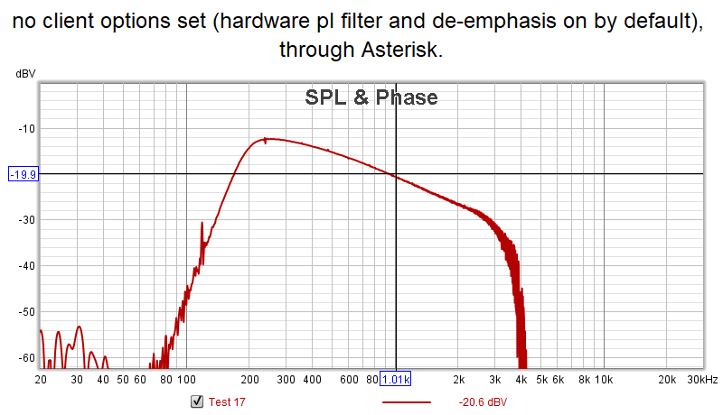

# VOTER Audio Analysis
This page shows the results of analyzing the audio response through an original through-hole VOTER board. As most of the background engineering on the design was lost with Jim's passing, some reverse engineering is required to dig deeper in to the design.

The data presented here analyzes the audio response between different sections of the various circuits in both the audio path, and the squelch/RSSI path.

## Audio Select Lines
If you refer to the [schematic](https://github.com/AllStarLink/Voter/blob/master/VOTER-pcb/KiCAD-schematic/VOTER_2022-01-22.pdf), you will note that there are two Audio Select lines (ASEL1/ASEL2) connected to the 74HC4053, which determine how audio is routed through the VOTER board. 

ASEL1 determines the state of the hardware CTCSS Filter. When this line is Low, the CTCSS Filter is bypassed. When this line is High, the CTCSS Filter is inserted in the audio path (default).

ASEL2 determines the state of the hardware De-emphasis Filter. When this line is Low, the de-emphasis filter is inserted in the audio path. When this line is High, the de-emphasis filter is bypassed.

On initial boot (during the bootloader phase), ASEL1 and ASEL2 are Low. With the firmware running, default options, no host connection, and no GPS, ASEL1 = H and ASEL2 = L, which means that by default the CTCSS Filter is ENABLED and the De-emphasis Filter is ENABLED.

The state of the ASEL lines can be manually overridden by the `noplfilter` and `nodeemp` options in [`voter.conf`](../config/voter_conf.md). They, obviously, will cause their respective filters to be disabled on the VOTER client they are configured for. 

!!! note "Valid Host Connection Required"
    This is only true if there is a valid host connection.

In addition, Menu Item 11 (`Offline De-emphasis Override`) on the [`Offline Menu`](./voter-menus.md#o-offline-mode-parameters-menu) directly affects the state of ASEL2 (de-emphasis). ***This is true, regardless of whether `Offline Mode` is enabled, or not!!*** When Menu Item 11 is `NORM`, the de-emphasis filter is enabled (or at its default condition). When Menu Item 11 is set to `OVERRIDE`, the de-emphasis filter is bypassed. 

Note however, the effect of this setting is also directly tied to the setting of Main Menu Item 13 (`COR TYPE`). If `COR TYPE` is set to `NORMAL`, you can toggle the de-emphasis filter with Menu Item 11 on the Offline Menu. If the `COR TYPE` is set to `IGNORE COR`, the de-emphasis filter is bypassed immediately, and Menu Item 11 on the Offline Menu has no effect.
 
## Test Configuration
The data was captured using [Room Eq Wizard](https://www.roomeqwizard.com/) software (version 5.20.5) on a Dell E6510, using the built-in sound card. The sound card response was calibrated out (calibration file created and applied).

The VOTER being used was built by VE7FET, and was running Firmware V3.00.

In most cases, "zero" is actually about -15.8dBm, so through measurements would be relative to that. Sorry, I didn't feel like figuring out how to reference the measurement sweeps to zero out that correction. 

This is the baseline measurement, with the calibration applied, with the output of the sound card connected to the input, using a 10uF capacitor on the microphone input (DC blocking).

The sweeps presented below should be used as a general representation of the audio characteristics of the path. This is definitely not a scientific, lab-grade experiment. I was more interested in what the relative responses were of various parts of the circuit, as well as the effect and operation of various option settings in the config file (and menus).

## Audio Circuitry Sweeps

### Input Amplifier Response
Sweeping from Radio DB9 Pin 3 to U4 Pin7. 10uF cap on Mic input of sound card. No host connection. 

Inserting JP2 (20dB Pad):

If we do some circuit analysis, this is a first-order active LPF. The corner frequency (3dB point) is set by C29 and R34 (and R33 when the pad is enabled). With C29/R34, the corner frequency works out to be 1/(2\*pi\*R34\*C29) = 7.234KHz. That actually explains why we see a roll off on the upper end in the first sweep (even though the measured 3dB point on that graph is around 5.8kHz, that can likely be explained by C29 tolerance). This is well above the pass band of the audio we are interested in (300Hz to 3kHz), so it is fairly irrelevant.

The roll-off at the bottom end of the sweep is likely due to C30.

Being an inverting amp, the gain is set by the ratio of R34/R36. So with JP2 out, the gain is 10, or 20log10 = 20dBv. If we insert JP2, R33 and R34 are now in parallel, for a combined resistance of 99.099k. Now our gain is 99.099/100 = 0.99, or 20log0.99 = -0.08dBv (effectively 0dBv gain). Hence, JP2 is indeed a 20dB pad.

Note that with JP2 in, the corner frequency of the filter is theoretically shifted to 73kHz... which is why the second sweep shows a flat response at higher frequencies (and the low-end roll off from C30 is still present).

### CTCSS Filter Response
Sweeping from Radio DB9 Pin 3 to U14 Pin 1 to characterize the response of the high-pass CTCSS Filter. 10uF cap on Mic input of sound card. No host connection. JP2 is OUT.

Sweeping from U14 Pin 2 to U14 Pin 1, just the CTCSS filter by itself:

Again, the effects can be seen when sweeping through the Input Amp (a slight roll off at the higher end frequencies). Response is flat when sweeping through the CTCSS Filter directly.

The 3dB point of the filter is about 200Hz.

Some reverse-engineering of this filter seems to fit with it being a 6th-order Sallen-Key Butterworth filter. The filter coefficients seem to pretty closely match the resistors being used, when using Fc of 200Hz.

Reference [Op Amps for Everyone](https://web.mit.edu/6.101/www/reference/op_amps_everyone.pdf) Pages 308, 309, 341. A 6th-order filter is 3 cascaded 2nd-order stages.

### Anti-alias Low-pass Filter Response
Sweeping from Radio DB9 Pin 3 to U4 Pin 1 to characterize the response of the Anti-alias LPF. 10uF cap on Mic input of sound card. Host connection established (mix mode/no GPS), `nodeemp` and `noplfilter` options set on client config to bypass hardware CTCSS and De-emphasis Filters (ASEL1=L, ASEL2=H).

The Anti-alias LPF 3db point is about 3.22kHz. Fairly flat response through the audio pass band (up to 3kHz).

Sweeping from U14 Pin 4 to U4 Pin 1. Just the Anti-alias Filter directly:

There appears to be some impedance mismatch with the test setup, as there is higher loss observed... but the response is about the same.

### De-emphasis Filter Response
Sweeping from Radio DB9 Pin 3 to U14 Pin 5 to characterize the response of the De-emphasis Filter. 10uF cap on Mic input of sound card. Host connection established (mix mode/no GPS), `noplfilter` option set in client config to bypass CTCSS Filter (ASEL1=L), don't care about ASEL2.

Not the greatest response here.

There seems to be some gain here (note the peak response is about -6.2dBV, not the -15.8dBv we've seen on the other sweeps). The response is also not flat, that is probably some interaction with the input buffer stage.

The expected de-emphasis curve for LMR should have an Fc=212Hz (for 750uS de-emphasis), and roll off at 6dB/octave. We see Fc is around 370Hz, and the roll-off isn't very flat. We have 6dB/octave from 1kHz to 2kHz, but 4dB/octave from 2kHz to 3kHz, and 3dB/octave from 3kHz to 4kHz. 

Tried sweeping the de-emphasis filter directly (U14 Pin 3 to U14 Pin 5), but there was too much loading, and not enough signal was recoverable (probably an interaction with the test setup).

If we do a little circuit analysis here, we can see this is probably a design issue.

The gain is coming from the relationship of R37/R38. In an inverting amplifier, this is going to give us a gain of 100/33=3.3, or 20log3.3=10.37dBv. That is pretty darn close to the about 9.6dBv (15.8-6.2) that was measured.

If we solve for Fc using R37/C31 (1/(2\*pi\*R\*C)), we get 339Hz. Again, that is pretty close to the about 370Hz actually measured (that's within 10%, which is easily accounted for in the C31 tolerance, and the cheezy test setup). We would normally want Fc to be 212Hz for LMR applications.

Of note, solving for the time constant of R37/C31, we get 470uS... one would have expected that to have been 750uS.

So, I would say this is an unfortunate design oversight. The problem is, correcting it in the future would mean incompatibility with all the existing VOTER/RTCM's out there. So, perhaps, there will need to be some thought in adding some options for compatibility with existing hardware, versus deployment on new systems.

### Overall RX Audio Chain Responses
Here are the responses for the RX Audio chain, measuring from Radio DB9 Pin 3 to U4 Pin 1. 10uF capacitor on Mic input of sound card. Host connection established (mix mode/no GPS). `noplfilter` and `nodeemp` options set as needed.

You will note the effect of the Anti-alias LPF in the responses at the upper end of the frequency range.

#### No CTCSS Filter, No De-emphasis Filter
ASEL1=L, ASEL2=H

#### With CTCSS Filter, No De-emphasis Filter
ASEL1=H, ASEL2=H

#### No CTCSS Filter, With De-emphasis Filter
ASEL1=L, ASEL2=L

!!! note "Increased Audio Level"
    This test reveals a 9dB increase in audio level. That is odd. It is pointing to a design issue with the de-emphasis filter, as it is similar to what we saw when sweeping the de-emphasis filter directly.

#### With CTCSS Filter, With De-emphasis Filter
ASEL1=H, ASEL2=L

!!! note "Increased Audio Level"
    This test reveals a 7dB increase in audio level. Likely caused by the de-emphasis filter response, again. However, on the positive side, we are seeing 7dB/octave de-emphasis from 300-900Hz (which is pretty close to the desired 6dB/octave), 5.8dB/octave from 1kHz to 2kHz, and 4.3dB/octave from 2kHz to 3kHz.

### Output Amplifier Response
The Output Amplifier (U11) was not swept, as it was not easy to break in to the input for it to inject a signal.

However, we can do some circuit analysis and see that it is another first-order LPF. R59/C60 give it a corner frequency of 10.261kHz. R59/R62 give it a gain of 33, but it is also driven by the TX Level Pot to control the output level. There is likely some low-end roll off from C64.

### Summary
So, some interesting observations were revealed in these sweeps.

We see that the CTCSS filter has a pretty good response. The anti-alias filter too seems to have a pretty good response.

The de-emphasis filter is a bit of an odd ball. It appears to have a decent amount of gain (unexpected), and the low-pass response is not very consistent with the desired Fc=212Hz and roll off at 6dB/octave. However, when both the CTCSS filter and the de-emphasis filter are both in-circuit, the de-emphasis response is better, but we still have unexpected gain.

As a result of these observations one should be very careful when aligning their audio levels, and do not change options "on-the-fly" once they are set, as it will have a direct effect on the audio response in to Asterisk.

## Squelch/RSSI Circuitry Sweeps

### Input Pad Response
Sweeping from Radio DB9 Pin 3 to U1 Pin 5. 10uF cap on Mic input of sound card. Checking response of JP1. With JP1 IN:

Removing JP1 provides about 33dB of additional loss (padding). The high-pass response is a function of C10 (0.1uF).

### Noise Filter Response
Sweeping from U1 Pin 5 (TP2) to U2 Pin 14 (TP1), shorting U1 Pin 5 to 6 because U1 is in-initialized and at max R. 10uF cap on Mic input to sound card.

Fc appears to be around 9kHz of the high-pass filter. 

### Summary
As noted in the VOTER System Documentation, this is a high-pass filter used to measure high-frequency noise from the discriminator, in order to determine how quiet (strong) the signal is. The stronger the signal is, the less high-frequency audio components there will be (since the signal will be "quieter"). When this audio is rectified by U2A (and its associated components), a DC RSSI is generated to quantify the signal strength. A DC voltage closer to 0V would be a stronger signal.

That is why it is very important to have a radio with discriminator audio that has good high-frequency response, and why radios like the Motorola Quantar and SLR present issues (as their "discriminator audio" really isn't, it is processed, and doesn't have the necessary high frequency response).

## Audio Response THROUGH Asterisk

### Calibration
In order to sweep audio through `Asterisk/app_rpt`, we're going to need to calibrate the VOTER. Of course, this is going to be a little tricky, since we aren't actually using a radio with discriminator audio. However, we to have a "white noise" generator we can use to our advantage to simulate that.

Using the REW output at -12.06dBv gives us about 300mVpp at the Radio DB9 Pin 3 (measured with a scope).

Use the white noise generator, and put the VOTER in to Squelch and Diode calibration mode with the appropriate jumpers (with JP1 IN). The board calibrates with a noise value around 61, and about 125mVpp is measured at U2 Pin 5.

During calibration, 1 flash of the COS LED every about 4 seconds means the calibration is in progress. One flash every 1 second means the audio is too low. One flash every 0.5 seconds means the audio level is too high.

Normalize all jumpers settings, reboot the VOTER, restart Asterisk (as a side note, put `noplfilter` and `nodeemp` in the client config in [`voter.conf`](../config/voter_conf.md) to get a flat response through the VOTER).

The Squelch Pot can now be adjusted (with the white noise generator still on), until the COS LED goes out. Note that turning OFF the white noise generator makes the VOTER assume there is a "full-quieting" signal on the receiver, and will open the squelch. Read that last part again.

Use the REW signal generator to generate a 1kHz tone (at the nominal -12.06dBv level). Use the RX Level (Main Menu Item 97) display and the RX Level pot to adjust to the 3kHz mark. Measure the level on the Radio DB9 Pin 3 with a scope.

Audio should be repeating through Asterisk, so move the scope to Radio DB9 Pin 2 (TX Audio Output), and adjust the TX Level Pot for the same level measured on the DB9 pin 3. 

Switch back to the white noise generator to close the squelch.

You should now have a "calibrated" VOTER/Asterisk system, like you normally would when connected to a repeater. There should be a 1:1 level from input to output (through `app_rpt`) of the VOTER. Now we can proceed with measuring frequency response.

### Baseline Measurement Through Asterisk
For this measurement, we want `noplfilfer` and `nodeemp` set in [`voter.conf`](../config/voter_conf.md). This switches OUT both the hardware CTCSS and De-emphasis Filters. This should be a baseline response through `app_rpt`:

Note that our new baseline relative level is about -20dBv.

Audio pass band response from 300Hz-3kHz is pretty flat. There is some roll off below 100Hz, and it looks like the "brick wall" above 3kHz is probably an effect of the CODEC.

### No CTCSS Filter/With De-emphasis
This is the response with the `noplfilter` option only for the client in [`voter.conf`](../config/voter_conf.md). Therefore, de-emphasis is ENABLED:

We see the (unfortunate) effect of gain in the de-emphasis filter. The de-emphasis is about 4dB/octave.

### With CTCSS Filter/No De-emphasis
This is the response with the `nodeemp` option only for the client in [`voter.conf`](../config/voter_conf.md). Therefore, the CTCSS filter is ENABLED:

There are a few artifacts in the measurement, but it effectively matches what the sweep of the hardware filter was.

### With CTCSS Filter/With De-emphasis
This is the response with no options on the client in [`voter.conf`](../config/voter_conf.md), effectively the default configuration. Both the hardware CTCSS Filter and De-emphasis Filter are ENABLED:

### Summary
The audio response sweeping through `Asterisk/app_rpt` is pretty much as expected, reflecting the response seen when sweeping the VOTER hardware directly. The only real difference seen is the "brick wall" above 3kHz, which is likely due to the characteristics of the CODEC being used for the audio transport.

## Other Options

### `plfilter` and `hostdeemp`
What about the `plfilter` and `hostdeemp` options in [`Voter.conf`](../config/voter_conf.md) you ask?

Well, those options don't actually affect the audio THROUGH Asterisk (from the associated receiver to the transmitter), they affect the audio that would be going to the channel driver and to connected nodes.

These options are designed to be used with ["Duplex Mode 3"](./voter-chan_voter.md#duplex-mode-3hostdeemp). In that mode, the actual repeat audio for the repeater attached to the VOTER is done "in-cabinet", that is, audio is routed on the VOTER directly from receive to transmit, without going to the Asterisk host first. Asterisk sends telemetry tones and linked audio to the VOTER to mix in to the transmitter, but the repeat audio doesn't transit the host.

As such, Duplex Mode 3 is designed to use discriminator audio. That audio typically needs to be de-emphasized (and optionally CTCSS filtered), before Asterisk can do stuff with it (repeat it to linked nodes, DTMF decode, etc.). That is where these options, `hostdeemp` and `plfilter` come in. When those options are set, they apply software filters to the incoming discriminator audio (from the VOTER), before presenting it to the `app_rpt` channel driver.

!!! warning "Warning"
    Be forewarned, do NOT mess with the `hostdeemp` option, if you are not using Duplex Mode 3!! Unpredictable (unwanted) results happen when you have a mismatch between Duplex Mode 3 set in the VOTER, `hostdeemp` enabled in [`voter.conf`](../config/voter_conf.md), and `duplex=3` in [`rpt.conf`](../config/rpt_conf.md). Having those settings not matched (either all on, or all off) will cause the hardware de-emphasis filter in the VOTER to toggle on and off when either the VOTER restarts or Asterisk restarts. This is definitely **NOT** what you want!

Note that these options seem that they are supported on a *per-client* basis, but they are apparently not (tested and confirmed that `hostdeemp` on a client config does not change the hardware de-emphasis filter setting). They appear to be supported on a *per-instance* basis only.

### `gtxgain`
This is another obscure per-instance option in [`voter.conf`](../config/voter_conf.md).

This option allows positive and negative floating values (ie 6.0 or -6.5), measured in dB. It will adjust the audio level sent from Asterisk to the transmitter(s) by the desired amount. This was measured and confirmed to be relatively accurate.

### Sawyer Mode
The operation of [Sawyer Mode](./voter-menus.md#sawyer-mode) was also confirmed in these tests.

Sawyer Mode controls the operation of the hardware CTCSS Filter on the VOTER when Offline Mode is used. 

If the hardware CTCSS Filter is enabled, Option 1170=1, and Offline Mode is enabled, the loss of connection to the Host causes the hardware CTCSS Filter to turn OFF. When the connection to the Host is restored, the CTCSS Filter turns back ON.

This is contrast to normal operation where entering Offline Mode has no effect on the hardware CTCSS Filter.
