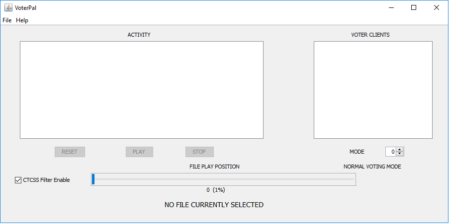

#VOTER `chan_voter`
The `chan_voter` channel driver is the interface between Asterisk and the [VOTER](./voter-hardware.md) or [RTCM](./rtcm-hardware.md) radio/repeater hardware interfaces. It allows receiver voting, simulcast transmitters, or just a plain repeater interface when used with the appropriate hardware.

This page will document configuring the channel driver, done through [`voter.conf`](../config/voter_conf.md), as well as some common issues and more obscure features that may not be widely known.

## How chan_voter Works
Each node has a number of potential "clients" associated with it. In [`voter.conf`](../config/voter_conf.md), each stanza (category/instance) is named by the **node number** that the clients specified within the stanza are to be associated with. 

Each client entry within that stanza (instance) then consists of an arbitrary (relatively meaningless, just included for easy identification purposes within this channel driver, and has nothing to do with its operation) client identifier name equated to a unique password. This password is programmed into the client. **All clients must have unique passwords, as that is what is used by this channel driver to identify them.**

Each channel instance (as opened by `app_rpt` as a main radio channel in [`rpt.conf`](../config/rpt_conf.md), e.g. `rxchannel=Voter/1999` in [`rpt.conf`](../config/rpt_conf.md)) and is directly associated with the node that opened it.

Each client has a pair of circular buffers, one for mu-law (mulaw/ulaw) audio data, and one for RSSI value. The allocated buffer length in all clients is determined by the `buflen` parameter, which is specified in the `[global]` stanza in [`voter.conf`](../config/voter_conf.md) in milliseconds, and represented in the channel driver as a number of samples (actual buffer length, which is 8 \* milliseconds). 

Every channel instance has an index ("drainindex"), indicating the next position within the physical buffer(s) where the audio will be taken from the buffers and presented to the Asterisk channel stream as VOICE frames. Therefore, there is an abstraction of a "buffer" that exists starting at *drainindex* and ending (modulo) at *drainindex - 1*, with length of *buflen*.

`buflen` is selected so that there is enough time (delay) for any straggling packets to arrive before it is time to present the data to the Asterisk channel. 

The idea is that the current audio being presented to Asterisk is from some time shortly in the past. Therefore, **NOW** is the position in the abstracted buffer of *bufdelay* (generally `buflen - 160`, you have to at least leave room for an entire frame) and the data is being presented from the start of the abstracted buffer. As the physical buffer moves along, what was once "now" will eventually become far enough in the "past" to be presented to Asterisk (gosh, doesn't this sound like a scene from "Spaceballs"??.. I too always drink coffee while watching "Mr. Radar").

During the processing of an audio frame to be presented to Asterisk, all client's buffers that are associated with a channel instance (node) are examined by taking an average of the RSSI value for each sample in the associated time period (the first 160 samples of the abstracted buffer (which is the physical buffer from *drainindex* to *drainindex + 159*) and whichever one, if any that has the largest RSSI average greater then zero is selected as the audio source for that frame). The corresponding audio buffer's contents (in the corresponding offsets) are presented to Asterisk, then **ALL** the clients corresponding RSSI data are set to 0, **ALL** the clients corresponding audio are set to quiet (0x7f). 

The overwriting of the buffers after their use/examination is done so that the next time those positions in the physical buffer are examined, they will not contain any data that was not actually put there, since all client's buffers are significant regardless of whether they were populated or not. This allows for the true "connectionless-ness" of this protocol implementation.

## Asterisk CLI Commands
These are the CLI commands that Asterisk and `chan_voter` supports:

```
*CLI> help voter
        voter debug level  Enable voter debugging
            voter display  Display voter (instance) clients
               voter ping  Ping (check connectivity) to client
               voter prio  Specify/Query voter client priority value
             voter record  Enables/Specifies (or disables) voter recording file
             voter reload  Reloads chan_voter parameters
               voter test  Specify/Query voter instance test mode
               voter tone  Sets/Queries Tx CTCSS level for specified chan_voter instance
          voter txlockout  Set Tx Lockout status for voter (instance) clients
```

### `voter debug level`

Usage: 

```
voter debug level {0-7}
```

Prints debug information from the channel driver at increasing verbosity. 

!!! warning "Warning"
    **Beware,** text will be rapidly scrolling by at higher debug levels.

Turn off with `voter debug level 0`.

### `voter display`

Usage: 

```
voter display [instance]
```

The `instance` is usually the node number associated with the channel driver in [`rpt.conf`](../config/rpt_conf.md) (`rxchannel=Voter/1999`), which is also defined as a stanza in [`voter.conf`](../config/voter_conf.md) as well (`[1999]`).

Running `voter display` will present a scrolling list of the real-time RSSI being received from all clients associated with that `instance`.

```
VOTER INSTANCE 1999 DISPLAY:

 NORTH      |>                                                       | [  0]
 SOUTH      |>                                                       | [  0]
 EAST       |>                                                       | [  0]
```

```
VOTER INSTANCE 1999 DISPLAY:

 NORTH      |==============================================>         | [240]
 SOUTH      |=======================================================>| [255]
 EAST       |======================================================> | [253]
```

Press **enter** to stop.

### `voter ping`

Usage: 

```
voter ping [client] <# pings, 0 to abort>
```

Used to checking network latency to clients. Use the `client_name` from [`voter.conf`](../config/voter_conf.md).

Defaults to 8 pings, if no number of pings is specified. Use at least 100 pings when [tuning buffer lengths](./voter-buffers.md). Send the same command with 0 pings to abort an in-progress ping.

```
*CLI> voter ping EAST 10
PING (EAST) Response:   seqno: 1  diff: 43 ms
PING (EAST) Response:   seqno: 2  diff: 42 ms
PING (EAST) Response:   seqno: 3  diff: 44 ms
PING (EAST) Response:   seqno: 4  diff: 42 ms
PING (EAST) Response:   seqno: 5  diff: 43 ms
PING (EAST) Response:   seqno: 6  diff: 43 ms
PING (EAST) Response:   seqno: 7  diff: 42 ms
PING (EAST) Response:   seqno: 8  diff: 42 ms
PING (EAST) Response:   seqno: 9  diff: 42 ms
PING (EAST) Response:   seqno: 10  diff: 43 ms
PING (EAST): Packets tx: 10, rx: 10, oos: 0, Avg.: 42.600 ms
PING (EAST):  Worst: 44 ms, Best: 42 ms, 100.0% Packets successfully received (0.0% loss)
*CLI>
```

The critical number is the `Worst: ` value. That is the one you will want to pay attention to when tuning buffers.

This ping **does not** use ICMP. It accomplishes it's task over the [VOTER Protocol](./voter-protocol.md). Ping times are round-trip.

### `voter prio`

Usage:

```
voter prio instance_id [client_id] [priority value]
```

Query the existing priorities, or arbitrarily assign (override) a priority value to a particular client. The `instance` (typically the node number the client is assigned to) and the `client_name` as specified in [`voter.conf`](../config/voter_conf.md) are required.

With an `instance` only, and no `client` specified, queries existing priorities for all clients associated with that instance:

```
*CLI> voter prio 1999
Voter instance 1999 priority values:

client NORTH: prio: 0 (not overridden)
client SOUTH: prio: 0 (not overridden)
client EAST: prio: 1 (not overridden)
```

`Not overridden` indicates that the displayed priority is the one configured in [`voter.conf`](../config/voter_conf.md).

Specify an `instance` and `client` to query the priority for that specific client:

```
*CLI> voter prio 1999 NORTH
Voter instance 1999, client NORTH: prio: 0 (not overridden)
```

Assign a specific priority to a specific client:

```
*CLI> voter prio 1999 SOUTH 2
voter instance 1999 client SOUTH prio (override): previous level: <disabled>, new level: 2

*CLI> voter prio 1999
Voter instance 1999 priority values:

client NORTH: prio: 0 (not overridden)
client SOUTH: eff_prio: 2, prio: 0, override_prio: 2
client EAST: prio: 1 (not overridden)
```

!!! note "Note"
    A priority of `0` is "disabled", as in "no priority" assigned, vote equally.

Revert changes to default/normal by assigning a priority level of `-2` or `off` or `disable` to the client:

```
*CLI> voter prio 1999 SOUTH -2
voter instance 1999 client SOUTH prio (override) disabled

*CLI> voter prio 1999
Voter instance 1999 priority values:

client NORTH: prio: 0 (not overridden)
client SOUTH: prio: 0 (not overridden)
client EAST: prio: 1 (not overridden)
```

Disable a client from being voted (effectively disable it's receiver) by assigning a priority of `-1`:

```
*CLI> voter prio 1999 SOUTH -1
voter instance 1999 client SOUTH prio (override): previous level: 2, new level: -1

*CLI> voter prio 1999
Voter instance 1999 priority values:

client NORTH: prio: 0 (not overridden)
client SOUTH: eff_prio: -1, prio: 0, override_prio: -1
client EAST: prio: 1 (not overridden)
```

To recap:

* A priority of 0 is no priority, everyone is voted equally
* A priority of 1-100 is supported, with lower numbers having a higher priority over clients with the same RSSI value and a lower priority
* A priority of -1 disables a particular client (disables it from receiving)
* A priority of -2 returns a client to normal and the priority assigned in [`voter.conf`](../config/voter_conf.md) or "0" if no priority is specified

### `voter record`

Usage: 

```
voter record instance_id [record filename]
```

Enables/specifies (or disables) recording file for `chan_voter`. See Voter Recording and Playback below for example configuration and usage.

The `instance` is usually the node number associated with the channel driver in [`rpt.conf`](../config/rpt_conf.md) (`rxchannel=Voter/1999`), which is also defined as a stanza in [`voter.conf`](../config/voter_conf.md) as well (`[1999]`).

Specify a filename to record the voter data to. Specify `voter record` with no file name, or with a new filename to stop recording a file already opened. 

### `voter reload`

Usage: 

```
voter reload
```

Reload all the variables in [`voter.conf`](../config/voter_conf.md). Useful if you are making changes on-the-fly, such as setting the `txctcsslevel`.

### `voter test`

Usage:

```
voter test instance_id [test value]
```

Puts an `instance` in to test mode.

The `instance` is usually the node number associated with the channel driver in [`rpt.conf`](../config/rpt_conf.md) (`rxchannel=Voter/1999`), which is also defined as a stanza in [`voter.conf`](../config/voter_conf.md) as well (`[1999]`).

Enter with just the `instance` value to query the current test state:

```
*CLI> voter test 1999
voter instance 1999 Test: currently disabled
```

Applicable `test` values are:

* 0 - Normal voting operation
* 1 - Randomly pick which client of all that are receiving at the max RSSI value to use
* &gt;1 - Cycle thru all the clients that are receiving at the max RSSI value with a cycle time of (test mode - 1) frames. In other words, if you set it to 2, it will change every single time. If you set it to 11, it will change every 10 times. This is serious torture test

### voter tone

Usage:

```
voter tone instance_id [new_tone_level(0-250)]
```

Sets/Queries Tx CTCSS level for specified `instance`.

The `instance` is usually the node number associated with the channel driver in [`rpt.conf`](../config/rpt_conf.md) (`rxchannel=Voter/1999`), which is also defined as a stanza in [`voter.conf`](../config/voter_conf.md) as well (`[1999]`).

Use to assist with setting the `txctcsslevel`, so you don't have to edit [`voter.conf`](../config/voter_conf.md) and do a `voter reload` all the time. Once you determine the suitable level for your tone, you can write that to [`voter.conf`](../config/voter_conf.md).

### voter txlockout

Usage:

```
voter txlockout [instance] <client_list>
```

Set Tx Lockout for voter `instance` `clients`.

The `instance` is usually the node number associated with the channel driver in [`rpt.conf`](../config/rpt_conf.md) (`rxchannel=Voter/1999`), which is also defined as a stanza in [`voter.conf`](../config/voter_conf.md) as well (`[1999]`).

The `clients` would be the defined `client_name` associated with that `instance`.

Query the current clients that are not allowed to transmit by just specifying the `instance` name:

```
*CLI> voter txlockout 1999
Full list of Tx Locked-out clients for voter instance 1999:
No clients are currently locked-out

Full list of normally transmitting clients for voter instance 1999:
Client NORTH is able to transmit
Client SOUTH is able to transmit
Client EAST is able to transmit
```

Lockout (disable) the transmitter at a particular client:

```
*CLI> voter txlockout 1999 +NORTH
Client NORTH tx lockout Enabled

Full list of Tx Locked-out clients for voter instance 1999:
Client NORTH tx is locked-out

Full list of normally transmitting clients for voter instance 1999:
Client EAST is able to transmit
Client SOUTH is able to transmit
```

Unlock (enable) the transmitter at a particular client:

```
*CLI> voter txlockout 1999 -NORTH
Client NORTH tx lockout Disabled

Full list of Tx Locked-out clients for voter instance 1999:
No clients are currently locked-out

Full list of normally transmitting clients for voter instance 1999:
Client NORTH is able to transmit
Client SOUTH is able to transmit
Client EAST is able to transmit
```

## Less Known Facts/Features

### ADPCM Functionality
The original intent was to change this driver to use signed linear internally, but after some thought, it was determined that it was prudent to continue using mulaw (ulaw) as the "standard" internal audio format (with the understanding of the slight degradation in dynamic range when using ADPCM resulting in doing so). This was done because existing external entities (such as the recording files and the streaming stuff) use mulaw as their transport, and changing all of that to signed linear would be cumbersome, inefficient and undesirable.

ADPCM can be specified as the transport encoding, see [`voter.conf`](../config/voter_conf.md) for information on enabling that.

### "Dynamic" Client Functionality

**DON'T USE IT!!**. It is intentionally **NOT** documented to encourage non-use of this feature. It is for demo purposes **ONLY**. The `chan_voter` driver will **NOT** properly perform reliably in a production environment if this option is used.

### Duplex Mode 3/`hostdeemp`
As of VOTER board firmware 1.19 (7/19/2013), there are a set of options in both the firmware ("DUPLEX Mode 3" support), and the `hostdeemp` option (instance-wide) in the [`voter.conf`](../config/voter_conf.md) file on the host.

Duplex Mode 3 in `app_rpt` allows for "in-cabinet" repeat audio (where the actual radio hardware supplies the repeated audio directly itself, and `app_rpt` simply "adds" all of the other audio as appropriate).

The VOTER/RTCM board now has an option to do the same functionality itself, for a case where local repeat audio is desired without the "network audio delay" normally associated with VOTER/RTCM board operation, and for a radio that doesn't have the option of providing "in cabinet" repeat audio (along with externally provided audio) itself.

Because of limitations with the VOTER/RTCM board hardware (being that there is only one audio path into the processor, and it either has de-emphasis in its "hardware path" or not), it is necessary if you:

* Wish to have the `duplex=3` functionality in `app_rpt`
* Have the `DUPLEX3` support enabled in the VOTER/RTCM board
* Have a transmitter that you are "modulating directly" (with flat audio)

If all of the above is true, then you need to use the `hostdeemp` option in `chan_voter` ([`voter.conf`](../config/voter_conf.md)), which basically "forces" the VOTER/RTCM **NOT** to do de-emphasis in hardware (it will send the non-de-emphasized audio to the host), and have the host "do" the de-emphasis (in software) instead.

This will allow the VOTER/RTCM to be able to "pass" the non-de-emphasized (discriminator) audio back into the "direct modulation audio" stream, since that is what will be "presented" to the processor in the VOTER/RTCM, as the hardware de-emphasis is disabled in this mode.

If you have a transmitter that you are "feeding" line-level (mic) audio, then this mode is not necessary, as the VOTER/RTCM is fully capable of providing the functionality all by itself.

Obviously, it is not valid to use **ANY** of the `duplex=3` modes in a voted and/or simulcast system.

### Redundant "Proxy" Mode
A "Redundant" (backup) server may be set up, so that if the "primary" server fails, clients can detect this failure, and connect to the designated "backup" (or "secondary") server.

Needless to say, since Internet connectivity is not by any means guaranteed to be consistent, it is possible for some clients to have working connectivity to the "primary" server and not others, even though the "primary" server is functional.

If this was to occur, actual voting and/or simulcast clients would have a "broken" system (being that all the clients need to be on the same server for any sort of functional operation).

To eliminate this possibility, functionality has been added so that a "secondary" server will "proxy" (forward) all of its VOTER packets to the "primary" (if the "primary" is
on line), and the "primary" will generate all of the outbound VOTER packets, which (for clients "connected" to the "secondary" server) get sent to the "secondary" server to distribution to its clients.

This allows for a "unity" of all of the clients on a network, even though they may be connected to different servers.

In addition, it is assumed that "permanent linking" (at least of some sort) will be provided between the channel side of the `chan_voter` instances (presumably through a "perma-link" provided by `app_rpt`).

When the "secondary" is "proxying" (to the "primary") it does not provide direct connectivity to/from its locally-connected clients, thus allowing them to "connect" via the "primary" server instead. In "normal" mode, it works "normally".

The operation is performed by more-or-less "encapsulating" the VOTER packets received by the "secondary" server, and forwarding them on to the "primary" server, where they are "un-encapsulated" and appear to that serer to be coming from clients connected directly to it (and keeps track of which ones are connected in this manner, etc.). When it needs to send VOTER packets to a client connected through the "secondary", it "encapsulates" them, and sends them to the "secondary", where they get "un-encapsulated" and sent to their associated connected clients, based upon information in the "encapsulation".

If the "secondary" server loses (or does not make) connection to the "primary", it operates as normal, until such time as it can make the connection.

The server redundancy feature is local to each `chan_voter` `instance`.

For each `chan_voter` `instance` served by both the "primary" and "secondary" servers, the client list (parameters, etc.) **MUST** be identical.

In addition, the following things **must** be added uniquely on each server:

* In the "primary" server, there needs to be a "primary connectivity" client specified for each "secondary" server for which it is "primary". Basically, this is a client that does NOTHING other then providing a means by which the "secondary" can determine whether the "primary" is on line
    * It is a standard `chan_voter` client, with nothing else specified other then its password. Again, although it is a "legitimate" client (technically), its only purpose **MUST** be to allow the secondary server to connect to it
* The "primary" server also needs to have the following in all of its instances that require redundancy:

```
isprimary = y
```

* The "secondary" server needs to have the following in all of its instances that require redundancy:

```
primary = 12.34.56.78:1667,mypswd
```
Where 12.34.56.78:1667 is the IPADDDR:PORT of the "primary" server, and mypswd is the password of the "primary connectivity" client

!!! note "Timing Sources"
    Master timing sources **MUST** be local to their associated server, and therefore, can not be operated in a redundant configuration. If a radio needs server redundancy, it **CAN NOT** be connected to a master timing source. Also, the master timing source **MUST** be associated with a `chan_voter` instance that **DOES NOT** have redundancy configured for it, even if a separate instance needs to be created just for this purpose.

Also, if non-GPS-based operation is all that is needed, just the use of redundancy within the clients is sufficient, and does not require any use of the server redundancy features.

### Voter Recording and Playback
The `chan_voter` channel driver has the ability to record VOTER streams by the channel driver live on the air (using the `voter record` command in Asterisk console). This also records time-stamped data and the voted receiver at that particular time along with RSSI readings. This can then be played back using the VoterPal GUI JAVA applet.

#### How to Setup Playback

* Download the files from [Github](https://github.com/AllStarLink/Voter/tree/master/archive/voterpal) 
* Run `VoterPal.jar`. You may come across issues with running Java such as security permissions. These can be allowed 
* Once running, you will see the applications GUI. File --&gt; Open to select your voter data files. 



* `Reset` - Resets the file back to start
* `Play` - Plays the recorded file
* `Stop` - Stops the current playing file in it's current position
* `CTCSS Filter Enable` - Removes CTCSS hum from any recorded audio stream
* `File Play Position` - Drag this slider to skip
* `Activity` - This will show time-stamped information including RSSI of the selected VOTER client within the recorded data stream
* `Voter Clients` - This will show the real time voted client. This is also dependent of the Mode setting
* `Mode` -Various modes can be selected in VoterPal
    * `0` - Normal Voting Mode  
    * `1` - Randomly pick which client of all that are receiving at the max RSSI value to use
    * `>1` - Cycle thru all the clients that are receiving at the max RSSI value with a cycle time of (test mode - 1) frames. In other words, if you set it to 2, it will change every single frame. If you set it to 11, it will change every 10 frames. This is a serious torture test
    * `<0` - Any value less than zero will force select the Voter Client (i.e. -1 is the first client, -2 is the 2nd client)       

#### Node Configuration
As mentioned above the Asterisk CLI is as follows:

```
voter record instance_id [record filename] 
```

This enables/Specifies (or disables) recording file for `chan_voter`.

Where:

* `instance_id` - voter number instance
* `record filename` - is the filename of the recording to be stored

A script can be made and placed in `/etc/cron.hourly` which will run every hour. Every time the above command is run in Asterisk, it creates a new file. An example of such a script is below:

```
#!/bin/sh 
asterisk -r -x "voter record <instance_id> /tmp/voter-record"`date +%F-%H-%M` >> /var/log/voterrecordlog
```

The `/tmp/` directory can be substituted for mounted USB HDD.