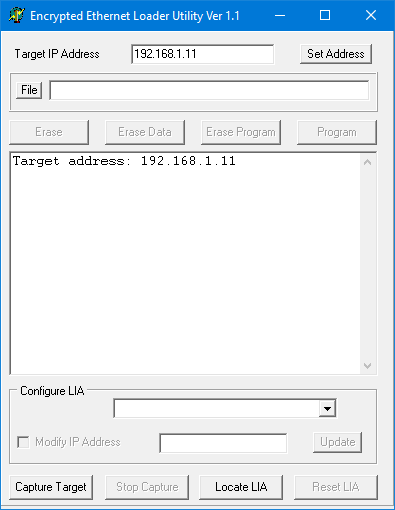
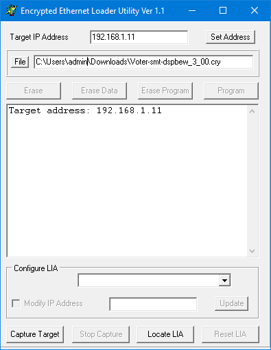

# VOTER/RTCM Firmware
The firmware in the VOTER and RTCM is the same, except it is compiled for the specific dsPIC that is installed in each. As such, the firmware is specific to the VOTER or the RTCM, and is **NOT** interchangeable (it **won't** boot in the wrong device). Firmware specific for the RTCM is denoted by *-smt* in the filename.

The VOTER uses a dsPIC33FJ128GP80**2** and the RTCM uses a dsPIC33FJ128GP80**4**. There is different peripheral mapping between the two.

There are **two parts** to the firmware, a *bootloader*, and then the actual *firmware* file. The bootloader starts when power is applied, and allows you to talk to the dsPIC and load new firmware files over ethernet. If the bootloader is not intercepted by the loading tool, it will continue to boot the current firmware file.

All new boards will need to have the bootloader installed first, followed by a firmware file. You **can** load a firmware file directly (.hex) in to the dsPIC, but then you will not have any of the bootloader remote loading features. Unless you have to change the main processor dsPIC, you should not need to worry about the bootloader.

## Firmware Upgrading
The VOTER/RTCM tries to update it's firmware every time it boots as part of the bootloader process. The bootloader has it's own IP address which is set by menu `14` of the `(i) IP parameters menu`.

```
IP Parameters Menu

Select the following values to View/Modify:

1  - (Static) IP Address (192.168.1.124)
2  - (Static) Netmask (255.255.255.0)
3  - (Static) Gateway (192.168.1.254)
4  - (Static) Primary DNS Server (8.8.8.8)
5  - (Static) Secondary DNS Server (0.0.0.0)
6  - DHCP Enable (0)
7  - Telnet Port (23)
8  - Telnet Username (admin)
9  - Telnet Password (radios)
10 - DynDNS Enable (0)
11 - DynDNS Username (wb6nil)
12 - DynDNS Password (radios42)
13 - DynDNS Host (voter-test.dyndns.org)
14 - BootLoader IP Address (192.168.1.11) (OK)
15 - Ethernet Duplex (0=Half, 1=Full) (1)
99 - Save Values to EEPROM
x  - Exit IP Parameters Menu (back to main menu)
q  - Disconnect Remote Console Session, r - reboot system
```

The default bootloader IP address is `192.168.1.11`. If that address fits in your network you can leave it there for all the VOTERs/RTCMs on your LAN as it is active only during the bootloader process.

If you are updating an VOTER/RTCM which is behind a firewall, you will need to port forward `16388/UDP` to the bootloader IP address. If you leave all your bootloaders on the same IP address, then you won't have to change the forwarding to update different clients.

The VOTER/RTCM firmware is updated with a Windows program called `EBLEX C3 Programmer`. Download from [here](https://github.com/AllStarLink/Voter/tree/master/EBLEX%20C30%20Programmer). Put both the `exe` and the `ini` file in a folder.

There are multiple "flavors" of firmware available.

The `DSPBEW` versions have Jim's DSP/BEW feature enabled. Note that due to the size of this feature, the diagnostics menu is **NOT** available in this version.

If you are upgrading an RTCM *be sure to use a `.cry` file that contains `smt` in the filename*. 

If you are upgrading a through-hole VOTER, **do not** use the `smt` files. 

Save the `.cry` file in the folder with the `.exe` and `.ini` files.

Download the firmware from the [AllStarLink GitHub Repository](https://github.com/AllStarLink/Voter/tree/master/VOTER_RTCM-firmware) that is appropriate for your application. 

Run the EBLEX Programmer:



* Fill in the target `bootloader IP address` (or the public IP, if your VOTER/RTCM is behind a firewall) of the device
* Click `File` and load the `.cry` file you are going to program



* Click the `Capture Target` button
* **Reboot** the VOTER/RTCM with TELNET (`r` option), power cycle, or use the reset button. In a moment you should see text come up on the programmer that it captured the target
* Click the `Program` button
* In a few minutes you will see some more messages including a program complete message
* Click the `Reset LIA` button. The VOTER/RTCM will restart with the new firmware

TELNET into your VOTER/RTCM and verify the new version is loaded with menu `98`:

```
S/W Version: 3.00 3/24/2021
System Uptime: 1992442.4 Secs
IP Address: 192.168.1.124
Netmask: 255.255.255.0
Gateway: 192.168.1.254
Primary DNS: 8.8.8.8
Secondary DNS: 0.0.0.0
DHCP: 0
VOTER Server IP: 192.168.1.100
VOTER Server UDP Port: 667
OUR UDP Port: 667
GPS Lock: 1
PPS BAD or Wrong Polarity: 0
Connected: 1
COR: 0
EXT CTCSS IN: 0
PTT: 0
RSSI: 0
Current Samples / Sec.: 8000
Current Peak Audio Level: 65528
Squelch Noise Gain Value: 45, Diode Cal. Value: 60, SQL Level 675, Hysteresis 10
Current Time: Sat  Jan 29, 2022  22:21:56.160
Last Ntwk Rx Pkt System time: 01/29/2022 22:20:33.540, diff: 82620 msec
Last Ntwk Rx Pkt Timestamp time: 01/29/2022 22:20:33.540, diff: 0 msec
Last Ntwk Rx Pkt index: 320, inbounds: 1

Press The Any Key (Enter) To Continue
```

## Compiling Environment
Do you want to "roll your own" version of the firmware? Well to do so, you will need to build yourself a compiling environment.

If you look in the original [votersystem.pdf](https://github.com/AllStarLink/Voter/blob/master/docs/votersystem.pdf), you will find a procedure to modify and load the bootloader in to the dsPIC of a VOTER board. 

Unfortunately, there is an important step **missing* in that procedure, which is covered below.

In addition, the old links for the MPLAB software are dead, so let's update this info and get you going.

Currently (Jan 2022), you can get the required software from:

* [https://www.microchip.com/en-us/tools-resources/archives/mplab-ecosystem](https://www.microchip.com/en-us/tools-resources/archives/mplab-ecosystem)

Download MPLAB IDE 32-bit Windows v8.66:

* [http://ww1.microchip.com/downloads/en/DeviceDoc/MPLAB_IDE_v8_66.zip](http://ww1.microchip.com/downloads/en/DeviceDoc/MPLAB_IDE_v8_66.zip)
* [http://dvswitch.org/files/AllStarLink/Voter/MPLAB_IDE_v8_66.zip](http://dvswitch.org/files/AllStarLink/Voter/MPLAB_IDE_v8_66.zip)

Download MPLAB C Compiler for PIC24 and dsPIC DSCs v3.31 ***NOT v.3.25***:

* [http://ww1.microchip.com/downloads/en/DeviceDoc/mplabc30-v3_31-windows-installer.exe](http://ww1.microchip.com/downloads/en/DeviceDoc/mplabc30-v3_31-windows-installer.exe)
* [http://dvswitch.org/files/AllStarLink/Voter/mplabc30-v3_31-windows-installer.exe](http://dvswitch.org/files/AllStarLink/Voter/mplabc30-v3_31-windows-installer.exe)

Optionally, install Windows Virtual PC and XP Mode. This is getting to be pretty old software, so running it under XP Mode may be a good idea, so we can keep it isolated (install it in a virtual machine). It does run fine in Windows 7. You're on your own with newer versions of Windows... maybe you want to build XP in a virtual machine?

To setup the compile/build environment, follow these steps:

* Run the MPLAB IDE installer. You don't need to install the HI-TECH C Compiler at the end (click no)
* Run the MPLAB C Compiler installer
* Select Legacy Directory Name
* **Select Lite Compiler**
* Go to: [https://github.com/AllStarLink](https://github.com/AllStarLink)
* Follow the links to: voter --&gt; Clone or Download --&gt; Branch = Master --&gt; Download Zip. That will get you `voter-master.zip` which is a download of the whole VOTER tree from GitHub
* Extract it somewhere (ie. in the XP Mode Virtual PC)
* Launch the MPLAB IDE
* Go to Configure --&gt; Settings --&gt; Projects and *de-select* "one-to-one project mode"

## Bootloader Installation
Set up your Compiling Environment (above). You will also need a PICKit2 or PICKit3 interface.

The current bootloader (`.cof` file) is available [here](https://github.com/AllStarLink/voter/tree/master/voter-bootloader) (the `-smt` file is for the RTCM). It needs to be loaded with a PICKit programmer.

If you need to load the bootloader in to a fresh board, you will need to follow these steps:

* Go to Project --&gt; Open --&gt; voter-bootloader.mcp --&gt; Open (it is in the voter-bootloader folder of the GitHub source)
* Go to File --&gt; Import --&gt; voter-bootloader --&gt; ENC_C30.cof --&gt; Open. ***This step is missing from the original procedure.***
* Remove `JP7` on the VOTER Board. This is necessary to allow programming by the PICKit2/PICKit3 device
* Attach the PICKIT2/PICKit3 device to `J1` on the VOTER board. Note that Pin 1 is closest to the power supply modules (as indicated on the board)
* If you have not already selected a programming device, go to Programmer --&gt; Select Device and choose PICKit3 (or PICKit2, depending on what you are using)
* Go to Programmer --&gt; Program. This will program the bootloader firmware into the PIC device on the board

If you want to change the default IP address from 192.168.1.11 in the bootloader:

* Select View --&gt; Program Memory (from the top menu bar)
* Hit Control-F (to "find") and search for the digits "00A8C0"
* These should be found at memory address "03018"

The "A8C0" at 03018 represents the hex digits C0 (192) and A8 (168) which are the first two octets of the IP address. The six digits to enter are 00 then the SECOND octet of the IP address in hex then the FIRST octet of the IP address in hex.

The "0B01" at 0301A represents the hex digits 0B (11) and 01 (1) which are the second two octets of the IP address. The six digits to enter are 00 then the FOURTH octet of the IP address in hex then the THIRD octet of the IP address in hex.

Once you have modified the address to your desired IP, follow the programming procedure (above).

## Compiling Firmware
To compile the firmware (if you want to make custom changes):

* Go to Project --&gt; Open --&gt; navigate to build-files and open the `.mcp` file for the flavor of firmware you want to compile. They are in the VOTER_RTCM-firmware folder of the GitHub source.

!!! note "Note"
    The `.mcp` files with the "smt" suffix are for the RTCM (built with SMT parts). The non-smt files are for the ORIGINAL through-hole VOTER boards. The difference is that the VOTER uses a dsPIC33FJ128GP802 and the RTCM uses a dsPIC33FJ128GP804.

!!! note "Note"
    If you want to compile the DSP/BEW version, make sure to open the appropriate `.mcp` file for that project.

* Go to Project --&gt; Build Configuration and select "Release". This may not be necessary (I don't believe that option is used in the firmware), but it removes the compiler option of __DEBUG being passed, so theoretically it would build "normal" firmware.
* Go to Configure --&gt; Select Device and choose the appropriate device for your board from the Device list. If you don't select the right one, the board will not boot. Select dsPIC33FJ128GP802 for the VOTER, and dsPIC33FJ128GP804 for the RTCM.
* Now, if you go to Project --&gt; Build All it should compile everything and show you "Build Succeeded"

A `.cry` file should be in the board-firmware folder. You can load this with the ENC Loader.

There is also a `.hex` file in there that you could load with a programmer... but that would wipe the bootloader... so don't do that.