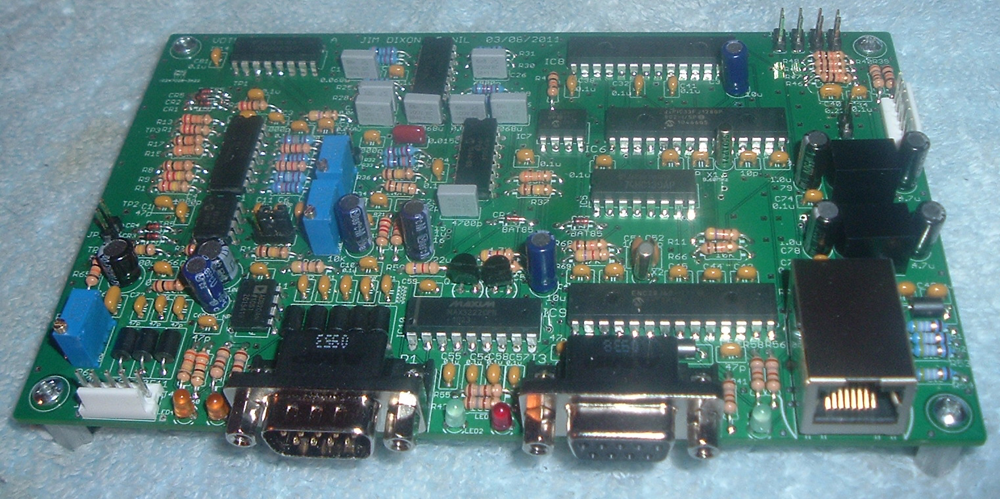

# VOTER Hardware
This is the documentation page to support the through-hole implementation of the VOTER Hardware Client.

<div class="grid" markdown>




</div>

See the [About](./about-voter.md) page for more information on the background/history. If you have bought or built a through-hole VOTER, this page is for you. If you have an [RTCM](http://www.micro-node.com/thin-m1.shtml), then you will want to reference the [user manual](./assets/rtcm_manual.pdf) for the RTCM or our [RTCM Hardware](./rtcm-hardware.md) page. That said, most of the information here should be applicable too.


The Micro-Node [RTCM](./rtcm-hardware.md) and VOTER interfaces are typically used with AllStarLink in voting/simulcast applications. They **may** be used for **ANY** repeater interface application, through the `chan_voter` channel driver, as they are primarily a Radio over IP (RoIP) adapter. 

## Firmware
See the [VOTER Firmware](./voter-firmware.md) page for information on upgrading the firmware.

If you are building your own VOTER, or for some reason you need to replace U6, you will want to program in the bootloader in to the dsPIC to allow for remote firmware upgrades. See the [Bootloader section](./voter-firmware.md#bootloader-installation) on how to do that.

## Board Layout
The through-hole board typically looks like this:

<div class="grid" markdown>


</div>

## Connectors 

```
J1 - 6 pin MTA-100 connector for PIC programmer (PICKit3 or equivalent). A reset switch may be placed across pins 1 and 3.
J2 - Ethernet (10-Base-T).
J3 - RS-232 (console 57600 bps 8N1, DCE)
J4 - 5 pin MTA-100 connector for GPS (see below for pinout).
P1 - Radio Connector (9 pin D-shell Male) (see below for pinout).
```

### P1 - Radio Connector Pinout (DB9 Male)

```
1 - + VIn (6.5-30 Volts DC).
2 - Transmit Audio Out
3 - Receive (discriminator) Audio In
4 - External CTCSS Input (optional)
5 - Gnd
6 - Gnd
7 - /PTT Out (open-collector, active-low)
8 - Gnd
9 – Gnd
```

### J4 - GPS Connector (5 Pin MTA-100 Male) Pinout

```
1 - Gnd
2 - 5 Volts DC Out (to power GPS device)
3 - GPS TXD (Gnd, actually)
4 - GPS RXD (in)
5 - GPS PPS (in)
```

## LED Designations
LED designations (shown from right to left along front of VOTER board, see photo above):

```
LED1 - (Green) System Activity Indicator (should toggle every 500ms)
LED5 - (Red) Transmit Indicator
LED2 - (Green) Receive Signal Indicator (solid green is valid Rx signal, flashing is signal without CTCSS)
LED3 - (Yellow) GPS Indicator (sold is GPS received and locked, flashing is GPS received, lock in progress)
LED4 - (Yellow) Connection Indicator (indicates that connection was made with VOTER host)
```

The COS (RX) LED on the VOTER will flash (same rate as Activity LED) if you have External CTCSS enabled, and the received signal has the wrong (or no) valid PL.

## Jumpers

```
JP1  - Discriminator Level Boost
JP2  - 20dB Pad
JP3  - Output Amp Power Source
JP7  - Bootloader Programming
JP8  - Initialize EEPROM
JP9  - Squelch Calibration
JP10 - Diode Calibration
JP11 - LED3/4 Receiver Level Mode
```

### JP1 - Discriminator Level Boost
Insert if low discriminator level. If squelch cannot self-calibrate with JP1 removed (too low), try with JP1 inserted.

!!! note "Level Boost"
    This jumper affects the squelch calibration circuit only. Not to be confused with JP2, which is the pad for the receive audio.

### JP2 - 20dB Pad
Insert to attenuate discriminator input level by 20db. This pad affects the **receive audio level**. See the [Receive Level Input Calibration](#receive-level-input-calibration) section.

### JP3 - Output Amp Power Source  
Selects power source for output audio amplifier. 1-2 is to power it from the 5VDC power supply. 2-3 is to power it directly from Vin. 

!!! danger "Do Not Change With Power On"
    DO ***NOT*** CHANGE THIS JUMPER WITH POWER ON. DAMAGE MAY OCCUR IF YOU DO!

### JP7 - Bootloader Programming
This jumper only needs to be removed when programming the bootloader in the dsPIC using the ICSP header.

### JP8 - Initialize EEPROM
Initialize the configuration parameters in EEPROM (factory reset). If JP8 is inserted when firmware starts, the operating parameters in the EEPROM will be set to default values. The system activity LED (LED1, Green) will stay off for approximately 4 seconds, then stay on steady to indicate that the initialization process is complete. Afterwards, the jumper may be removed and the system will continue running as usual.

!!! note "Diode Calibration"
    If JP10 is also inserted during this procedure, the "Diode Calibration" process will also occur.

### JP9 - Squelch Calibration
Insert to calibrate squelch. See [Squelch Calibration and Setting](#squelch-calibration-and-setting) below. 

### JP10 - Diode Calibration 
Insert to perform "Diode Calibration". This is a form of temperature compensation, where a power supply voltage is sampled that is dependent on the temperature coefficient of a diode (D5).

This may only be done in conjunction with an EEPROM Initialization (see JP8, above), or a Squelch Calibration (see JP9, above).

### JP11 - LED3/4 Receiver Level Mode
Insert this jumper to temporarily re-purpose LED3 and LED4 to allow for visual indication of RX input level (see [Receive Level Input Calibration](#receive-level-input-calibration) below). Alternatively, you can use [Menu 97](./voter-menus.md#97-rx-level-display).

## Potentiometers

```
R22 - Squelch adjustment
R36 - Rx Input Level
R61 - Tx Output Level
```

## Initialization 
Once you have verified that the firmware is running, place a jumper shunt on JP8 and JP10. 

Be sure to do this at a reasonable human room temperature (like 60-80 deg. F). This is necessary because this procedure initializes the operating parameters in the EEPROM and also does a temperature compensation diode calibration, which *needs* to happen at room temperature. 

Once the jumper shunts have been installed, power-cycle the board and wait for the system activity light to come on **steady** (about 4 seconds or so after the 5 second initial wait time).

Then, **remove** the jumper shunts, and proceed with [Squelch Calibration and Setting](#squelch-calibration-and-setting).

## Squelch Calibration and Setting
With the receiver connected and its antenna removed, insert JP9. In the next few seconds the "Receive Signal Indicator" (LED2, green) will flash on and off, then (hopefully) on steady. 

This indicates that the squelch calibration has occurred successfully. 

If unsuccessful, the LED will flash either **fast** to indicate that the discriminator noise level is too **high**, or **slowly** to indicate that the discriminator noise level is too **low**. If the discriminator level is too low, try inserting JP1 and try again.

!!! note "Diode Calibration"
    If JP10 is inserted during this procedure, the "Diode Calibration" process will also occur.

If you still have troubles calibrating the squelch, you may need to try the [Baseband Examination Window (BEW)](./voter-audio.md#dspbew-firmware-version) firmware.

When Squelch Calibration has been completed, **remove** JP9.

Once the Squelch Calibration procedure has been performed, the squelch adjustment (R22) needs to be properly set. Make sure that the "External CTCSS" is set to "ignore" (value: 0).

```
12 - External CTCSS (0=Ignore, 1=Non-Inverted, 2=Inverted) (0)
```

Adjust R22 until the Receive Signal Indicator (LED2) is lit. Then, advance R22 clockwise until LED2 is no longer lit. That is the minimum squelch setting. You probably will want to crank it up at least another turn clockwise, because if you leave it there it will open on a REALLY low level signal.

After proper setting has been achieved, return the "External CTCSS" configuration to its original setting.

[Menu 98](./voter-menus.md#98-status-display) will show the settings of the Squelch Calibration, Diode Calibration, and Squelch Levels:

```
Squelch Noise Gain Value: 45, Diode Cal. Value: 60, SQL Level 675, Hysteresis 10
```

!!! note "Software Squelch"
    Firmware >3.00 allows for the option to set the squelch via software, after initially setting it with the hardware potentiometer to get a baseline level. See the [Squelch Parameters Menu](./voter-menus.md#s-squelch-parameters-menu).

## Receive Level Input Calibration 
See the [VOTER Audio](./voter-audio.md) page for additional considerations when it comes to connecting the VOTER to your receiver, and for level setting instructions.

Place a full-quieting saturated signal on the receiver, modulated by 1000 Hertz sine wave at 3kHz deviation. 

With JP11 inserted, LED3 will indicate (by brightness) if the RX level is too low, and LED4 will indicate (by brightness) if the RX level is too high. So the idea is to tune R36 so that there is minimal brightness on both LED3 and LED4 (like a null, more or less). **Remove** JP11, when complete.

Alternatively, [Menu 97](./voter-menus.md#97-rx-level-display) from the console menu gives a more graphical method of setting the receiver input level:

```
RX VOICE DISPLAY:
                                  v -- 3KHz        v -- 5KHz
|=================================>                                        
```

Again, tune R36 until the input level matches 3kHz (since that is the deviation you are feeding in to the receiver).

## Transmit Level Calibration
Transmit output level is adjusted with R63. Transmit Level Calibration is **not* required for satellite receiver sites, obviously.

See the [VOTER Audio](./voter-audio.md) page for considerations when it comes to connecting the transmit audio to your transmitter, and for level setting instructions.

## Console Connection
Serial Console access is provided by an RS-232 serial port (J3) at 57600 baud, 8 bits, No parity, 1 Stop Bit. It is also made available remotely (off-board) via TELNET. When TELNET-ing the default user is `admin` and the password is `radios`. 

```
VOTER System Serial # 1234 Remote Console Access

Login: admin
Password: radios

Logged in successfully, now joining console session...
```

When done with the console session, please use the `q` command to disconnect. The local serial port and the TELNET (remote) user share the same (and only) console session.

### Console Menus
For a thorough explanation of the different menus, see the [VOTER Menus](./voter-menus.md) page.

### Debug Options
The VOTER/RTCM firmware supports some additional debugging information that can be turned on.

From the source code, the different Debug Options are listed as:

```
1 - Alt/Main Host change notifications
2 - Ignore HWlock (GGPS only)
4 - GPS/PPS Failure simulation (GGPS only)
8 - POCSAG H/W output disable (GGPS only)
16 - IP TOS Class for Ubiquiti
32 - GPS Debug
64 - Fix GPS 1 second off
```

Not sure what they all do, but that is what they are. Here are the most common ones used:

* `Alt/Main Host change notifications` shows when the connection to the Asterisk server changes state (when configured for redundant servers).
* `IP TOS Class for Ubiquity` in firmware >2.00, this **disables** marking the IP headers from the RTCM/VOTER **TO** the network with ToS C0/DSCP 48 (UBNT shows this as 802.1p Class 6 (Voice <10mS latency). Other sources show this as a Network Control TOS.) If you are using TOS, you also will want to have `utos=y` in your [`voter.conf`](../config/voter_conf.md) to mark the packets from the network **TO** the RTCM/VOTER.
* `GPS Debug` will print NMEA or TSIP debug strings from the connected GPS.
* `Fix GPS 1 second off` this is for NMEA GPS **only**. It will *add* one second to the time.

The way this works is you add together the options you want to enable (it is a bitmask), and set the debug level accordingly.

For example, if you want to enable GPS Debug and disable IP ToS, set debug to 48.

If you just want to turn on GPS Debug, set debug to 32.

If you just want TOS disabled, set debug to 16.

Set debug back to 0 to clear all debug settings.